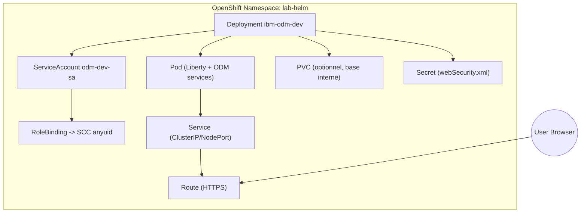
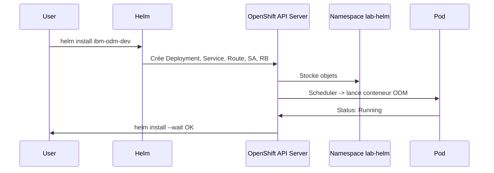
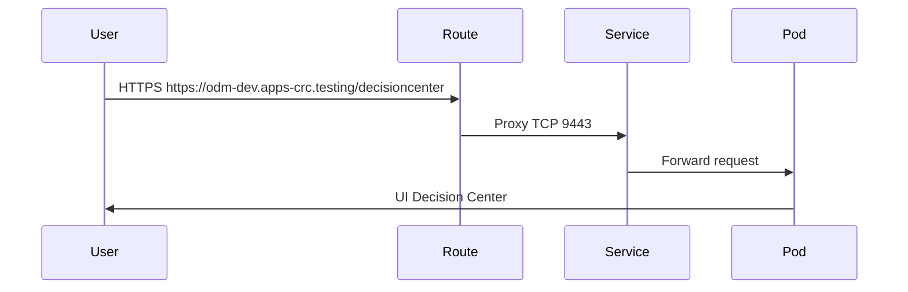
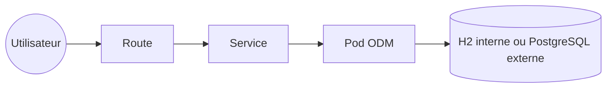
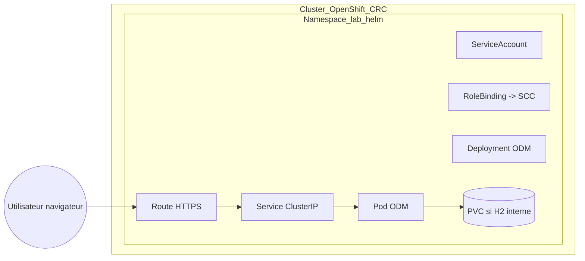

# Polycopié – IBM ODM Developer Edition (Helm sur OpenShift)

---

## 1. Principe du chart `ibm-odm-dev`

Le chart **ibm-odm-dev** déploie un cluster d’évaluation ODM sur Kubernetes/OpenShift.  
Il regroupe en un seul pod les 5 composants ODM principaux :

- Decision Center Business Console  
- Decision Center Enterprise Console  
- Decision Server Console  
- Decision Server Runtime  
- Decision Runner  

⚠️ Usage limité au **développement / évaluation**. Pas pour la production.

---

## 2. Objets Kubernetes / OpenShift utilisés

- **Deployment** : gère le pod ODM.  
- **Pod** : contient le conteneur Liberty avec les 5 services ODM.  
- **Service** : expose le pod au sein du cluster.  
- **Route (OpenShift)** : expose le Service à l’extérieur via un hostname.  
- **Secret** : stocke le fichier `webSecurity.xml` (utilisateurs/mots de passe).  
- **PersistentVolumeClaim (PVC)** : requis si persistance activée (base interne H2).  
- **ServiceAccount** : utilisé pour exécuter le pod avec SCC/PSP adaptées.  

---

## 3. Diagramme de relation des objets



---

## 4. Diagrammes de séquence

### 4.1 Installation avec Helm


### 4.2 Accès utilisateur


---

## 5. Diagramme réseau simplifié



---

## 6. Configuration : paramètres clés du chart

- `license=accept` → obligatoire  
- `usersPassword=<motdepasse>` → définit mot de passe par défaut (odmAdmin, rtsAdmin…)  
- `internalDatabase.populateSampleData=true` → ajoute données d’exemple Loan Validation  
- `serviceAccountName` → associe SA créé avec SCC  
- `route.enabled=true` → expose via Route OpenShift  

---

## 7. Ressources minimales

| Ressource | Valeur |
|-----------|--------|
| CPU       | 1 vCPU |
| Mémoire   | 1 Go   |
| Stockage  | 2 Gi (si base interne H2) |

---

## 8. Commandes pratiques

### Installation
```bash
oc new-project lab-helm
helm repo add ibm-charts https://raw.githubusercontent.com/IBM/charts/master/repo/stable
helm install my-odm-dev-release \
  --set license=accept \
  --set usersPassword=MyPassword \
  ibm-charts/ibm-odm-dev
```

### Vérification
```bash
oc -n lab-helm get pods
oc -n lab-helm get svc
oc -n lab-helm get route
```

### Désinstallation
```bash
helm uninstall my-odm-dev-release -n lab-helm
oc delete pvc <release>-odm-pvclaim -n lab-helm   # si vous voulez aussi supprimer les données
```

---

## 9. URLs exposées (via Route)

Supposons que la Route soit `https://odm-dev.apps-crc.testing` :

- Decision Center Business Console  
  `https://odm-dev.apps-crc.testing/decisioncenter`  

- Decision Center Enterprise Console  
  `https://odm-dev.apps-crc.testing/teamserver`  

- Decision Server Console (RES)  
  `https://odm-dev.apps-crc.testing/res`  

- Decision Server Runtime (exécution de règles)  
  `https://odm-dev.apps-crc.testing/DecisionService/rest/v1/<ruleset>`  

- Decision Runner  
  `https://odm-dev.apps-crc.testing/DecisionRunner`  

---

## 10. Exemple de cas d’usage (Loan Validation)

- Vérification de l’éligibilité à un prêt.  
- Validation des données, calcul d’un score, détermination d’un taux d’assurance.  
- Démonstration pratique pour manipuler et exécuter des règles dans Decision Center.  

---

## 11. Structure complète du Chart Helm pédagogique

### Arborescence
```
lab_helm_chart/
├─ Chart.yaml
├─ values.yaml
├─ templates/
│  ├─ _helpers.tpl
│  ├─ serviceaccount.yaml
│  ├─ rolebinding.yaml
│  ├─ deployment.yaml
│  ├─ service.yaml
│  ├─ route.yaml
│  └─ NOTES.txt
```

### Chart.yaml
```yaml
apiVersion: v2
name: ibm-odm-dev-lab
description: ODM Developer Edition sur OpenShift (CRC) – chart pédagogique
type: application
version: 0.1.0
appVersion: "9.5"
```

### values.yaml
```yaml
image:
  repository: icr.io/cpopen/odm-k8s/odm
  tag: "9.5"
  pullPolicy: IfNotPresent
license: "accept"
usersPassword: "odmAdmin123"
service:
  port: 9443
  type: ClusterIP
route:
  enabled: true
  host: ""
resources:
  requests:
    cpu: "1"
    memory: "1024Mi"
  limits:
    cpu: "2"
    memory: "2048Mi"
serviceAccount:
  create: true
  name: odm-dev-sa
```

### templates/_helpers.tpl
```yaml
{{- define "odm.name" -}}
{{- default .Chart.Name .Values.nameOverride | trunc 63 | trimSuffix "-" -}}
{{- end -}}

{{- define "odm.fullname" -}}
{{- if .Values.fullnameOverride -}}
{{- .Values.fullnameOverride | trunc 63 | trimSuffix "-" -}}
{{- else -}}
{{- printf "%s-%s" .Release.Name (include "odm.name" .) | trunc 63 | trimSuffix "-" -}}
{{- end -}}
{{- end -}}
```

### templates/serviceaccount.yaml
```yaml
apiVersion: v1
kind: ServiceAccount
metadata:
  name: {{ .Values.serviceAccount.name }}
```

### templates/rolebinding.yaml
```yaml
apiVersion: rbac.authorization.k8s.io/v1
kind: RoleBinding
metadata:
  name: {{ include "odm.fullname" . }}-scc-anyuid
subjects:
- kind: ServiceAccount
  name: {{ .Values.serviceAccount.name }}
roleRef:
  kind: ClusterRole
  name: system:openshift:scc:anyuid
  apiGroup: rbac.authorization.k8s.io
```

### templates/deployment.yaml
```yaml
apiVersion: apps/v1
kind: Deployment
metadata:
  name: {{ include "odm.fullname" . }}
spec:
  replicas: 1
  selector:
    matchLabels:
      app.kubernetes.io/name: {{ include "odm.name" . }}
  template:
    metadata:
      labels:
        app.kubernetes.io/name: {{ include "odm.name" . }}
    spec:
      serviceAccountName: {{ .Values.serviceAccount.name }}
      containers:
      - name: odm
        image: "{{ .Values.image.repository }}:{{ .Values.image.tag }}"
        imagePullPolicy: {{ .Values.image.pullPolicy }}
        env:
        - name: LICENSE
          value: "{{ .Values.license }}"
        - name: SAMPLE
          value: "true"
        - name: ODM_ADMIN_PASSWORD
          value: "{{ .Values.usersPassword }}"
        ports:
        - containerPort: {{ .Values.service.port }}
```

### templates/service.yaml
```yaml
apiVersion: v1
kind: Service
metadata:
  name: {{ include "odm.fullname" . }}
spec:
  type: {{ .Values.service.type }}
  selector:
    app.kubernetes.io/name: {{ include "odm.name" . }}
  ports:
  - port: 9443
    targetPort: {{ .Values.service.port }}
    name: https
```

### templates/route.yaml
```yaml
apiVersion: route.openshift.io/v1
kind: Route
metadata:
  name: {{ include "odm.fullname" . }}
spec:
  host: {{ .Values.route.host }}
  to:
    kind: Service
    name: {{ include "odm.fullname" . }}
  port:
    targetPort: https
  tls:
    termination: edge
```

### templates/NOTES.txt
```txt
ODM Developer Edition déployé.

URLs disponibles :
- Decision Center : https://<HOST>/decisioncenter
- RES Console : https://<HOST>/res
- Decision Runner : https://<HOST>/DecisionRunner
- REST API : https://<HOST>/DecisionService/rest/v1/<ruleset>
- SOAP WSDL : https://<HOST>/DecisionService/ws/<ruleset>?wsdl
```

---

## 12. Diagramme d’architecture globale



