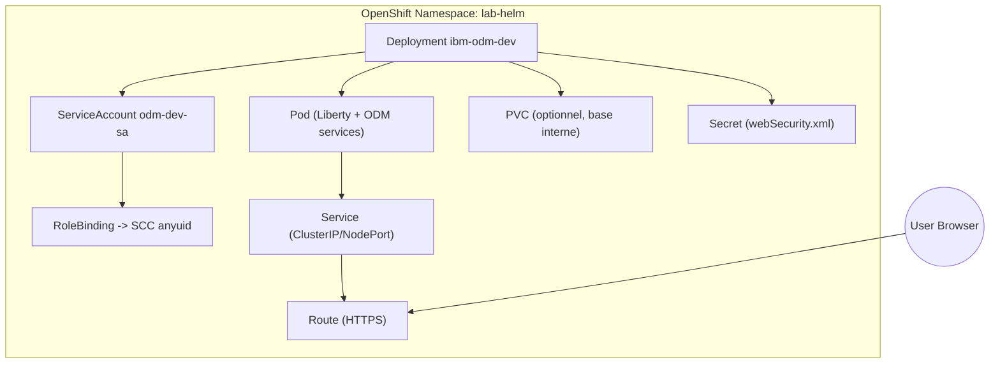
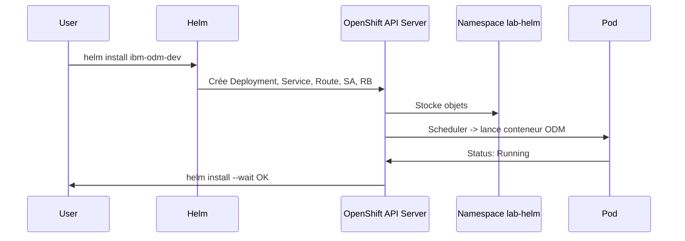
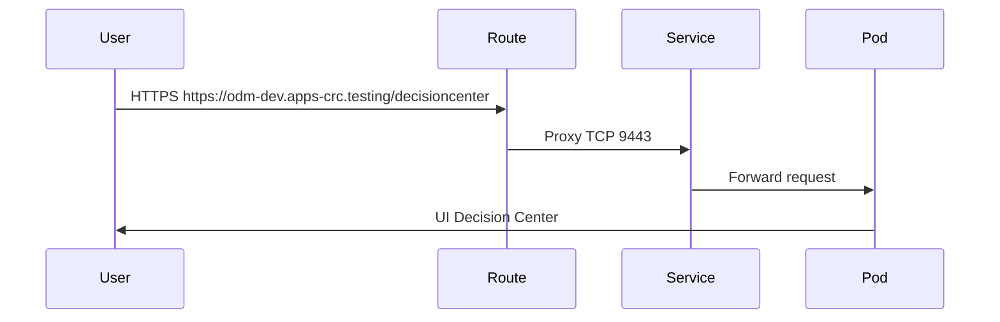
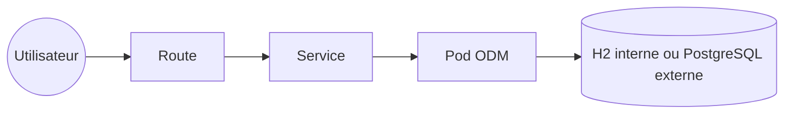

# Polycopié – IBM ODM Developer Edition (Helm sur OpenShift)

---

## 1. Principe du chart `ibm-odm-dev`

Le chart **ibm-odm-dev** déploie un cluster d’évaluation ODM sur Kubernetes/OpenShift.  
Il regroupe en un seul pod les 5 composants ODM principaux :

- Decision Center Business Console  
- Decision Center Enterprise Console  
- Decision Server Console  
- Decision Server Runtime  
- Decision Runner  

⚠️ Usage limité au **développement / évaluation**. Pas pour la production.

---

## 2. Objets Kubernetes / OpenShift utilisés

- **Deployment** : gère le pod ODM.  
- **Pod** : contient le conteneur Liberty avec les 5 services ODM.  
- **Service** : expose le pod au sein du cluster.  
- **Route (OpenShift)** : expose le Service à l’extérieur via un hostname.  
- **Secret** : stocke le fichier `webSecurity.xml` (utilisateurs/mots de passe).  
- **PersistentVolumeClaim (PVC)** : requis si persistance activée (base interne H2).  
- **ServiceAccount** : utilisé pour exécuter le pod avec SCC/PSP adaptées.  

---

## 3. Diagramme de relation des objets



---

## 4. Diagrammes de séquence

### 4.1 Installation avec Helm


### 4.2 Accès utilisateur


---

## 5. Diagramme réseau simplifié



---

## 6. Configuration : paramètres clés du chart

- `license=accept` → obligatoire  
- `usersPassword=<motdepasse>` → définit mot de passe par défaut (odmAdmin, rtsAdmin…)  
- `internalDatabase.populateSampleData=true` → ajoute données d’exemple Loan Validation  
- `serviceAccountName` → associe SA créé avec SCC  
- `route.enabled=true` → expose via Route OpenShift  

---

## 7. Ressources minimales

| Ressource | Valeur |
|-----------|--------|
| CPU       | 1 vCPU |
| Mémoire   | 1 Go   |
| Stockage  | 2 Gi (si base interne H2) |

---

## 8. Commandes pratiques

### Installation
```bash
oc new-project lab-helm
helm repo add ibm-charts https://raw.githubusercontent.com/IBM/charts/master/repo/stable
helm install my-odm-dev-release \
  --set license=accept \
  --set usersPassword=MyPassword \
  ibm-charts/ibm-odm-dev
```

### Vérification
```bash
oc -n lab-helm get pods
oc -n lab-helm get svc
oc -n lab-helm get route
```

### Désinstallation
```bash
helm uninstall my-odm-dev-release -n lab-helm
oc delete pvc <release>-odm-pvclaim -n lab-helm   # si vous voulez aussi supprimer les données
```

---

## 9. URLs exposées (via Route)

Supposons que la Route soit `https://odm-dev.apps-crc.testing` :

- Decision Center Business Console  
  `https://odm-dev.apps-crc.testing/decisioncenter`  

- Decision Center Enterprise Console  
  `https://odm-dev.apps-crc.testing/teamserver`  

- Decision Server Console (RES)  
  `https://odm-dev.apps-crc.testing/res`  

- Decision Server Runtime (exécution de règles)  
  `https://odm-dev.apps-crc.testing/DecisionService/rest/v1/<ruleset>`  

- Decision Runner  
  `https://odm-dev.apps-crc.testing/DecisionRunner`  

---

## 10. Exemple de cas d’usage (Loan Validation)

- Vérification de l’éligibilité à un prêt.  
- Validation des données, calcul d’un score, détermination d’un taux d’assurance.  
- Démonstration pratique pour manipuler et exécuter des règles dans Decision Center.  

