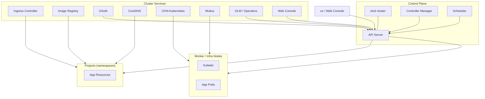
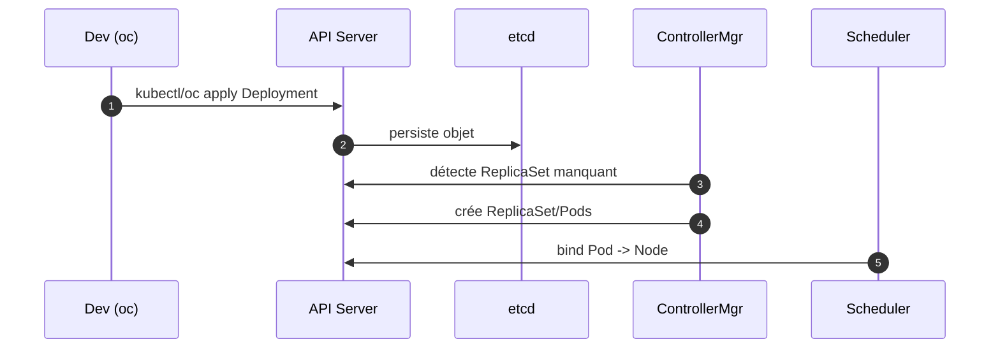
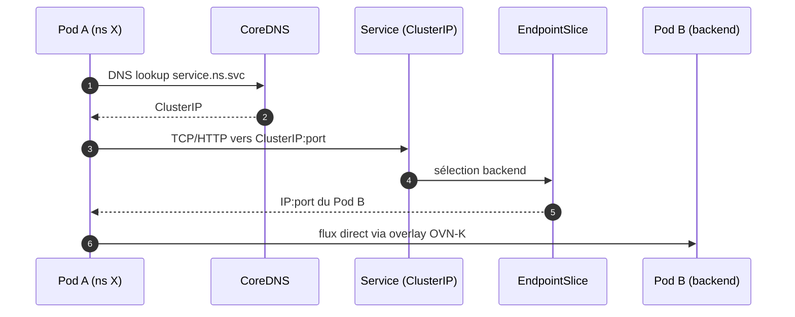
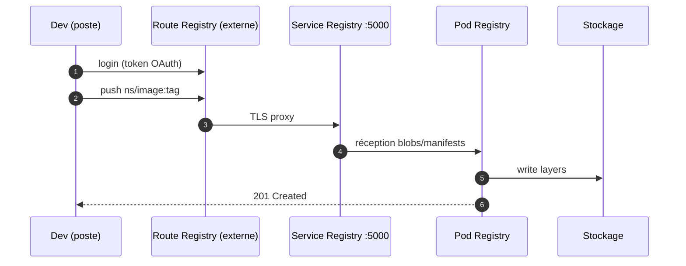

# Architecture OpenShift — Niveau Plateforme : Explications détaillées

> Cible : cluster CRC ou prod minimal. Objectif : comprendre chaque brique, ses interactions, et les séquences clés.

---

## 1) Vue d’ensemble (rappel schéma)


---

## 2) Control Plane
- **API Server** : point d’entrée unique (CRUD sur objets K8s). AuthN via OAuth/OIDC, AuthZ via RBAC.
- **etcd** : base clé/valeur. Stocke l’état désiré du cluster.
- **Controller Manager** : boucle de contrôle (ReplicaSet, endpoints, tokens…).
- **Scheduler** : planifie les pods sur les nœuds selon ressources/affinités/taints.

### Séquence contrôle


---

## 3) Services de cluster
### 3.1 Ingress Controller
- Termine TLS, route le trafic externe vers Services/Routes/Ingress.
- Multi‑tenant via **IngressClass**/**Routes**. HA via plusieurs contrôleurs.

### 3.2 Image Registry
- Dépôt d’images interne. Endpoint interne `svc:5000`, route externe optionnelle.
- S’intègre aux **ImageStreams** et aux **BuildConfig**.

### 3.3 OAuth
- Authentification des utilisateurs (kubeadmin, htpasswd, OIDC/Keycloak).
- Délivre tokens pour oc/console.

### 3.4 DNS (CoreDNS)
- Résolution `*.svc.cluster.local` et services internes.

### 3.5 Réseau : OVN‑Kubernetes + Multus
- **OVN‑K** : CNI par défaut, overlay réseau pour Pods/Services, NetworkPolicy.
- **Multus** : CNI multiple optionnel (deuxième interface SR‑IOV, MacVLAN, etc.).

### 3.6 OLM (Operators Lifecycle Manager)
- Installe et met à jour les Operators (catalogsource, subscriptions, CRDs).

### 3.7 Console
- UI web. Utilise API Server et OAuth. Expose tableaux de bord, opérateurs, projets.

---

## 4) Réseau Pod→Service (OVN‑K)


---

## 5) Pull/Push d’images (Registry)


---

## 6) Sécurité et gouvernance
- **RBAC** : `ClusterRole/Role` + `Binding` pour droits fins par projet.
- **SCC** : politiques d’exécution (privileged, anyuid, restricted-v2…).
- **NetworkPolicy** : segmentation Est‑Ouest.
- **Quotas/LimitRange** : plafonds CPU/Mem/storage par projet.
- **PullSecrets** : accès registries privés.

---

## 7) Stockage
- **Registry** : PVC ou objet S3. En CRC : PVC local.
- **Applications** : PVC via `StorageClass`. Modes RWO/RWX selon driver.

---

## 8) Observabilité
- **Metrics** : Prometheus + Alertmanager, Console → dashboards nœuds/pods.
- **Logs** : Loki/Elastic (optionnels) + `oc adm node-logs`.
- **Events** : `oc get events -A` pour diagnostic rapide.

---

## 9) GitOps & Operators
- **Operators** : packaging et lifecycle des composants (OLM).
- **Argo CD** : Git = source de vérité. Sync vers cluster.
- **Combinaison** : Argo CD déploie CRs d’Operators, qui gèrent leurs opérés.

---

## 10) Commandes repères (CRC)
```bash
# Santé control plane
oc get pods -n openshift-apiserver
oc get pods -n openshift-controller-manager
oc get pods -n openshift-etcd

# Ingress / DNS / OAuth / Console
oc get pods -n openshift-ingress
oc get pods -n openshift-dns
oc get pods -n openshift-authentication
oc get routes -n openshift-console

# Registry
oc get clusteroperator image-registry
oc -n openshift-image-registry get pods,svc,route,pvc

# Réseau et politiques
oc get network.config/cluster -o yaml | less
oc get netpol -A

# OLM (Operators)
oc get clusteroperators
oc -n olm get catalogsource,subscriptions,clusterserviceversions

# Projets & workloads
oc get projects
oc -n <ns> get deploy,rs,po,svc,ingress,route,pvc
```

---

## 11) Bonnes pratiques plateforme
- Séparer **namespaces infra** et **projets applicatifs**.
- Verrouiller `restricted-v2` par défaut, n’ouvrir que par exception.
- Activer mirroring d’images critiques vers le **registry interne**.
- Définir des **Quotas/LimitRange** systématiques.
- Automatiser via GitOps (Argo CD) + Operators, pas d’actions manuelles.
- Sauvegardes et **rotation des certificats** planifiées (OAuth/Ingress/Registry).

