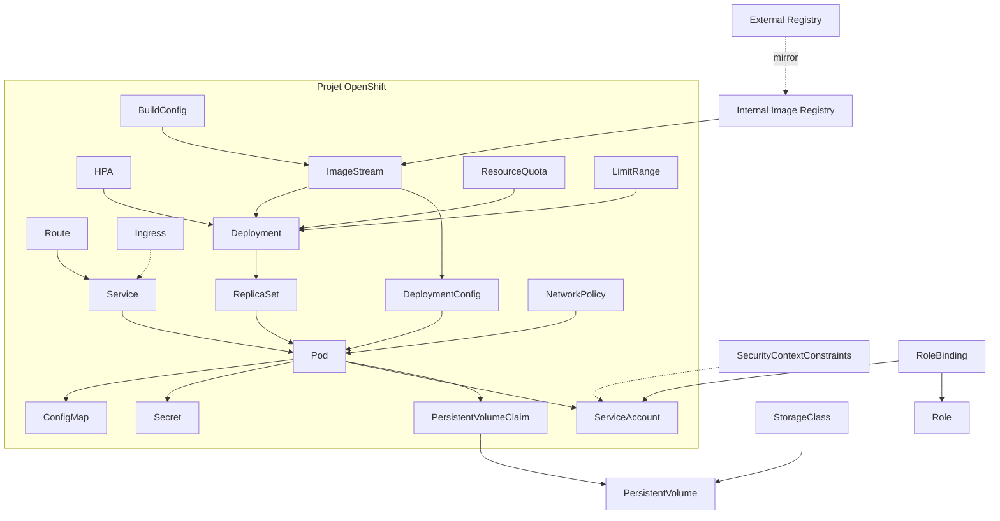
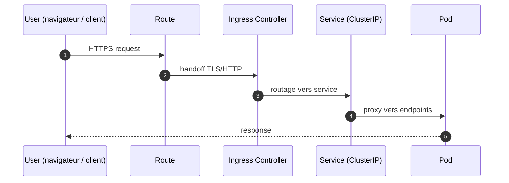
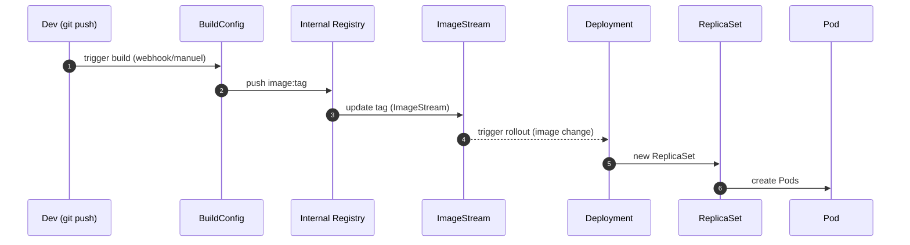
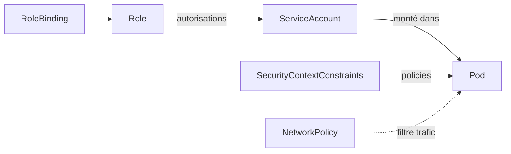
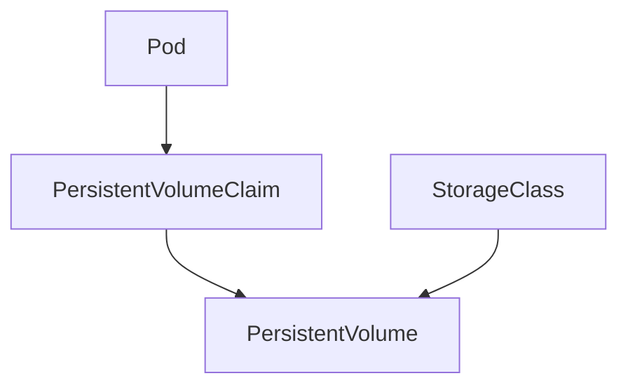
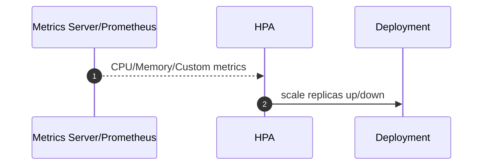
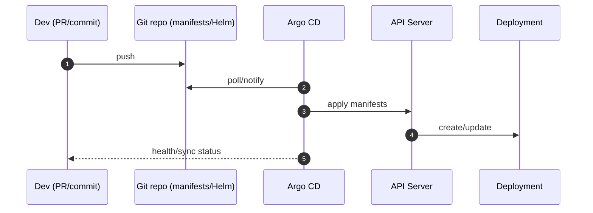
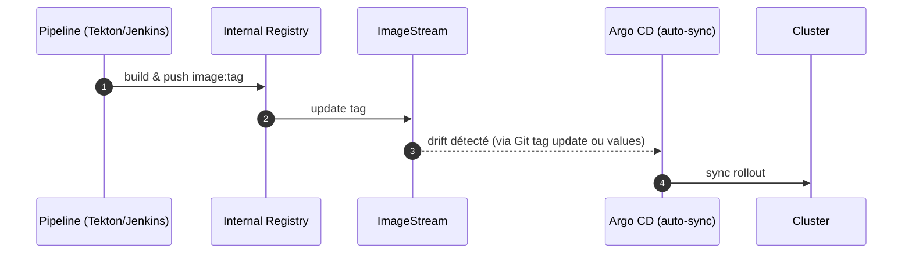

# Architecture OpenShift — Niveau Projet : Schéma central + explications et séquences

## 0) Objectif
Comprendre toutes les briques d’un **projet OpenShift** et leurs interactions autour d’un schéma central. Inclut trafic entrant, build/images, sécurité, stockage, autoscaling et GitOps.

---

## 1) Schéma central du projet

**Lecture rapide**
- **Trafic**: Route/Ingress -> Service -> Pod
- **Images**: BuildConfig -> ImageStream -> Deployment/DeploymentConfig -> Pods
- **Sécurité**: RBAC (Role/RoleBinding -> ServiceAccount), **SCC** (niveau exécution), **NetworkPolicy** (réseau)
- **Ressources**: ResourceQuota/LimitRange
- **Stockage**: PVC -> PV (via StorageClass)
- **Registry**: Interne, option miroir depuis un registre externe

---

## 2) Trafic entrant: Route/Ingress -> Service -> Pod

**Notes**
- Route expose un FQDN externe. Ingress Controller implémente le dataplane.
- Le Service (ClusterIP) distribue vers les Pods via Endpoints.

---

## 3) Build et images: de la source au déploiement

**Variantes**
- **Mirroring**: `skopeo/oc image mirror` depuis un registre externe vers le registre interne, puis IS importe la référence.
- **Dockerfile/Tekton**: build dérivé (drivers, certs, conf) puis push dans le registre interne.

---

## 4) Sécurité d’exécution et d’accès

**Principes**
- **RBAC**: Role/RoleBinding donnent au ServiceAccount les droits API.
- **SCC**: cadre d’exécution (uid, capabilities, privileged). Par défaut `restricted`.
- **NetworkPolicy**: autorise/limite les flux L3/L4 entre namespaces/pods.

---

## 5) Stockage: claims, volumes, classes

**Règles**
- **RWO/RWX** selon le driver de stockage.
- `StorageClass` provisionne dynamiquement les PV utilisés par les PVC.

---

## 6) Autoscaling: HPA

**Bonnes pratiques**
- Définir **requests/limits** sur Pods. HPA scale sur métriques cibles.

---

## 7) GitOps: Argo CD déploie l’état Git

**Idées**
- Git = source de vérité. Pas d’`oc apply` manuel en prod.
- Promotion par PR/merge entre branches (dev -> preprod -> prod).

---

## 8) CI et pipeline (Tekton ou autre) -> Registry -> Déploiement

**Options**
- Tag immuable par commit (`app:1.2.3+sha`), ou digest SHA.
- Argo CD peut consommer Helm/Kustomize; l’IS peut rester interne au cluster.

---

## 9) Contrôles de plateforme dans le projet
- **Quotas/LimitRange**: encadrent CPU/Mem/objets.
- **Policies**: PodSecurityAdmission/SCC, NetworkPolicy, signatures d’images.
- **Secrets**: pull secrets vers registries privés.

---

## 10) Check-list rapide (CRC)
- Route/Ingress resolus (FQDN). Service exposé. Probes OK.
- Image présente dans le **registry interne**. IS pointe sur le bon tag.
- RBAC correct pour ServiceAccount. SCC par défaut `restricted`.
- PVC liés si volume requis. Quotas/limits définis.
- HPA actif si charge variable. Argo CD en sync si GitOps.

