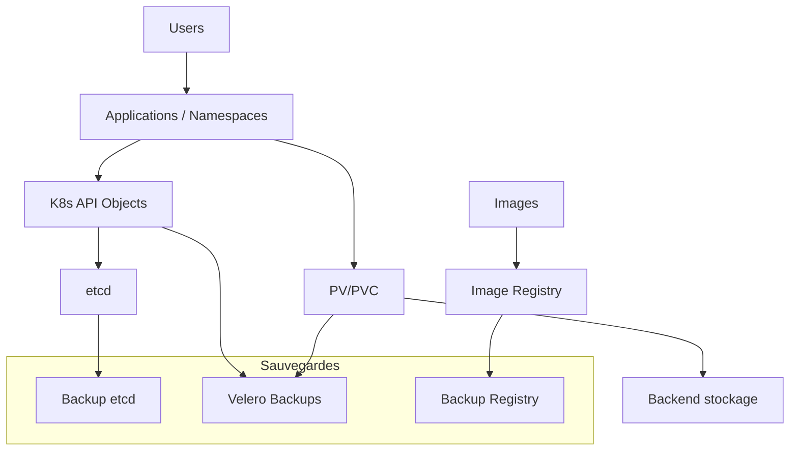
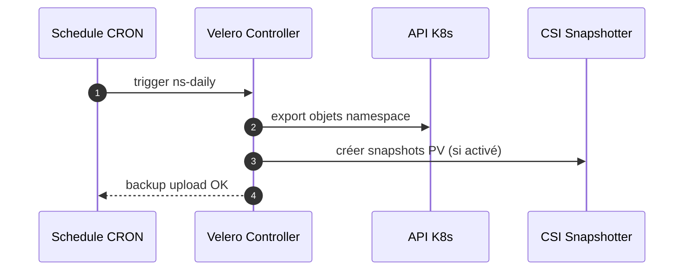
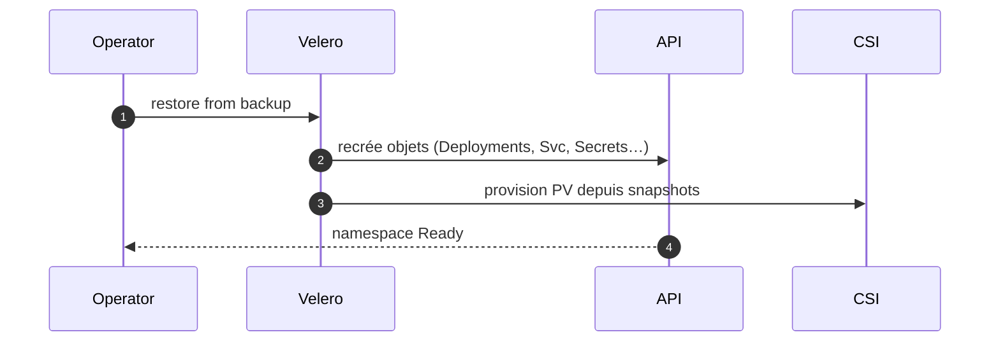

# 07 — Backup & DR (etcd • Velero • Snapshots • Registry • Restauration test)

## 0) Objectif
Assurer la continuité de service : sauvegarde **etcd** du control plane, sauvegarde/restauration **namespaces** avec **Velero** (plugins CSI/restic), protection du **registry** d’images, stratégies **RPO/RTO**, et tests réguliers de restauration.

---

## 1) Couches de sauvegarde


---

## 2) Scénarios DR
- **Perte de cluster** : restaurer **etcd** (même version), puis re-synchroniser workloads.
- **Perte d’app** : restaurer **namespace** via Velero (objets + PV).
- **Migration** : backup Velero vers nouveau cluster + remap StorageClass/ingress.

RPO/RTO cibles définissent fréquences et tailles de rétention.

---

## 3) etcd — sauvegarde du control plane
### 3.1 Sauvegarde
```bash
# En tant qu’admin sur une node control-plane
sudo -i
mkdir -p /backup/etcd-$(date +%F)
/usr/local/bin/cluster-backup.sh /backup/etcd-$(date +%F)
ls -l /backup/etcd-*/
```
Contenu : snapshot etcd + manifestes statiques nécessaires.

### 3.2 Restauration (haut niveau)
```bash
# Arrêt des pods statiques etcd/kube-apiserver/kcm/ks
# cluster-restore.sh /backup/etcd-YYYY-MM-DD
# Redémarrage des services puis vérifications API
```
Prérequis : même version OCP, mêmes certificats ou rotation gérée.

---

## 4) Velero — sauvegarde de namespaces et PV
### 4.1 Déploiement minimal
- Backend objet (S3/MinIO) : `velero install --provider aws --bucket <bucket> --secret-file creds --plugins velero/velero-plugin-for-aws:v1.8.0`
- **CSI snapshots** : ajouter plugin CSI et `--features=EnableCSI`.

### 4.2 Modèle de `BackupStorageLocation`
```yaml
apiVersion: velero.io/v1
kind: BackupStorageLocation
metadata: { name: default, namespace: velero }
spec:
  provider: aws
  objectStorage:
    bucket: velero-backups
  config:
    region: us-east-1
```

### 4.3 Sauvegarde à la demande
```bash
# Sans PV
velero backup create app-dev-$(date +%F) --include-namespaces app-dev
# Avec snapshots CSI
velero backup create app-dev-snap --include-namespaces app-dev \
  --snapshot-volumes --wait
```

### 4.4 Restauration
```bash
velero restore create --from-backup app-dev-2025-08-26 --namespace-mappings app-dev:app-dev-restore
```

### 4.5 Schedules
```bash
velero schedule create ns-daily --schedule "0 1 * * *" \
  --include-namespaces app-dev --ttl 168h
```

### 4.6 Points d’attention
- Mapper `StorageClass` : annotation `velero.io/restore-volumes` ou remap via `Restore`.
- Ressources cluster‑scoped (CRDs, RBAC) : inclure `--include-cluster-resources` si requis.
- Orphelins : vérifier secrets, pull‑secrets, ConfigMaps référencés.

---

## 5) restic — file‑level (si pas de snapshots CSI)
Activer le **node agent** restic dans Velero, puis :
```bash
velero backup create app-dev-files --include-namespaces app-dev --default-volumes-to-fs-backup
```
Restauration identique via `velero restore`.

---

## 6) Registry interne — sauvegarde et GC
### 6.1 Backends
- **Objet (S3/Ceph/MinIO)** : s’appuyer sur snapshots/versions côté objet.
- **PV** : sauvegarder le répertoire de données du registry.

### 6.2 Garbage‑collect / nettoyage
```bash
oc adm prune images --keep-tag-revisions=5 --keep-younger-than=96h --confirm
```
Planifier prunes après sauvegardes pour réduire volume.

### 6.3 Sauvegarde logique
- Export des **ImageStreams** par projet (`oc get is -o yaml`).
- Sauvegarde BSL Velero incluant les objets `ImageStream`.

---

## 7) Séquences
### 7.1 Sauvegarde quotidienne Velero


### 7.2 Restauration d’un namespace


---

## 8) RPO/RTO — politiques
- **RPO** : 24h (daily) pour non‑critiques, 1h (hourly) pour critiques.
- **RTO** : documenter étapes et durées. Inclure DNS, certificats, ingress.
- Rétention : 7 jours + 4 semaines + 6 mois (exemple 7‑4‑6).

---

## 9) Tests réguliers
- **Restore sec** : restaurer vers `*-restore` namespace chaque mois.
- **Chaos‑Day** : supprimer un déploiement en pré‑prod et mesurer RTO.
- **Vérifs** : pods Running, endpoints OK, données cohérentes.

---

## 10) Sécurité
- Chiffrer le backend de sauvegarde. Accès restreint (IAM/ACL).
- Rotation des clés d’accès. Audit des accès au bucket.
- Masquer données sensibles si exports hors périmètre.

---

## 11) Commandes utiles
```bash
velero backup get
velero describe backup <name> --details
velero restore get
velero logs

# etcd
ls -l /backup/etcd-*/

# Registry
oc -n openshift-image-registry get pods,pvc
```

---

## 12) Checklist
- etcd : script de backup planifié et testé.
- Velero : installé avec backend objet, schedules actifs.
- CSI snapshots ou restic activés selon driver.
- Registry : stratégie prune + sauvegarde backend.
- RPO/RTO définis, tests de restauration mensuels.
- Documentation DR accessible et à jour.

