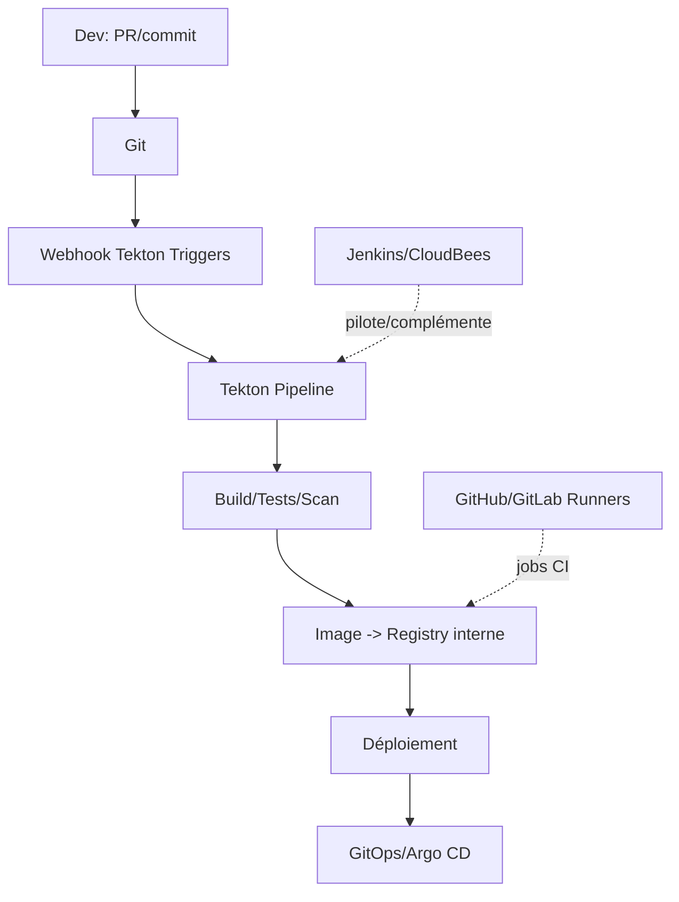

# 12 — CI/CD sur OpenShift (Tekton • OpenShift Pipelines • Jenkins/CloudBees • Runners)

## 0) Objectif
Mettre en place des chaînes CI/CD natives Kubernetes avec **Tekton / OpenShift Pipelines**, intégrer **Jenkins/CloudBees**, et exécuter des **runners** GitHub/GitLab dans OpenShift. Inclut secrets, registres, triggers, promotions et sécurité.

---

## 1) Vue d’ensemble


---

## 2) Tekton — ressources clés
- **Task** : étapes conteneurisées (steps).
- **Pipeline** : enchaîne des tasks.
- **Workspace** : stockage partagé (PVC/emptyDir/ConfigMap/Secret).
- **PipelineRun/TaskRun** : exécution.
- **Params/Results** : I/O entre tasks.
- **ServiceAccount** : identités et secrets (registry/git).

### 2.1 Task exemple (build + push)
```yaml
apiVersion: tekton.dev/v1
kind: Task
metadata: { name: build-push }
spec:
  workspaces: [{ name: source }]
  params:
  - name: image
  steps:
  - name: build
    image: gcr.io/kaniko-project/executor:latest
    args:
    - --dockerfile=$(workspaces.source.path)/Dockerfile
    - --context=$(workspaces.source.path)
    - --destination=$(params.image)
    - --insecure
```

### 2.2 Pipeline exemple
```yaml
apiVersion: tekton.dev/v1
kind: Pipeline
metadata: { name: ci }
spec:
  workspaces: [{ name: shared }]
  params: [{ name: image }]
  tasks:
  - name: unit
    taskRef: { name: golang-test }
    workspaces: [{ name: source, workspace: shared }]
  - name: build-push
    runAfter: ["unit"]
    taskRef: { name: build-push }
    workspaces: [{ name: source, workspace: shared }]
    params: [{ name: image, value: "$(params.image)" }]
```

### 2.3 PipelineRun (avec PVC et SA)
```yaml
apiVersion: tekton.dev/v1
kind: PipelineRun
metadata: { name: ci-run }
spec:
  pipelineRef: { name: ci }
  serviceAccountName: ci-sa
  params: [{ name: image, value: image-registry.openshift-image-registry.svc:5000/app/hello:$(context.pipelineRun.uid) }]
  workspaces:
  - name: shared
    volumeClaimTemplate:
      spec:
        accessModes: [ReadWriteOnce]
        resources: { requests: { storage: 2Gi } }
        storageClassName: fast-rwo
```

---

## 3) Tekton Triggers
```yaml
apiVersion: triggers.tekton.dev/v1beta1
kind: EventListener
metadata: { name: el }
spec:
  serviceAccountName: ci-sa
  triggers:
  - name: on-push
    bindings:
    - ref: tb
    template:
      ref: tt
---
kind: TriggerBinding
apiVersion: triggers.tekton.dev/v1beta1
metadata: { name: tb }
spec:
  params:
  - name: gitrev
    value: $(body.head_commit.id)
---
kind: TriggerTemplate
apiVersion: triggers.tekton.dev/v1beta1
metadata: { name: tt }
spec:
  params: [{ name: gitrev }]
  resourcetemplates:
  - apiVersion: tekton.dev/v1
    kind: PipelineRun
    metadata: { generateName: ci- }
    spec:
      pipelineRef: { name: ci }
      params:
      - name: image
        value: image-registry.openshift-image-registry.svc:5000/app/hello:$(tt.params.gitrev)
      workspaces:
      - name: shared
        volumeClaimTemplate:
          spec:
            accessModes: [ReadWriteOnce]
            resources: { requests: { storage: 2Gi } }
```
Expose l’EventListener via **Route** pour recevoir les webhooks Git.

---

## 4) Secrets & permissions
- **Pull/Push registry** : `kubernetes.io/dockerconfigjson` lié à `ci-sa` (`oc secrets link ci-sa regcred --for=pull,mount`).
- **Git** : secret SSH/HTTPS, `known_hosts` en ConfigMap si SSH.
- **RBAC** : `Role` donnant create/get Pods, PVC, TaskRun, PipelineRun.

Exemple ServiceAccount :
```yaml
apiVersion: v1
kind: ServiceAccount
metadata: { name: ci-sa, namespace: app }
secrets:
- name: regcred
- name: git-ssh
```

---

## 5) Tests, cache, artefacts
- **Cache build** : kaniko cache, Buildah avec registry local.
- **Artefacts** : stocker dans PVC ou object store (minio/S3).
- **Unit/Intégration** : tasks dédiées et parallélisme.

---

## 6) Promotions et déploiement
- **Direct** : Pipeline appelle `oc` pour appliquer manifests.
- **GitOps recommandé** : pipeline bump de tag/values dans Git → Argo CD sync.

Modèle step GitOps :
```bash
# commit du nouveau tag d’image
sed -i "s/tag:.*/tag: ${NEW_TAG}/" envs/preprod/values.yaml
git commit -am "bump image ${NEW_TAG}" && git push
```

---

## 7) Sécurité CI/CD
- SA dédiés, **SCC restricted**.
- **Policies**: interdire `latest`, forcer digest/signatures (Kyverno).
- **Scan** : Trivy/ACS/Quay/Harbor avec gate sur HIGH/CRITICAL.
- **Secrets** : pas en clair, montés par SA seulement.

---

## 8) Jenkins / CloudBees sur OpenShift
- **Agents dynamiques** : `Kubernetes Plugin` lance des pods agent (jnlp) par build.
- **Pipelines Jenkinsfile** pour orchestrer, Tekton pour steps natifs si mixte.
- **CloudBees** : contrôleurs gérés, dossiers, RBAC avancé, approbations et release orchestration.

Exemple podTemplate (extrait) :
```groovy
podTemplate(label: 'jnlp', containers: [
  containerTemplate(name: 'maven', image: 'maven:3.9', command: 'sleep', args: '99d')
]) {
  node('jnlp') {
    stage('build') { sh 'mvn -B -DskipTests package' }
  }
}
```

---

## 9) Runners GitHub/GitLab dans OpenShift
- Déployer `actions-runner-controller` ou chart GitLab Runner.
- Runner avec SA restreint et secrets limités.
- Pousser images vers **registry interne**.

Exemple values (GitLab Runner) :
```yaml
gitlabUrl: https://gitlab.example.com
runners:
  privileged: false
  tags: ["ocp"]
  cache:
    type: s3
    s3ServerAddress: minio.logging.svc:9000
```

---

## 10) Observabilité CI/CD
- **Tekton** : `PipelineRun`/`TaskRun` conditions, events, metrics (tekton-controller).
- **Jenkins** : logs de stages + exporter metrics vers Prometheus.
- **Runners** : dashboards jobs, files d’attente, taux d’échec.

---

## 11) Dépannage
```bash
# Échecs Tekton
oc -n app get pipelinerun,taskrun
oc -n app logs tr/<taskrun> -c step-<name>

# EventListener / Trigger
oc -n app get svc,route,el,triggerbindings,triggertemplates

# Jenkins pods agents
oc -n jenkins get pods -l jenkins
```
Problèmes fréquents : droits PVC, secrets registry, CA de la route, ressources insuffisantes.

---

## 12) Checklist
- SA + secrets (git/registry) prêts. SCC restricted.
- Pipeline avec workspaces (PVC) et cache build.
- Triggers branchés sur Git. Route exposée si webhooks.
- Images dans registry interne. Promotion via GitOps.
- Politiques de sécurité (no latest, signatures). Scans intégrés.
- Observabilité en place. Runbooks d’échec documentés.

