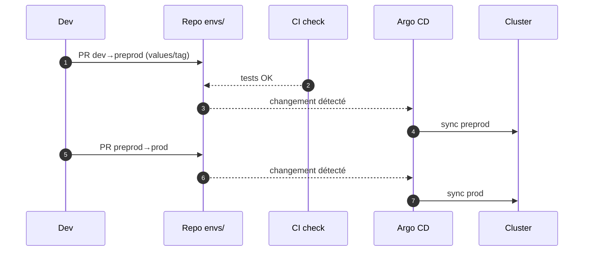

# 02 — GitOps avancé (Argo CD • App‑of‑Apps • ApplicationSet • Promotions PR)

## 0) Objectif
Déployer à l’échelle avec **Argo CD** : patterns App‑of‑Apps, **ApplicationSet**, promotions par **pull request**, options de **sync**, **hooks**, secrets, mises à jour d’images, progressive delivery, et runbooks.

---

## 1) Schéma GitOps global
```mermaid
flowchart TB
  Dev[Dev: commit/PR] --> Git[Repo Git (manifests/Helm/Kustomize)]
  Git --> Argo[Argo CD Controller]
  Argo --> API[Kubernetes API]
  API --> Cluster[Objets K8s]
  Cluster --> Health[Health/Sync Status]
  Health --> Argo
  Argo --> Notify[Notifications (Slack/Webhook)]
```

---

## 2) Structuration des dépôts
- **Mono‑repo** (simple au début) ou **multi‑repo** (app vs infra vs env).
- Exemple arborescence :
```
repo/
  apps/
    myapp/
      charts/    # Helm chart
      kustomize/ # Overlays
  envs/
    dev/
      values-dev.yaml
      kustomization.yaml
    preprod/
      values-preprod.yaml
    prod/
      values-prod.yaml
  argo/
    root-app.yaml
    applicationsets/
      myapp-envs.yaml
```

---

## 3) Pattern App‑of‑Apps
**Root Application** qui gère des sous‑applications.
```yaml
apiVersion: argoproj.io/v1alpha1
kind: Application
metadata:
  name: root
  namespace: argocd
spec:
  project: default
  source:
    repoURL: https://git.example/repo.git
    path: argo
    directory:
      recurse: true
  destination:
    server: https://kubernetes.default.svc
    namespace: argocd
  syncPolicy:
    automated: { prune: true, selfHeal: true }
```
Les manifests enfants (Applications) vivent dans `argo/children/` ou sous‑répertoires.

---

## 4) ApplicationSet — générer N Applications
### 4.1 Par environnements (liste)
```yaml
apiVersion: argoproj.io/v1alpha1
kind: ApplicationSet
metadata:
  name: myapp-envs
  namespace: argocd
spec:
  generators:
  - list:
      elements:
      - name: dev
      - name: preprod
      - name: prod
  template:
    metadata:
      name: myapp-{{name}}
    spec:
      project: default
      source:
        repoURL: https://git.example/repo.git
        path: apps/myapp
        helm:
          valueFiles: [ "envs/{{name}}/values-{{name}}.yaml" ]
      destination:
        server: https://kubernetes.default.svc
        namespace: myapp-{{name}}
      syncPolicy:
        automated: { prune: true, selfHeal: true }
```

### 4.2 Par clusters (multicluster)
```yaml
spec:
  generators:
  - clusters: { selector: { matchLabels: { env: managed } } }
  template:
    metadata: { name: myapp-{{name}} }
    spec:
      destination:
        server: '{{server}}'
        namespace: myapp
```

---

## 5) Promotions par PR (dev→preprod→prod)

**Bonnes pratiques** : PR signées, approbations, tags immuables (digest), rollback = revert Git.

---

## 6) Options de sync et gestion du drift
### 6.1 Automatisation
```yaml
spec:
  syncPolicy:
    automated:
      prune: true
      selfHeal: true
    syncOptions:
    - CreateNamespace=true
    - PruneLast=true
    - ApplyOutOfSyncOnly=true
    - ServerSideApply=true
```
### 6.2 Ignorer différences (champ volatile)
```yaml
spec:
  ignoreDifferences:
  - group: apps
    kind: Deployment
    jsonPointers:
    - /spec/replicas
```
### 6.3 Sync waves (ordre d’application)
```yaml
metadata:
  annotations:
    argocd.argoproj.io/sync-wave: "0"   # plus petit = d’abord
```

---

## 7) Hooks (PreSync/Sync/PostSync)
```yaml
apiVersion: batch/v1
kind: Job
metadata:
  name: db-migrate
  annotations:
    argocd.argoproj.io/hook: PreSync
    argocd.argoproj.io/hook-delete-policy: HookSucceeded
spec:
  template:
    spec:
      restartPolicy: Never
      containers:
      - name: migrate
        image: myrepo/db-migrator:1.0
        args: ["upgrade"]
```

---

## 8) Helm vs Kustomize — overlays d’environnement
### 8.1 Helm values par env
```yaml
source:
  helm:
    valueFiles:
    - envs/dev/values-dev.yaml
```
### 8.2 Kustomize overlay
```yaml
# envs/dev/kustomization.yaml
resources:
- ../../apps/myapp/kustomize/base
patches:
- target: { kind: Deployment, name: web }
  patch: |
    - op: replace
      path: /spec/replicas
      value: 2
```

---

## 9) Secrets — Sealed Secrets ou SOPS
### 9.1 Bitnami SealedSecret
```yaml
apiVersion: bitnami.com/v1alpha1
kind: SealedSecret
metadata:
  name: db-cred
  namespace: myapp-dev
spec:
  encryptedData:
    password: AgB1...
```
Pipeline : `kubeseal` chiffre → commit en Git → Argo applique → Secret déchiffré in‑cluster.

### 9.2 SOPS (GPG/KMS)
- Fichier `secret.enc.yaml` chiffré en Git.
- Argo CD + plugin Kustomize SOPS pour déchiffrer lors du render.

---

## 10) Mises à jour d’images — Argo CD Image Updater
Annotations sur Application :
```yaml
metadata:
  annotations:
    argocd-image-updater.argoproj.io/image-list: myapp=registry/myapp
    argocd-image-updater.argoproj.io/myapp.update-strategy: latest
    argocd-image-updater.argoproj.io/write-back-method: git
```
Effet : scrute le registry, met à jour la référence d’image dans Git, Argo sync.

---

## 11) Progressive delivery — Argo Rollouts (canary)
```yaml
apiVersion: argoproj.io/v1alpha1
kind: Rollout
metadata: { name: web }
spec:
  replicas: 4
  strategy:
    canary:
      steps:
      - setWeight: 25
      - pause: { duration: 120 }
      - setWeight: 50
      - pause: { duration: 120 }
      - setWeight: 100
  selector: { matchLabels: { app: web } }
  template:
    metadata: { labels: { app: web } }
    spec:
      containers:
      - name: web
        image: registry/web:1.2.3
        ports: [{ containerPort: 8080 }]
```
Option : **Analysis** avec Prometheus pour auto‑abort sur régression.

---

## 12) Fenêtres de déploiement (sync windows)
```yaml
spec:
  syncWindows:
  - kind: allow
    schedule: "Mon-Fri 09:00-18:00"
    applications: ["myapp-*"]
```

---

## 13) Notifications (Slack/Webhook)
ConfigMap `argocd-notifications-cm` : triggers, templates, services. Exemple trigger : `on-sync-succeeded` → Slack.

---

## 14) Runbooks (extraits)
- **OutOfSync persistant** : vérifier `ignoreDifferences`, SSA, CRDs non prêtes.
- **Hook en échec** : logs du Job hook, `hook-delete-policy`, ré‑appliquer.
- **Drift en prod** : activer `selfHeal`, verrouiller accès en écriture.
- **Image non trouvée** : vérifier pull secret et tag immuable/digest.

---

## 15) Commandes utiles
```bash
# CLI
argocd login <url> --username admin --password *** --grpc-web
argocd app list
argocd app sync myapp-prod --prune
argocd app wait myapp-prod --health --timeout 600

# Diff local rendu Helm/Kustomize
helm template ./apps/myapp -f envs/prod/values-prod.yaml | kubectl diff -f -
kustomize build envs/prod | kubectl diff -f -
```

---

## 16) Bonnes pratiques
- Git = source unique. Tout changement via PR.
- Tags immuables (digest), pas de `:latest`.
- `selfHeal` + `prune` en prod avec prudence. Sync windows. Hooks pour migrations.
- Séparer Applications par domaine/env. ApplicationSet pour générer à l’échelle.
- Versionner dashboards/alertes/policies et déployer via GitOps.

