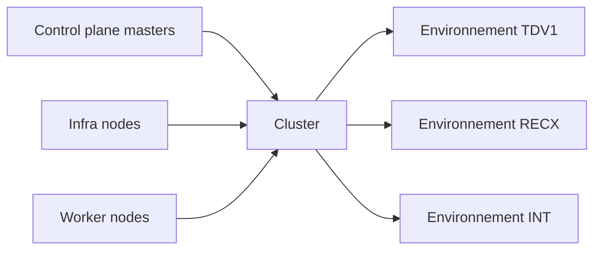
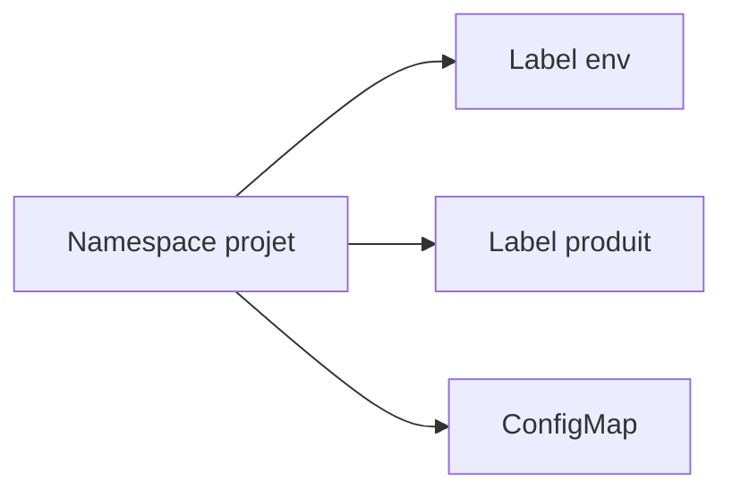
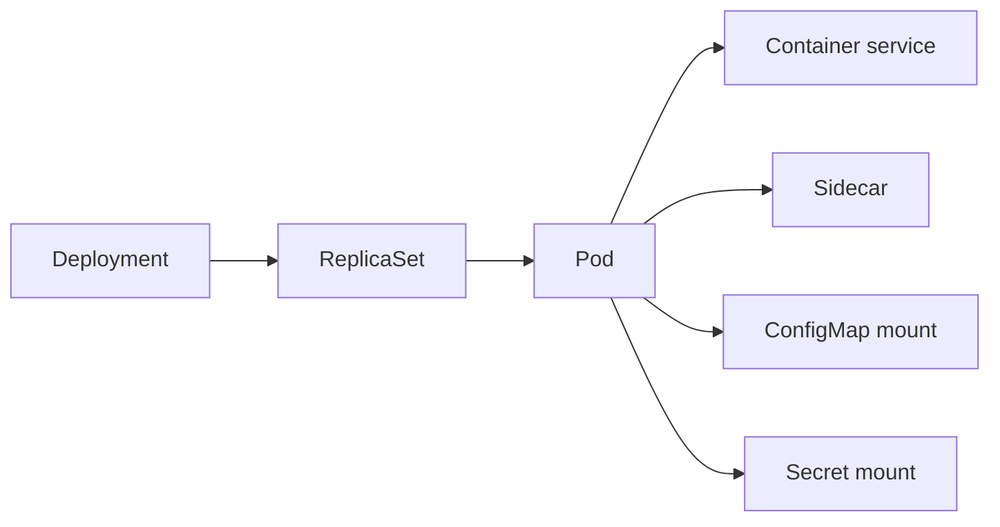
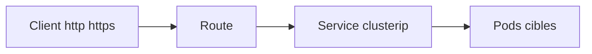
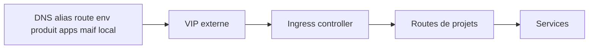
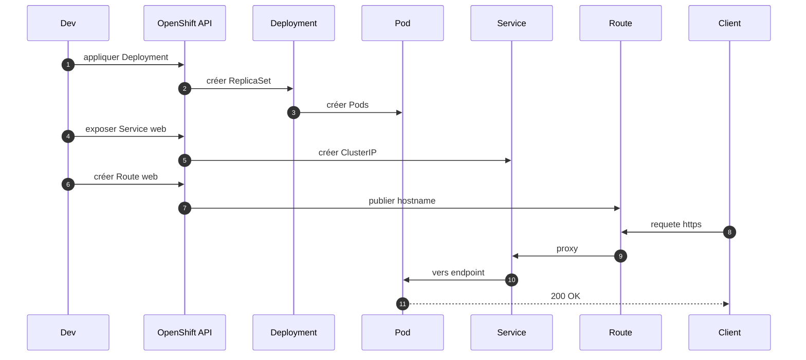

# conceptsopenshiftMAIF

> Référence concise des concepts et commandes OpenShift selon le vocabulaire MAIF. Inclut schémas Mermaid et une feuille de commandes.

---

## 1. Cluster, Node, Environnement

**Texte source**  
Un cluster OpenShift est composé de :
- 3 serveurs dits nodes masters pour le pilotage du cluster
- 1 à n serveurs dits nodes d'infrastructures pour l'hébergement de services techniques Ingress par exemple
- n serveurs dits nodes workers pour les applications hébergées Les nodes d'infrastructures et les nodes workers peuvent être mutualisés
- héberge plusieurs environnements MAIF TDV1 RECX INT

**Schéma**  


**Commandes clés**
```bash
# Contexte et accès
oc whoami
oc status

# Nœuds
oc get nodes -o wide
oc describe node <node>

# Labels et rôles
oc label node <node> node-role.kubernetes.io/infra=""
oc label node <node> node-role.kubernetes.io/worker=""
oc get nodes --show-labels

# Taints infra ou ingress
oc taint node <node> role=ingress:NoSchedule
oc describe node <node> | egrep "Taints|Labels"

# Événements cluster
oc get events -A --sort-by=.lastTimestamp | tail -n 50
```

---

## 2. Projet, Namespace, Produit, ConfigMap

**Texte source**  
Un projet Namespace :
- est un contexte d'exécution
- est associé à un environnement TDV1 RECX INT
- est associé à un produit MAIF NORA Comet
- présente des contextes de configuration ConfigMap

**Schéma**  


**Commandes clés**
```bash
# Créer un projet
oc new-project ex288

# Labeler le projet avec env et produit
oc label ns ex288 env=TDV1 produit=NORA --overwrite

# ConfigMap
oc -n ex288 create configmap app-cfg --from-literal=PROFILE=recx
oc -n ex288 get cm
oc -n ex288 describe cm app-cfg

# Secrets liés
oc -n ex288 create secret generic app-secret --from-literal=API_KEY=changeme
oc -n ex288 get secret
```

---

## 3. Pod, Conteneur, Deployment

**Texte source**  
Un pod :
- est une unité de déploiement
- expose un ou plusieurs ports
- est composé de un conteneur rendant le service proprement dit
- zero a n conteneurs sidecar apportant des fonctionnalités complémentaires souvent techniques ex certificats service mesh logs metriques
- utilise les ConfigMap du projet
- s'exécute sur un Node selon les ressources allouées dans la limite du projet
- est décrit par un DeploymentConfig historique ou un Deployment moderne recommandé

Le cluster gère la répartition des pods sur les nodes et l arrêt redémarrage des pods.

**Schéma composants**  


**Commandes clés**
```bash
# Déployer une app de test
oc -n ex288 create deployment web --image=registry.k8s.io/echoserver:1.10

# Ressources et réplication
oc -n ex288 set resources deploy/web --requests=cpu=100m,memory=128Mi --limits=cpu=500m,memory=256Mi
oc -n ex288 scale deploy/web --replicas=3

# Monter ConfigMap comme variables d env
oc -n ex288 set env deploy/web --from=configmap/app-cfg

# Inspecter et diagnostiquer
oc -n ex288 get deploy,rs,pod -o wide
oc -n ex288 describe deploy web
oc -n ex288 logs deploy/web -f
oc -n ex288 rsh deploy/web sh

# Événements récents du projet
oc -n ex288 get events --sort-by=.lastTimestamp | tail -n 30
```

---

## 4. Service, Route

**Texte source**  
Le service est une définition logique qui expose un ou plusieurs ports vers un ensemble de pods sélectionnés par labels. C est comparable à une VIP.  
Une route rend un service accessible hors projet par un nom DNS normalisé.  
MAIF : {route}.{env}.{produit}.apps.maif.local

**Schéma flux**  


**Commandes clés**
```bash
# Créer le Service vers web
oc -n ex288 expose deploy/web --port=8080 --name=web

# Vérifier endpoints
oc -n ex288 get svc web -o wide
oc -n ex288 get endpoints web

# Exposer en externe via Route
oc -n ex288 expose svc/web
oc -n ex288 get route web -o wide

# Test depuis un pod
oc -n ex288 rsh deploy/web curl -s http://web:8080 || true
```

---

## 5. VIP et alias DNS

**Texte source**  
Des VIP physiques NetScaler ou autres sont en frontal des clusters et pointent sur les nodes d'infrastructure et l Ingress.  
Elles ont un nom DNS technique **apps.cluster.maif.local**.  
Des alias DNS sont créés pour chaque route selon le modèle **route.env.produit.apps.maif.local**.

**Schéma**  


---

## 6. Séquence complète du déploiement à l exposition



---

## 7. Vérifications et nettoyage

```bash
# Vue d ensemble
oc -n ex288 get all -o wide

# Health rapide
oc -n ex288 get deploy web -o jsonpath='{.status.availableReplicas}{"\n"}'
oc -n ex288 get route web -o jsonpath='{.spec.host}{"\n"}'

# Nettoyage
oc -n ex288 delete route web || true
oc -n ex288 delete svc web || true
oc -n ex288 delete deploy web || true
```

---

## 8. Notes

- DeploymentConfig est déprécié depuis OpenShift 4.14 et retiré dans les futures versions. Utiliser Deployment apps v1.
- Les labels env et produit sur les namespaces permettent les conventions MAIF et les filtres.
- Routes TLS et certificats voir canvas TLS si besoin.
