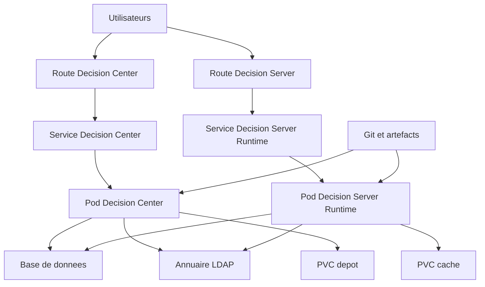
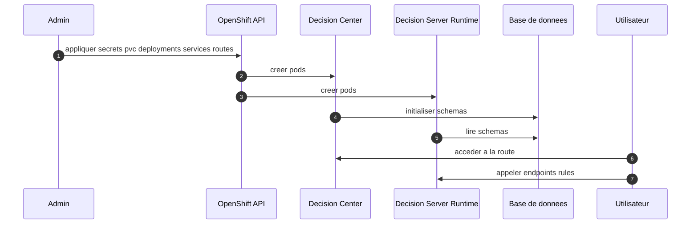

# ddm_openshift_concent — IBM ODM sur OpenShift

> Fiche opérationnelle pour intégrer **IBM ODM** dans OpenShift. Concepts, schémas simples, modèles YAML et commandes `oc`.
> Cible: CRC ou cluster multi‑nœuds. Adapter noms d’images et paramètres selon votre licence IBM.

---

## 1. Vue d’ensemble IBM ODM sur OpenShift



Rôles
- **Decision Center**: studio web, gestion des règles, gouvernance.
- **Decision Server Runtime**: exécution des règles, endpoints REST.
- **Base de données**: référentiel DC et exécution. **LDAP** si SSO.
- **Routes**: exposition HTTPs vers les services. **PVC** si persistance requise.

---

## 2. Prérequis

- Accès au **registry IBM** (entitlement key).  
- Un namespace dédié, ex `odm`.
- Une **base de données** (PostgreSQL ou DB2) accessible depuis le namespace.  
- Paramètres: `DB_HOST`, `DB_PORT`, `DB_NAME`, `DB_USER`, `DB_PASSWORD`.
- Optionnel: LDAP `LDAP_URL`, `LDAP_BIND_DN`, `LDAP_PASSWORD`.

Commandes initiales
```bash
# Namespace
oc new-project odm || true

# Secret d accès au registry IBM (entitlement)
oc -n odm create secret docker-registry ibm-entitlement   --docker-server=cp.icr.io   --docker-username=cp   --docker-password='<ENTITLEMENT_KEY>'   --docker-email='none@local'

# Lier le pull secret aux SAs
oc -n odm secrets link default ibm-entitlement --for=pull
oc -n odm secrets link builder ibm-entitlement --for=pull

# Secrets applicatifs DB et LDAP
oc -n odm create secret generic odm-db   --from-literal=DB_HOST=db.example.local   --from-literal=DB_PORT=5432   --from-literal=DB_NAME=odmdb   --from-literal=DB_USER=odmuser   --from-literal=DB_PASSWORD='change_me'

oc -n odm create secret generic odm-ldap   --from-literal=LDAP_URL=ldap://ldap.example.local:389   --from-literal=LDAP_BIND_DN='cn=bind,dc=example,dc=local'   --from-literal=LDAP_PASSWORD='change_me' || true
```

---

## 3. Modèles YAML minimaux

### 3.1 Storage (si persistance)
```yaml
apiVersion: v1
kind: PersistentVolumeClaim
metadata:
  name: odm-depot
  namespace: odm
spec:
  accessModes: [ReadWriteOnce]
  resources:
    requests:
      storage: 5Gi
  storageClassName: fast-rwo
---
apiVersion: v1
kind: PersistentVolumeClaim
metadata:
  name: odm-cache
  namespace: odm
spec:
  accessModes: [ReadWriteOnce]
  resources:
    requests:
      storage: 2Gi
  storageClassName: fast-rwo
```

### 3.2 Decision Center
> Remplacez l image par la référence IBM valide de votre souscription. Exemple indicatif: `cp.icr.io/cp/odm/odm-decision-center:<tag>`
```yaml
apiVersion: apps/v1
kind: Deployment
metadata:
  name: odm-decision-center
  namespace: odm
spec:
  replicas: 1
  selector:
    matchLabels: { app: odm-dc }
  template:
    metadata:
      labels: { app: odm-dc }
    spec:
      imagePullSecrets:
      - name: ibm-entitlement
      containers:
      - name: dc
        image: cp.icr.io/cp/odm/odm-decision-center:<tag>
        ports: [{ containerPort: 9080 }]
        env:
        - name: DB_HOST
          valueFrom: { secretKeyRef: { name: odm-db, key: DB_HOST } }
        - name: DB_PORT
          valueFrom: { secretKeyRef: { name: odm-db, key: DB_PORT } }
        - name: DB_NAME
          valueFrom: { secretKeyRef: { name: odm-db, key: DB_NAME } }
        - name: DB_USER
          valueFrom: { secretKeyRef: { name: odm-db, key: DB_USER } }
        - name: DB_PASSWORD
          valueFrom: { secretKeyRef: { name: odm-db, key: DB_PASSWORD } }
        - name: LDAP_URL
          valueFrom: { secretKeyRef: { name: odm-ldap, key: LDAP_URL } }
        - name: LDAP_BIND_DN
          valueFrom: { secretKeyRef: { name: odm-ldap, key: LDAP_BIND_DN } }
        - name: LDAP_PASSWORD
          valueFrom: { secretKeyRef: { name: odm-ldap, key: LDAP_PASSWORD } }
        readinessProbe:
          httpGet: { path: /health, port: 9080 }
          initialDelaySeconds: 30
          periodSeconds: 10
        livenessProbe:
          httpGet: { path: /live, port: 9080 }
          initialDelaySeconds: 60
          periodSeconds: 20
        securityContext:
          allowPrivilegeEscalation: false
          readOnlyRootFilesystem: true
          runAsNonRoot: true
        volumeMounts:
        - name: depot
          mountPath: /opt/odm/depot
      volumes:
      - name: depot
        persistentVolumeClaim: { claimName: odm-depot }
---
apiVersion: v1
kind: Service
metadata:
  name: odm-decision-center
  namespace: odm
spec:
  selector: { app: odm-dc }
  ports: [{ name: http, port: 9080, targetPort: 9080 }]
---
apiVersion: route.openshift.io/v1
kind: Route
metadata:
  name: odm-decision-center
  namespace: odm
spec:
  to: { kind: Service, name: odm-decision-center }
  tls: { termination: edge }
```

### 3.3 Decision Server Runtime
> Remplacez l image: `cp.icr.io/cp/odm/odm-decision-server-runtime:<tag>`
```yaml
apiVersion: apps/v1
kind: Deployment
metadata:
  name: odm-runtime
  namespace: odm
spec:
  replicas: 2
  selector:
    matchLabels: { app: odm-dsr }
  template:
    metadata:
      labels: { app: odm-dsr }
    spec:
      imagePullSecrets:
      - name: ibm-entitlement
      containers:
      - name: dsr
        image: cp.icr.io/cp/odm/odm-decision-server-runtime:<tag>
        ports: [{ containerPort: 9080 }]
        env:
        - name: DB_HOST
          valueFrom: { secretKeyRef: { name: odm-db, key: DB_HOST } }
        - name: DB_PORT
          valueFrom: { secretKeyRef: { name: odm-db, key: DB_PORT } }
        - name: DB_NAME
          valueFrom: { secretKeyRef: { name: odm-db, key: DB_NAME } }
        - name: DB_USER
          valueFrom: { secretKeyRef: { name: odm-db, key: DB_USER } }
        - name: DB_PASSWORD
          valueFrom: { secretKeyRef: { name: odm-db, key: DB_PASSWORD } }
        readinessProbe:
          httpGet: { path: /health, port: 9080 }
          initialDelaySeconds: 20
          periodSeconds: 10
        livenessProbe:
          httpGet: { path: /live, port: 9080 }
          initialDelaySeconds: 40
          periodSeconds: 20
        securityContext:
          allowPrivilegeEscalation: false
          readOnlyRootFilesystem: true
          runAsNonRoot: true
        volumeMounts:
        - name: cache
          mountPath: /opt/odm/cache
      volumes:
      - name: cache
        persistentVolumeClaim: { claimName: odm-cache }
---
apiVersion: v1
kind: Service
metadata:
  name: odm-runtime
  namespace: odm
spec:
  selector: { app: odm-dsr }
  ports: [{ name: http, port: 9080, targetPort: 9080 }]
---
apiVersion: route.openshift.io/v1
kind: Route
metadata:
  name: odm-runtime
  namespace: odm
spec:
  to: { kind: Service, name: odm-runtime }
  tls: { termination: edge }
```

### 3.4 Réseau minimal
```yaml
apiVersion: networking.k8s.io/v1
kind: NetworkPolicy
metadata:
  name: odm-allow-ingress
  namespace: odm
spec:
  podSelector: {}
  policyTypes: [Ingress]
  ingress:
  - from:
    - namespaceSelector:
        matchLabels:
          kubernetes.io/metadata.name: openshift-ingress
---
apiVersion: networking.k8s.io/v1
kind: NetworkPolicy
metadata:
  name: odm-allow-egress-db-dns
  namespace: odm
spec:
  podSelector: {}
  policyTypes: [Egress]
  egress:
  - to:
    - namespaceSelector:
        matchLabels:
          kubernetes.io/metadata.name: openshift-dns
    ports:
    - { protocol: UDP, port: 53 }
    - { protocol: TCP, port: 53 }
  - to:
    - ipBlock: { cidr: 10.0.0.0/8 }
    ports:
    - { protocol: TCP, port: 5432 }
```

### 3.5 Haute dispo et maintenance
```yaml
apiVersion: policy/v1
kind: PodDisruptionBudget
metadata:
  name: odm-runtime-pdb
  namespace: odm
spec:
  minAvailable: 1
  selector: { matchLabels: { app: odm-dsr } }
---
apiVersion: autoscaling/v2
kind: HorizontalPodAutoscaler
metadata:
  name: odm-runtime-hpa
  namespace: odm
spec:
  scaleTargetRef:
    apiVersion: apps/v1
    kind: Deployment
    name: odm-runtime
  minReplicas: 2
  maxReplicas: 6
  metrics:
  - type: Resource
    resource:
      name: cpu
      target:
        type: Utilization
        averageUtilization: 70
```

---

## 4. Séquence simple de déploiement



---

## 5. Commandes utiles

```bash
# Inventaire
oc -n odm get all -o wide

# Routes
oc -n odm get route

# Logs et readiness
oc -n odm logs deploy/odm-decision-center -f
oc -n odm logs deploy/odm-runtime -f
oc -n odm get pod -l app=odm-dsr -o name | xargs -I{} oc -n odm exec {} -- curl -s http://localhost:9080/health || true

# Connexion DB depuis un pod
oc -n odm rsh deploy/odm-runtime bash -lc "getent hosts $DB_HOST || true"

# Nettoyage
oc -n odm delete all -l app=odm-dc
oc -n odm delete all -l app=odm-dsr
oc -n odm delete pvc odm-depot odm-cache
```

---

## 6. Points d’attention

- Remplacer les **images** par les références **exactes** de votre souscription IBM ODM.  
- Ajuster les **probes** selon le contexte runtime réel.  
- Gérer TLS selon votre politique: `edge`, `reencrypt` ou `passthrough`.  
- Sécuriser par **SCC restricted**, **runAsNonRoot** et **no privilege**.  
- Configurer **sauvegardes** pour la base et les PVC si utilisés.
