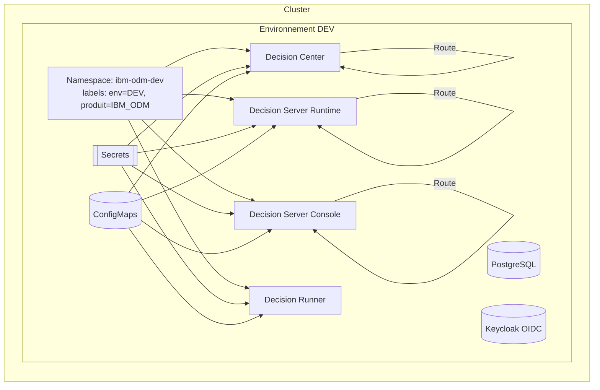
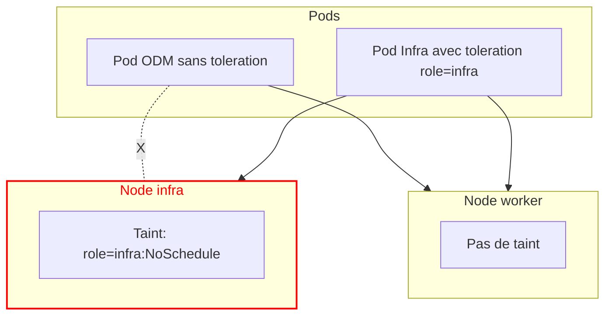

# dm_openshift_concent — IBM_ODM

But: intégrer IBM ODM dans OpenShift avec conventions MAIF.

---

## 0) Portée
- Cible: ODM 9.x (Decision Center, Decision Server Runtime, Decision Server Console, Decision Runner).
- Périmètre: namespaces, labels, ConfigMap/Secret, Deployments, Services, Routes, taints/tolerations, observabilité, licensing.
- Hypothèses: Postgres, OIDC via Keycloak, Ingress/Routes OpenShift.

---

## 1) Vocabulaire et conventions MAIF
- **Namespace = Projet**. Labels requis: `env`, `produit`.
- **Routes**: `<route>.<env>.<produit>.apps.maif.local`.
- **DNS technique**: `*.apps.<nom-cluster>.maif.local`.
- **Deployment** (apps/v1). `DeploymentConfig` déprécié.

```bash
# Création du projet ODM (exemple)
oc new-project ibm-odm-dev
oc label ns ibm-odm-dev env=DEV produit=IBM_ODM --overwrite
```

---

## 2) Vue logique




---

## 3) Configurations (exemples)

### 3.1 ConfigMap application
```bash
oc -n ibm-odm-dev create configmap odm-app-cfg \
  --from-literal=PROFILE=dev \
  --from-literal=LOG_LEVEL=info
```

### 3.2 Secrets DB et OIDC
```bash
# Base Postgres
oc -n ibm-odm-dev create secret generic odm-db \
  --from-literal=DB_HOST=postgres.dev.svc \
  --from-literal=DB_PORT=5432 \
  --from-literal=DB_NAME=decisiondb \
  --from-literal=DB_USER=WDC \
  --from-literal=DB_PASSWORD=devsecops

# OIDC Keycloak
oc -n ibm-odm-dev create secret generic odm-oidc \
  --from-literal=OIDC_ISSUER_URL=https://keycloak.apps.maif.local/realms/odm \
  --from-literal=OIDC_CLIENT_ID=odm-liberty \
  --from-literal=OIDC_CLIENT_SECRET=<secret>
```

---

## 4) Déploiements type (squelettes)

### 4.1 Decision Server Runtime (exemple générique)
```yaml
apiVersion: apps/v1
kind: Deployment
metadata:
  name: odm-decisionserver-runtime
  namespace: ibm-odm-dev
  labels: { app: odm, role: runtime, env: DEV, produit: IBM_ODM }
spec:
  replicas: 2
  selector:
    matchLabels: { app: odm, role: runtime }
  template:
    metadata:
      labels: { app: odm, role: runtime, env: DEV, produit: IBM_ODM }
      annotations:
        productName: "IBM Operational Decision Manager"
        productVersion: "9.x"
        productMetric: "VIRTUAL_PROCESSOR_CORE"
        productID: "REPLACE-WITH-PRODUCT-ID"
    spec:
      securityContext:
        runAsNonRoot: true
      containers:
        - name: runtime
          image: REPLACE_WITH_IMAGE # ex: icr.io/cpopen/odm/odm-decisionserver-runtime:9.5.0
          imagePullPolicy: IfNotPresent
          envFrom:
            - configMapRef: { name: odm-app-cfg }
            - secretRef: { name: odm-db }
            - secretRef: { name: odm-oidc }
          ports:
            - name: http
              containerPort: 9080
          readinessProbe:
            httpGet: { path: /health/ready, port: http }
            initialDelaySeconds: 20
            periodSeconds: 10
          livenessProbe:
            httpGet: { path: /health/live, port: http }
            initialDelaySeconds: 30
            periodSeconds: 20
          resources:
            requests: { cpu: "250m", memory: "512Mi" }
            limits:   { cpu: "1",    memory: "1Gi" }
      nodeSelector:
        node-role.kubernetes.io/worker: "true"
      tolerations: [] # ODM applicatif: pas de tolérance infra par défaut
```

### 4.2 Service + Route
```yaml
apiVersion: v1
kind: Service
metadata:
  name: odm-runtime
  namespace: ibm-odm-dev
  labels: { app: odm, role: runtime }
spec:
  type: ClusterIP
  selector: { app: odm, role: runtime }
  ports:
    - name: http
      port: 80
      targetPort: http
---
apiVersion: route.openshift.io/v1
kind: Route
metadata:
  name: odm-runtime
  namespace: ibm-odm-dev
  labels: { env: DEV, produit: IBM_ODM }
spec:
  to: { kind: Service, name: odm-runtime }
  port: { targetPort: http }
  tls:
    termination: edge
    insecureEdgeTerminationPolicy: Redirect
  host: odm-runtime.dev.IBM_ODM.apps.maif.local
```

> Répliquer le même motif pour **Decision Center**, **Console**, **Runner**.

---

## 5) Taints & Tolerations

Objet: réserver des nœuds infra/ingress et éviter les déploiements applicatifs dessus.

```bash
# Poser un taint infra (exemple)
oc taint node <infra-node> role=infra:NoSchedule

# Vérifier
oc describe node <infra-node> | egrep "Taints|Labels"
```

Schéma:



Règle:
- Pods ODM applicatifs: **pas** de `tolerations` → vont sur workers.
- Pods techniques (ingress, monitoring, registry): tolèrent le taint infra.

---

## 6) Observabilité et santé
```yaml
# Annotations Prometheus (si scrape auto)
metadata:
  annotations:
    prometheus.io/scrape: "true"
    prometheus.io/port: "9080"
    prometheus.io/path: "/metrics"
```
- Probes HTTP `/health/live` et `/health/ready`.
- Labels homogènes: `app`, `role`, `env`, `produit`.

---

## 7) Sécurité
- `runAsNonRoot: true`, UID non-0.
- Réduire les capabilities, `readOnlyRootFilesystem` si image compatible.
- Secrets via `envFrom` ou montages, jamais en clair.
- SCC: utiliser une SCC adaptée si besoin (éviter anyuid par défaut).

---

## 8) Licensing IBM
- Prévoir **IBM License Service** (namespace `ibm-licensing`).
- Ajouter annotations produit sur les pods (ex ci-dessus).
- Vérifier l’export métrique et la détection.

---

## 9) Vérifications et dépannage
```bash
# Vue d’ensemble
oc -n ibm-odm-dev get all -o wide

# Endpoints et route
oc -n ibm-odm-dev get svc odm-runtime -o wide
oc -n ibm-odm-dev get route odm-runtime -o wide

# Événements récents
oc -n ibm-odm-dev get events --sort-by=.lastTimestamp | tail -n 30

# Logs et shell
oc -n ibm-odm-dev logs deploy/odm-decisionserver-runtime -f
oc -n ibm-odm-dev rsh deploy/odm-decisionserver-runtime sh
```

---

## 10) Nettoyage
```bash
oc -n ibm-odm-dev delete route,svc,deploy -l app=odm
oc delete project ibm-odm-dev
```

---

## 11) Notes
- Adapter `image:` aux images officielles ODM et tag version.
- Repenser ressources CPU/Mem selon SLO.
- Postgres: activer persistance, sauvegarde, readiness SQL.
- OIDC: valider `issuer`, `client_id`, `redirect_uri` côté Liberty/ODM.

