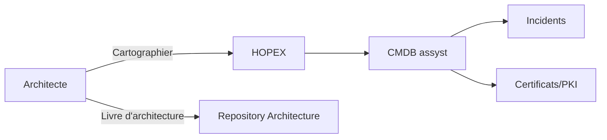
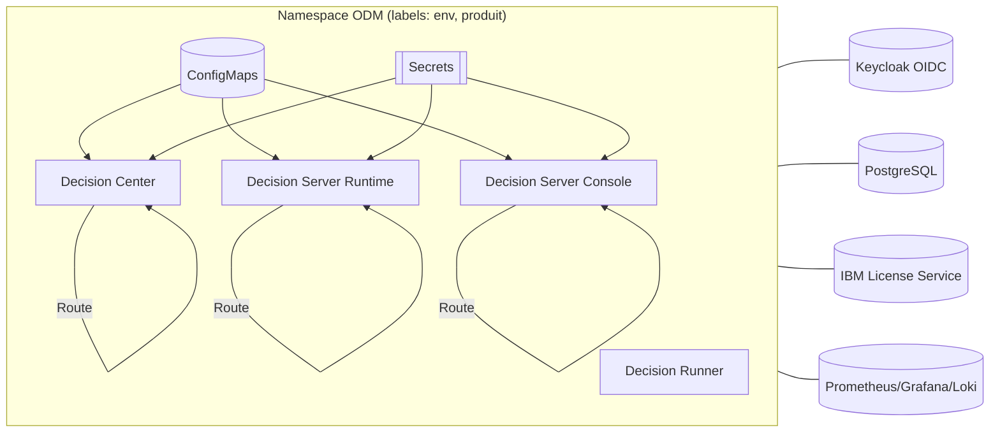
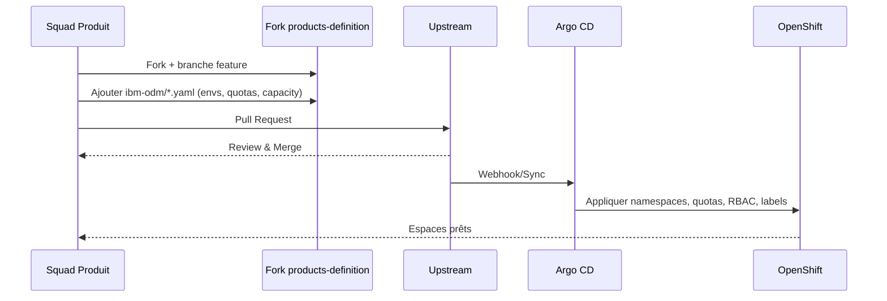
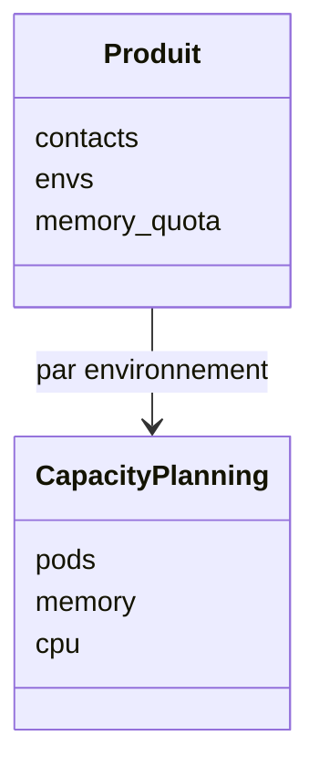

# Dossier de cadrage — Modernisation **IBM Operational Decision Manager (ODM)** sur OpenShift

> Objet : fournir la vision, le périmètre, l’architecture cible, la démarche GitOps, les exigences et le plan de migration/industrialisation d’IBM ODM vers OpenShift.

---

## 1. Résumé exécutif
- Moderniser IBM ODM (Decision Center, Decision Server Runtime, Decision Server Console, Decision Runner) en **mode container** sur **OpenShift**.
- Gouvernance **pull‑based GitOps**. Source de vérité : dépôts Git produits.
- **SSO OIDC** via Keycloak, **PostgreSQL** en lieu et place d’Oracle (si retenu), **observabilité** Prometheus/Grafana/Loki, **licensing** via IBM License Service.
- Déploiement multi‑environnements : sandbox, build, preprod, prod.
- Cibles non‑fonctionnelles : haute dispo, sécurité, conformité, SRE (SLO/SLI), capacité et coût.

---

## 2. Contexte et objectifs
**Contexte** : parc hétérogène (Tomcat/Oracle/VM), dette technique, faible automatisation, exposition non unifiée.
**Objectifs** :
- Standardiser sur **Liberty + Postgres + OIDC**.
- Passer à **Kubernetes/OpenShift** avec **GitOps** (Argo CD).
- Fiabiliser le **run** (SRE), industrialiser CI/CD, tracer la conformité (licences, sécurité, audit).

---

## 3. Périmètre
- Composants ODM : DC, DSR, DSC, DR.
- Services techniques : Keycloak, Postgres/Operator, IBM License Service, Prometheus/Grafana/Loki, cert‑manager, Ingress/Routes.
- Hors-périmètre initial : refonte fonctionnelle des règles.

---

## 4. Cartographie et référentiels
- **HOPEX** : Solutions SI, Systèmes techniques.
- **CMDB assyst** : CI et dépendances (clusters, namespaces, bases, VIP, certificats).
- **PKI & Certificats** : catalogués, chaînes, renouvellement.
- **Incidents/Problems/Changes** : liens vers objets CMDB.



---

## 5. Architecture cible
### 5.1 Vue logique ODM sur OpenShift



### 5.2 Exposition et DNS
- **Route OpenShift** : `odm-runtime.<env>.IBM_ODM.apps.<cluster>.local`.
- Alias DNS techniques : `*.apps.<cluster>.local`.

### 5.3 Sécurité
- OIDC / Authorization Code Flow via Keycloak (groupes → rôles ODM).
- `runAsNonRoot`, `readOnlyRootFilesystem` si possible, NetworkPolicy, PSS.
- Secrets en Kubernetes, rotation des credentials.

### 5.4 Observabilité
- Scrape Prometheus, logs Loki, dashboards Grafana (JVM, Liberty, ODM KPIs, SLI/SLO).

### 5.5 Licensing
- Déploiement **IBM License Service**. Annotations pods :
  - `productName`, `productID`, `productVersion`, `productMetric` (ex: VIRTUAL_PROCESSOR_CORE).

---

## 6. Démarche **pull‑based GitOps**


**Arborescence type**
```
ibm-odm/
├── sandbox.yaml
├── build.yaml
├── preprod.yaml
├── prod.yaml
└── users/
    ├── edit.yaml
    └── admin.yaml
```

---

## 7. Capacity Planning
**But** : déclarer tôt les besoins par **namespace** (pods, mémoire, CPU).

Règles :
- `capacity_planning.pods` = nb de pods nécessaires.
- `capacity_planning.memory` = somme des **requests mémoire** des pods.
- `capacity_planning.cpu` = somme des **requests CPU** des pods.
- **Prod** : valeurs **pour 1 bâtiment**. Les tableaux Grafana appliquent ×2.
- `memory_quota` (cluster) ≥ somme des `memory` des envs + marge (~50 % du plus gros env).



**Exemple** `build.yaml` :
```yaml
contacts:
  - squad-odm_at_maif

envs:
  - tdv1
  - tdv2

memory_quota: 10Gi
capacity_planning:
  pods: 5
  memory: 6.5Gi
  cpu: 2000m
```

---

## 8. Environnements et conventions
| Env        | Usage             | Nommage Route                                 | Notes |
|------------|-------------------|-----------------------------------------------|-------|
| sandbox    | bac à sable       | `*.ttech.IBM_ODM.apps.<cluster>.local`         | quotas réduits |
| build      | intégration       | `*.tdv*.IBM_ODM.apps.<cluster>.local`          | CI, non‑prod |
| preprod    | pré‑production    | `*.recx/recz.IBM_ODM.apps.<cluster>.local`     | proche prod |
| prod       | production        | `*.prod.IBM_ODM.apps.<cluster>.local`          | HA, SLO |

Taints/Tolerations :
- Nœuds **infra** taintés `role=infra:NoSchedule`.
- Workloads ODM applicatifs **sans** toleration → workers.

---

## 9. CI/CD et artefacts
- Build images via pipeline (Jenkins/Tekton). Publication **Nexus/Registry**.
- Charts Helm/Overlays Argo CD par env. Promotion GitOps (PR/merge).
- Artefacts : RuleApps `.dsr`, XOM `.jar`, WAR Liberty.

---

## 10. Migration
### 10.1 As‑Is → To‑Be
- **Serveur** : Tomcat/WebLogic → Liberty container.
- **Base** : Oracle → PostgreSQL (si validé), schémas `wdc`, `res1/res2`.
- **Auth** : LDAP Basic → OIDC Keycloak.
- **Infra** : VM → OpenShift.

### 10.2 Stratégie
- Phase 1 : **lift‑and‑shift** ODM 9.x en containers sur OpenShift.
- Phase 2 : **SSO OIDC**, observabilité, ILS, durcissement sécurité.
- Phase 3 : **optimisation** coûts/perf, autoscaling, GitOps complet.

### 10.3 Données
- Scripts de création PostgreSQL (users/schemas, index, perms).
- Plan de bascule des connexions applicatives.

---

## 11. Tests et critères d’acceptation
- **Fonctionnels** : exécution de RuleApps, console DC/DSC.
- **Perf** : temps réponse p95/p99, débit nominal, GC stable.
- **Résilience** : perte d’un nœud/bâtiment, redémarrage pods.
- **Sécu** : parcours SSO, RBAC, secrets, NetworkPolicy.
- **Licences** : ILS collecte métriques correcte.

---

## 12. SRE — SLI/SLO
- **Disponibilité** DSR : SLO 99.9 % mensuel.
- **Latence** REST p95 < 300 ms (à calibrer).
- **Erreur** taux 5xx < 0.5 %.
- **Saturation** CPU < 70 % moyenne, mémoire sans OOM.

---

## 13. Sauvegarde & PRA
- Backups Postgres (snapshots + logical). RPO/RTO à définir.
- Export RuleApps/Artifacts, sauvegarde Config/Secrets chiffrés.
- Rejeu GitOps (infra as code).

---

## 14. Sécurité & conformité
- PSS baseline, SecurityContext strict, images signées, scans.
- Certificats TLS gérés (cert‑manager/PKI).
- Journaux d’audit, rotation secrets, RBAC least privilege.

---

## 15. Risques & mitigations
| Risque | Impact | Mitigation |
|---|---|---|
| Incompatibilité versions ODM/liberty | Blocage | POC versionné, matrice de compatibilité |
| Sous‑dimensionnement | Dégradations | Capacity planning initial + tests de charge |
| SSO/OIDC mal mappé | Accès | Synchronisation rôles Keycloak/ODM, tests bout‑en‑bout |
| Licences mal comptées | Non‑conformité | ILS + annotations, revue juridique |

---

## 16. Planning macro
| Phase | Jalons | Durée |
|---|---|---|
| Cadrage | Cartographie, capacity v0 | 2–3 semaines |
| POC | ODM 9.x sur OCP, SSO, ILS | 3–4 semaines |
| Industrialisation | GitOps, observabilité, sécurité | 4–6 semaines |
| Bascule | Données, DNS, validation | 2 semaines |

---

## 17. RACI (extrait)
| Activité | Archi | Ops | Sécurité | Squad Hébergement | Produit |
|---|---|---|---|---|---|
| Cartographie HOPEX/CMDB | R | C | C | I | I |
| Capacity planning | A | R | C | C | A |
| GitOps (repos/PR) | C | R | C | A | C |
| SSO OIDC | C | R | A | C | C |
| Licensing ILS | C | R | C | A | I |

---

## 18. Livrables
- Livre d’architecture, Modèles Mermaid des vues, Fichiers `products-definition`.
- Charts Helm/Manifests, pipelines CI/CD, tableaux de bord Grafana.
- Runbooks (déploiement, incident, rollbacks), matrices RACI.

---

## 19. Annexes
### 19.1 Exemples Route/Service
```yaml
apiVersion: v1
kind: Service
metadata:
  name: odm-runtime
spec:
  selector: { app: odm, role: runtime }
  ports:
    - name: http
      port: 80
      targetPort: 9080
---
apiVersion: route.openshift.io/v1
kind: Route
metadata:
  name: odm-runtime
spec:
  to: { kind: Service, name: odm-runtime }
  port: { targetPort: http }
  tls:
    termination: edge
    insecureEdgeTerminationPolicy: Redirect
```

### 19.2 Taints & tolerations (rappel)
```bash
oc taint node <infra-node> role=infra:NoSchedule
oc describe node <infra-node> | egrep "Taints|Labels"
```

### 19.3 Commandes utiles
```bash
oc whoami && oc status
oc get nodes -o wide
oc get projects | head
oc -n <ns> get all -o wide
oc -n <ns> get events --sort-by=.lastTimestamp | tail -n 30
```

