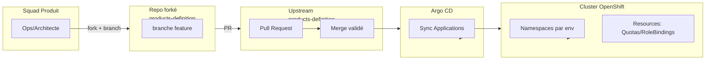
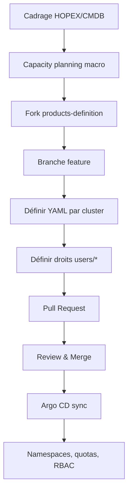
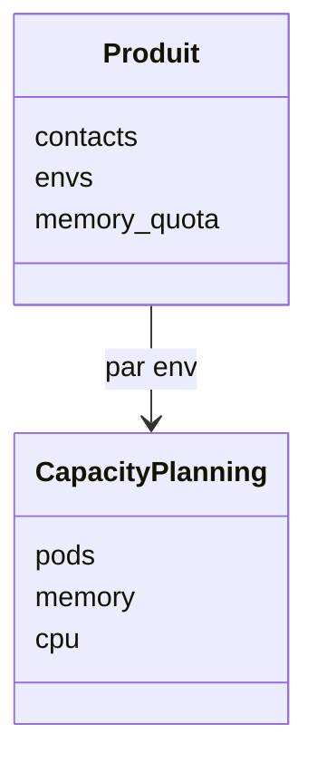
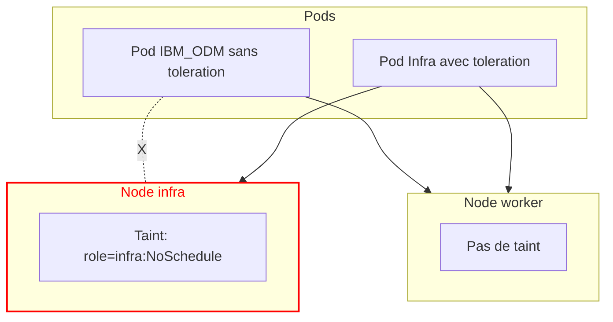
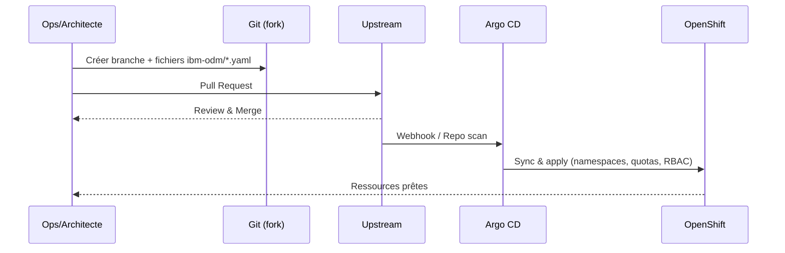

# Gestion produit GitOps — **IBM_ODM**

But : formaliser la démarche **pull‑based GitOps** pour déclarer et maintenir le produit *IBM_ODM* sur OpenShift.
Public : Ops / Architectes produit. Livrable : fichiers YAML par cluster + droits utilisateurs.

---

## 0) Vue d’ensemble



---

## 1) Cadrage produit
- **Cartographier** dans HOPEX (solution SI + système technique CMDB).
- **Anticiper** capacity planning amont (macro) : pods, memory, CPU par env.
- **Source de vérité** : répertoire produit dans *products‑definition*.

---

## 2) Démarche opératoire
1. **Fork** le dépôt `products-definition`.
2. **Créer une branche** `feature/ibm-odm-capacity`.
3. **Créer le répertoire** `ibm-odm/` à la racine.
4. **Ajouter** 4 fichiers cluster : `sandbox.yaml`, `build.yaml`, `preprod.yaml`, `prod.yaml`.
5. **Ajouter** les droits : `users/edit.yaml` et `users/admin.yaml`.
6. **PR** vers `master` du dépôt amont.
7. **Validation** par Squad Hébergement Applications → génération auto des ressources.

---

## 3) Schéma « parcours produit »



---

## 4) Arborescence de référence

```
ibm-odm/
├── sandbox.yaml
├── build.yaml
├── preprod.yaml
├── prod.yaml
└── users/
    ├── edit.yaml
    └── admin.yaml
```

---

## 5) Modèles YAML — *IBM_ODM*

### 5.1 `build.yaml`
```yaml
contacts:
  - zdmooc_at_github
  - squad-odm_at_maif

envs:
  - tdv1
  - tdv2
  - recx

# quota global mémoire (cluster build)
memory_quota: 8Gi

# capacity planning par défaut (s’applique à chaque env non surchargé)
capacity_planning:
  pods: 6
  memory: 2Gi
  cpu: 600m

# visibilité ops (exemple)
ops_visibility: true
exploit_hors_prod_visibility: false
```

### 5.2 `preprod.yaml`
```yaml
contacts:
  - zdmooc_at_github

envs:
  - recz

memory_quota: 6Gi
capacity_planning:
  pods: 4
  memory: 2Gi
  cpu: 400m
```

### 5.3 `prod.yaml` (exemple avec surcharge par env)
```yaml
contacts:
  - zdmooc_at_github

# map pour surcharger envs individuellement
envs:
  tdv3: {}
  pprod:
    capacity_planning:
      pods: 4
      memory: 4Gi
      cpu: 800m
  prod:
    capacity_planning:
      pods: 6
      memory: 6Gi
      cpu: 1200m

# défaut si non surchargé (ex: tdv3)
capacity_planning:
  pods: 3
  memory: 2Gi
  cpu: 400m

# quota global mémoire prod
memory_quota: 24Gi
```

### 5.4 `sandbox.yaml`
```yaml
contacts:
  - zdmooc_at_github

envs:
  - ttech

memory_quota: 2Gi
capacity_planning:
  pods: 2
  memory: 1Gi
  cpu: 200m
```

### 5.5 Droits `users/edit.yaml`
```yaml
edit:
  - 99998A
  - 99999B
```

### 5.6 Droits `users/admin.yaml`
```yaml
admin:
  - 88998A
  - 88999B
  - 99999B
```

> Conventions contact : remplacer `@` par `_at_`. Limiter à 2 entrées, 63 caractères max.

---

## 6) Capacity planning — règles de calcul



- **pods** : nb de pods par namespace.
- **memory** : somme des *requests* mémoire par namespace.
- **cpu** : somme des *requests* CPU par namespace.
- **Production** : déclarer les besoins pour **1 bâtiment** (Grafana multiplie par 2).
- **memory_quota** (cluster) : `sum(memory envs) + marge`.
  - Marge ≈ **50 %** du plus gros namespace.
  - Ne pas inclure Prometheus community.

Exemples :
- Hors‑prod : `somme envs horsprod + marge(50% plus gros env)`
- Prod : `2 × memory(prod) + memory(formation) + marge`

---

## 7) Taints & Tolerations — principe d’atterrissage



- ODM applicatif : **sans** toleration → workers.
- Composants infra (ingress/monitoring) : **avec** toleration → nodes infra.

Commandes utiles :
```bash
oc taint node <infra-node> role=infra:NoSchedule
oc describe node <infra-node> | egrep "Taints|Labels"
```

---

## 8) Séquence GitOps



---

## 9) Contrôles et dépannage
```bash
# Présence des namespaces/tagging
oc get ns | egrep "ibm-odm|IBM_ODM|env|produit"

# Quotas/limits
oc -n <ns> get resourcequota,limitrange -o wide

# RBAC
oc -n <ns> get rolebinding | egrep "admin|edit|view"

# Événements récents
oc -n <ns> get events --sort-by=.lastTimestamp | tail -n 30
```

---

## 10) Bonnes pratiques
- Documenter les hypothèses et marges dans la PR.
- Homogénéiser labels/annotations par env.
- Réviser capacity planning à chaque release majeure.
- Automatiser la vérif via CI (lint YAML, schémas JSON si existants).

---

## 11) Annexes spécifiques *IBM_ODM*
- Composants concernés : Decision Center, Decision Server Runtime, Decision Server Console, Decision Runner.
- Intégrations fréquentes : PostgreSQL, Keycloak OIDC, IBM License Service.
- Nommage Routes (exemple) : `odm-runtime.<env>.IBM_ODM.apps.maif.local`.

