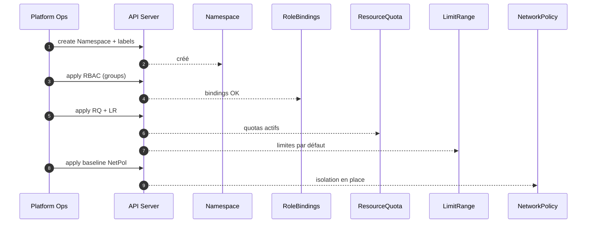
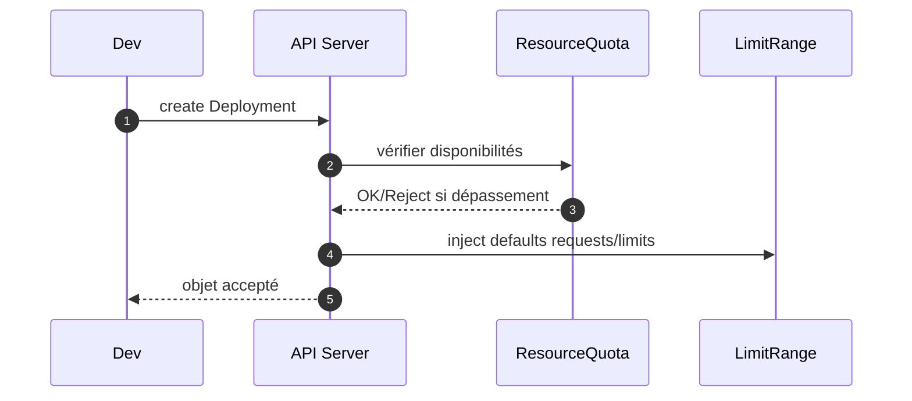

# 08 — Multi‑tenancy & Quotas (Namespaces • RBAC • Quotas • LimitRanges • Isolation)

## 0) Objectif
Organiser des équipes et environnements isolés, contrôlés et prévisibles : **namespaces**, **RBAC**, **quotas**, **LimitRanges**, **isolation réseau**, conventions, automatisation, et runbooks.

---

## 1) Modèle global
```mermaid
flowchart TB
  Users[Utilisateurs] --> Groups[Groupes IDP]
  Groups --> RBAC[RoleBinding par namespace]
  RBAC --> Roles[Roles (admin/edit/view/custom)]
  Roles --> NS[Namespaces projets]
  NS --> Quota[ResourceQuota]
  NS --> Limit[LimitRange]
  NS --> NetPol[NetworkPolicy]
  NS --> SA[ServiceAccounts + secrets]
```

---

## 2) Stratégie de découpage
- **Par équipe** : `team-a-*`, `team-b-*`.
- **Par environnement** : `*-dev`, `*-preprod`, `*-prod`.
- **Labels obligatoires** : `owner`, `env`, `cost-center`, `data-class`.
- **Conventions nommage** : kebab‑case court, pas d’underscore.

Exemple labels namespace :
```yaml
apiVersion: v1
kind: Namespace
metadata:
  name: web-prod
  labels:
    owner: team-web
    env: prod
    cost-center: cc-123
    data-class: internal
```

---

## 3) RBAC par rôles standards
- `admin` (projet) : plein droit sur le namespace.
- `edit` : déployer/modifier, pas les RBAC.
- `view` : lecture seule.

Bindings types :
```yaml
apiVersion: rbac.authorization.k8s.io/v1
kind: RoleBinding
metadata: { name: team-web-admins, namespace: web-prod }
subjects:
- kind: Group
  name: idp-team-web-admins
roleRef:
  apiGroup: rbac.authorization.k8s.io
  kind: ClusterRole
  name: admin
---
apiVersion: rbac.authorization.k8s.io/v1
kind: RoleBinding
metadata: { name: team-web-devs, namespace: web-prod }
subjects:
- kind: Group
  name: idp-team-web-devs
roleRef:
  apiGroup: rbac.authorization.k8s.io
  kind: ClusterRole
  name: edit
```

Bonnes pratiques :
- Groupes IDP par équipe et niveau (admins, devs, ops, lecteurs).
- SA dédiés pour pipelines et robots, jamais utiliser `default`.

---

## 4) Quotas de ressources (ResourceQuota)
Limiter objets et ressources CPU/Mémoire/Stockage.

### 4.1 Quota complet type
```yaml
apiVersion: v1
kind: ResourceQuota
metadata: { name: rq-standard, namespace: web-prod }
spec:
  hard:
    pods: "100"
    requests.cpu: "20"
    requests.memory: 64Gi
    limits.cpu: "40"
    limits.memory: 128Gi
    persistentvolumeclaims: "20"
    requests.storage: 2Ti
    services.loadbalancers: "2"
    services.nodeports: "4"
```

### 4.2 ClusterResourceQuota (plusieurs namespaces par label)
```yaml
apiVersion: quota.openshift.io/v1
kind: ClusterResourceQuota
metadata: { name: crq-team-web }
spec:
  selector:
    labels:
      matchLabels:
        owner: team-web
  quota:
    hard:
      requests.cpu: "60"
      requests.memory: 192Gi
      limits.cpu: "120"
      limits.memory: 384Gi
```

---

## 5) Limites par défaut (LimitRange)
Définir des **default requests/limits** et bornes min/max.
```yaml
apiVersion: v1
kind: LimitRange
metadata: { name: defaults, namespace: web-prod }
spec:
  limits:
  - type: Container
    default:
      cpu: "500m"
      memory: "512Mi"
    defaultRequest:
      cpu: "100m"
      memory: "256Mi"
    max:
      cpu: "2"
      memory: "2Gi"
    min:
      cpu: "50m"
      memory: "128Mi"
```

Options : ajouter section `type: PersistentVolumeClaim` pour tailles min/max de PVC.

---

## 6) Isolation réseau minimale (baseline)
Deny‑all + allowlist.
```yaml
apiVersion: networking.k8s.io/v1
kind: NetworkPolicy
metadata: { name: deny-all, namespace: web-prod }
spec:
  podSelector: {}
  policyTypes: [Ingress, Egress]
---
apiVersion: networking.k8s.io/v1
kind: NetworkPolicy
metadata: { name: allow-from-ingress, namespace: web-prod }
spec:
  podSelector: { matchLabels: { app: web } }
  policyTypes: [Ingress]
  ingress:
  - from:
    - namespaceSelector:
        matchLabels:
          kubernetes.io/metadata.name: openshift-ingress
---
apiVersion: networking.k8s.io/v1
kind: NetworkPolicy
metadata: { name: allow-egress-dns, namespace: web-prod }
spec:
  podSelector: {}
  policyTypes: [Egress]
  egress:
  - to:
    - namespaceSelector: { matchLabels: { kubernetes.io/metadata.name: openshift-dns } }
    ports:
    - { protocol: UDP, port: 53 }
    - { protocol: TCP, port: 53 }
```

---

## 7) Séquences de contrôle
### 7.1 Création projet guidée


### 7.2 Admission d’un Pod


---

## 8) Automatisation (template de projet)
- Désactiver self‑provisioner en prod.
- Exposer un **workflow** projet : demande via formulaire → labels, quotas, RBAC, NetPol appliqués.
- GitOps : manifestes de projet versionnés (namespace + RBAC + quotas + LR + NetPol).

Exemple arborescence Git :
```
platform-projects/
  web-dev/
    namespace.yaml
    rbac.yaml
    quota.yaml
    limitrange.yaml
    netpol-baseline.yaml
  web-prod/
    ...
```

---

## 9) Gouvernance supplémentaire
- **Registries autorisés** + **signatures** (voir canvas 03).
- **SCC** par défaut `restricted`.
- **Policies** Kyverno/Gatekeeper : probes obligatoires, anti‑`latest`, ressources max.
- **Quotas globaux** via ClusterResourceQuota pour coûts prévisibles.

---

## 10) Commandes utiles
```bash
# Quotas et limites
oc -n web-prod get resourcequota,limitrange -o wide
oc -n web-prod describe resourcequota rq-standard

# RBAC effectif
och auth can-i create pods --as=system:serviceaccount:web-prod:ci-bot -n web-prod

# NetworkPolicy
och -n web-prod get netpol

# ClusterResourceQuota (OpenShift)
oc get clusterresourcequota
```

---

## 11) Runbooks
- **Quota dépassé** : `oc describe resourcequota` → ajuster temporairement ou optimiser requests/limits.
- **Pod sans resources** : vérifier LimitRange injecte bien `defaultRequest`/`default`.
- **Accès refusé** : `oc auth can-i` avec l’identité SA/utilisateur.
- **Réseau bloqué** : baseline deny‑all → ajouter règles spécifiques.

---

## 12) Checklist
- Nommage et labels standardisés.
- RBAC par groupes IDP, SA dédiés.
- ResourceQuota et LimitRange appliqués par défaut.
- NetPol baseline deny‑all + allowlist.
- CRQ pour plafonds d’équipe.
- GitOps pour la création et l’évolution des projets.

