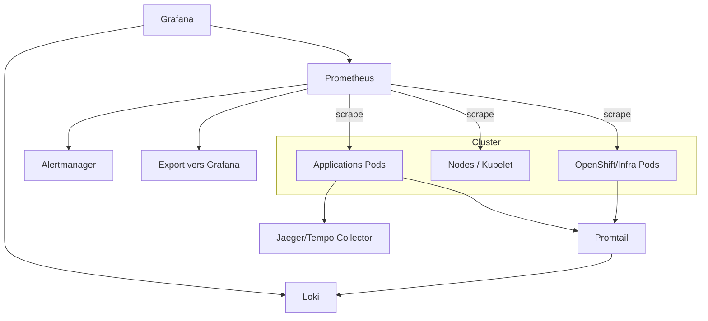
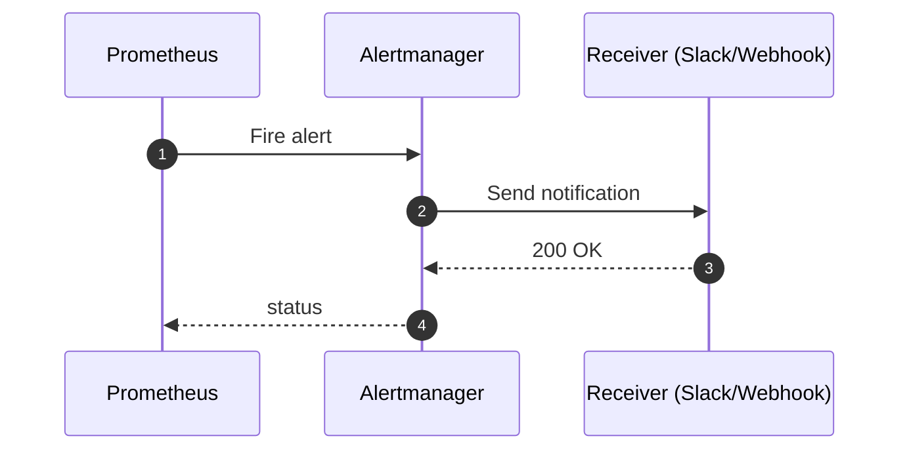
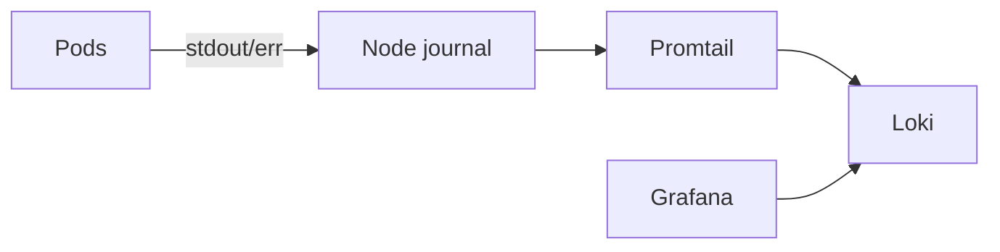
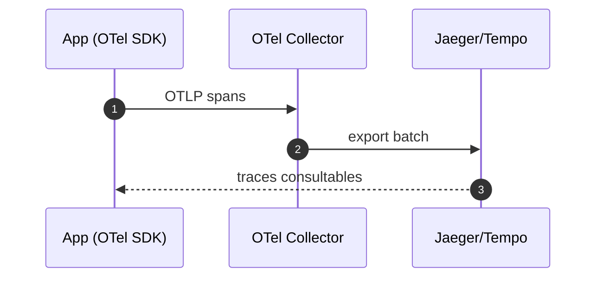

# 01 — Observabilité OpenShift (Prometheus • Alertmanager • Grafana • Loki • Traces)

## 0) Objectif
Concevoir une observabilité complète sur OpenShift : **métriques** (Prometheus), **alertes** (Alertmanager), **tableaux** (Grafana), **logs** (Loki/Promtail), **traces** (Jaeger ou Tempo), avec procédures d’installation, modèles, et runbooks.

---

## 1) Vue d’ensemble


---

## 2) Choix d’installation
- **OpenShift Monitoring par défaut** : stack gérée par Red Hat (namespaces `openshift-monitoring`, `openshift-user-workload-monitoring`).
- **Stack dédiée projet** : via Operators/Helm : Prometheus Operator, Grafana Operator, Loki Operator, Jaeger Operator.
- **Dev local (CRC)** : Grafana + Loki + Promtail en Helm, Jaeger all‑in‑one.

### Namespaces recommandés
- `monitoring` : Prometheus, Alertmanager, Grafana.
- `logging` : Loki, Promtail.
- `tracing` : Jaeger/Tempo.

---

## 3) Métriques — Prometheus
### 3.1 Concepts clés
- **Targets** : endpoints HTTP `/metrics`.
- **ServiceMonitor / PodMonitor** : ressources CRD pour découvrir les targets.
- **Relabelling** : normalisation des labels.
- **Recording rules** : agrégations pré‑calculées.
- **Alerting rules** : conditions → Alertmanager.

### 3.2 Exemple ServiceMonitor
```yaml
apiVersion: monitoring.coreos.com/v1
kind: ServiceMonitor
metadata:
  name: web-sm
  namespace: monitoring
spec:
  namespaceSelector:
    matchNames: ["app-dev"]
  selector:
    matchLabels:
      app: web
  endpoints:
  - port: http
    interval: 30s
```
Service exposant `/metrics` :
```yaml
apiVersion: v1
kind: Service
metadata:
  name: web
  namespace: app-dev
  labels: { app: web }
spec:
  selector: { app: web }
  ports:
  - name: http
    port: 8080
    targetPort: 8080
```

### 3.3 Règles d’alerting
```yaml
apiVersion: monitoring.coreos.com/v1
kind: PrometheusRule
metadata:
  name: app-rules
  namespace: monitoring
spec:
  groups:
  - name: availability.rules
    rules:
    - alert: HTTPHighErrorRate
      expr: sum(rate(http_requests_total{status=~"5.."}[5m]))
            /
            sum(rate(http_requests_total[5m])) > 0.05
      for: 10m
      labels:
        severity: warning
      annotations:
        summary: ">5% d’erreurs 5xx"
        runbook_url: "https://runbooks.internal/http-5xx"
```

---

## 4) Alertmanager — routage d’alertes
### 4.1 Config de base
```yaml
route:
  group_by: ["alertname","namespace"]
  group_wait: 30s
  group_interval: 5m
  repeat_interval: 4h
  receiver: default
  routes:
  - match:
      severity: critical
    receiver: pager

receivers:
- name: default
  slack_configs:
  - channel: "#alerts"
    send_resolved: true
- name: pager
  webhook_configs:
  - url: "https://ops.internal/pager"
```

### 4.2 Séquence d’alerte


---

## 5) Grafana — tableaux et datasources
### 5.1 Datasources
- **Prometheus** : métriques.
- **Loki** : logs (`{namespace="app-dev", app="web"}` + `|= "error"`).
- **Jaeger/Tempo** : traces.

### 5.2 Dashboards utiles
- **Kubernetes / Nodes / Pods** : CPU, mémoire, network, saturations.
- **SLO app** : taux d’erreur, latence p50/p95/p99, QPS.
- **ODM/Liberty** : threads, heap, GC, HTTP 5xx, temps de réponse.

### 5.3 Exemple panel requête Prometheus
```
sum(rate(container_cpu_usage_seconds_total{namespace="app-dev",pod=~"web-.*"}[5m]))
```

---

## 6) Logs — Loki + Promtail
### 6.1 Flux


### 6.2 Promtail DaemonSet minimal
```yaml
apiVersion: apps/v1
kind: DaemonSet
metadata: { name: promtail, namespace: logging }
spec:
  selector: { matchLabels: { app: promtail } }
  template:
    metadata: { labels: { app: promtail } }
    spec:
      serviceAccountName: promtail
      containers:
      - name: promtail
        image: grafana/promtail:2.9.0
        args: ["-config.file=/etc/promtail/config.yaml"]
        volumeMounts:
        - { name: varlog, mountPath: /var/log }
        - { name: config, mountPath: /etc/promtail }
      volumes:
      - { name: varlog, hostPath: { path: /var/log } }
      - name: config
        configMap:
          name: promtail-config
```

### 6.3 Règle de requête Loki
```
{namespace="app-dev", app="web"} |= "ERROR"
```

---

## 7) Traces — Jaeger (ou Tempo)
### 7.1 Intégration
- SDK OpenTelemetry/Jaeger dans l’application.
- Export OTLP → **Collector** → backend Jaeger/Tempo.

### 7.2 Déploiement simple (dev)
- Jaeger all‑in‑one dans `tracing`.
- Grafana datasource "Jaeger" pour visualisation.

### 7.3 Séquence


---

## 8) Sécurité
- **SCC** : containers non‑root, `readOnlyRootFilesystem`, `allowPrivilegeEscalation: false`.
- **RBAC** : accès lecture seule aux namespaces pour Prometheus/Grafana.
- **NetworkPolicy** : ouvrir ports des targets scrappés, Loki, Prometheus.
- **TLS** : activer HTTPS sur datasources, secrets pour credentials.

---

## 9) Stockage & rétention
- Prometheus : PV rapide, rétention 7–30 jours selon taille.
- Loki : index + chunks sur PV ou objet (S3/minio), rétention par label.
- Jaeger/Tempo : objet conseillé pour traces.

---

## 10) Dimensionnement initial (guide)
- Prometheus : 2 vCPU / 4–8 GiB RAM, PV 50–200 GiB.
- Loki : 2 vCPU / 4 GiB, PV 50 GiB (dev), plus en prod.
- Grafana : 1 vCPU / 2 GiB.
- Promtail : léger par nœud.

---

## 11) Procédure rapide (CRC) — Helm
```bash
# Namespaces
oc new-project monitoring || true
oc new-project logging || true
oc new-project tracing || true

# Grafana
helm repo add grafana https://grafana.github.io/helm-charts
helm -n monitoring upgrade --install grafana grafana/grafana \
  --set persistence.enabled=false \
  --set adminPassword=admin

# Loki + Promtail
helm -n logging upgrade --install loki grafana/loki \
  --set persistence.enabled=false
helm -n logging upgrade --install promtail grafana/promtail \
  --set config.clients[0].url=http://loki.logging.svc.cluster.local:3100/loki/api/v1/push

# Datasource Grafana (kubectl apply via ConfigMap ou UI)
```

---

## 12) SLO et alertes types
- **Disponibilité** : `5xx_rate < 1%` sur 30 min.
- **Latence** : `p95(http_request_duration_seconds) < 300ms`.
- **Saturation** : `container_memory_working_set_bytes` proche limit.
- **Erreur** : `CrashLoopBackOff` détecté.

---

## 13) Runbooks (extraits)
- **HTTPHighErrorRate** : vérifier version récente, pods impactés, logs Loki, rollbacks.
- **PodCrashLoop** : `oc describe pod`, events, probe config, mémoire/CPU.
- **NodeNotReady** : vérifier CNI, kubelet, `oc adm node-logs`.

---

## 14) Vérifications & dépannage
```bash
# Prometheus targets
oc -n monitoring port-forward svc/prometheus 9090:9090
# http://localhost:9090/targets

# Grafana login
oc -n monitoring get secret grafana -o jsonpath='{.data.admin-password}' | base64 -d; echo

# Loki ready
oc -n logging get pods

# Alertmanager UI
oc -n monitoring port-forward svc/alertmanager 9093:9093
```

---

## 15) Bonnes pratiques
- Versionner dashboards et règles dans Git. Déploiement GitOps.
- Éviter targets non protégés. Basic auth/TLS.
- Labels cohérents sur métriques, logs et traces.
- Rétention adaptée au coût. Export long terme si besoin.

