# OpenShift — Grand Schéma Intégré (Plateforme + Projet + Flux)

But : regrouper en un seul document les couches de la plateforme, les variantes de topologie, l’architecture d’un projet, et les séquences clés (réseau, images, CI/CD, GitOps, sécurité, stockage).

---

## 1) Couches OpenShift (bas → haut)
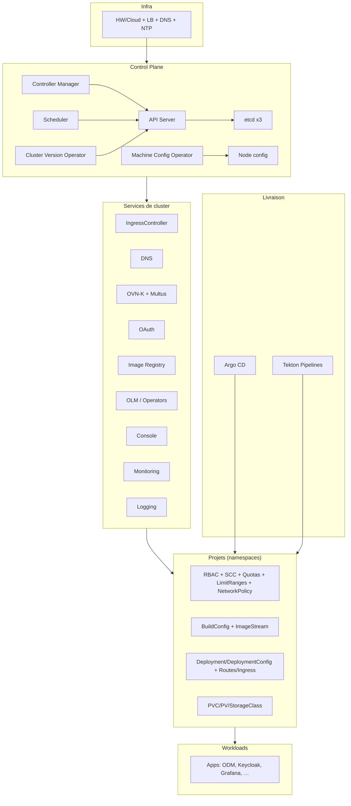

---

## 2) Variantes de topologie
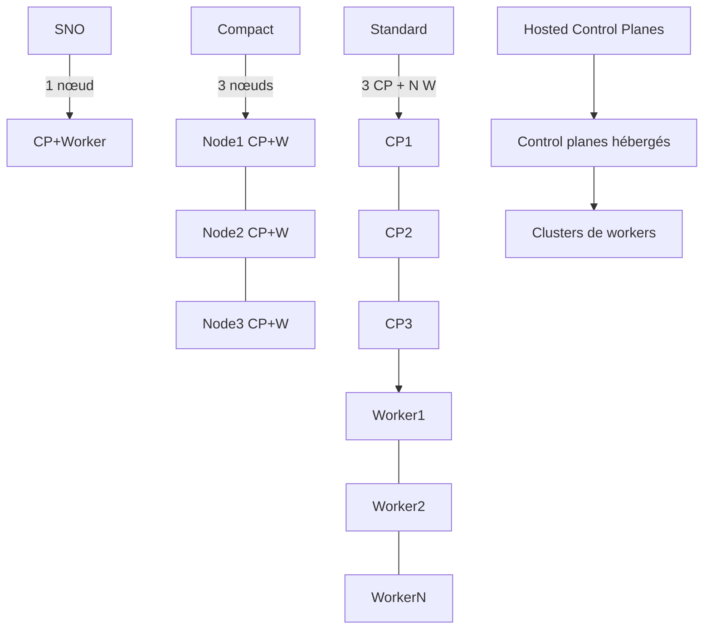

---

## 3) CRC : 1 nœud tout‑en‑un
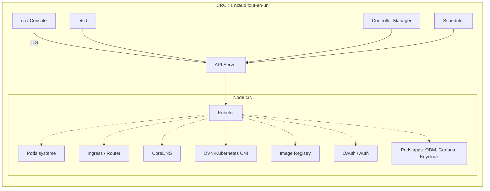

---

## 5) Architecture d’un projet (namespace)
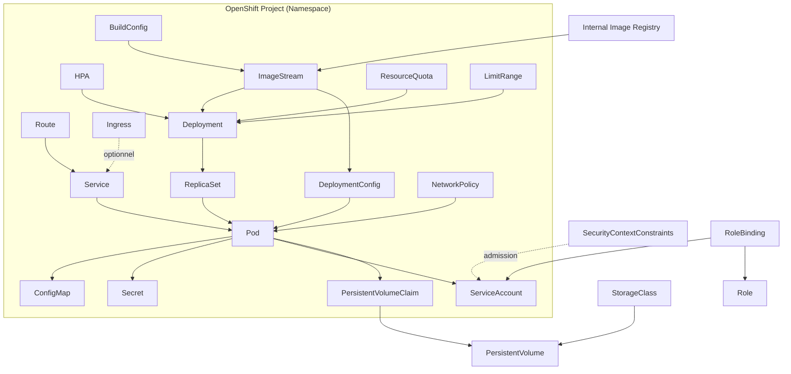

---

## 6) Contexte `oc` et rattachement au projet
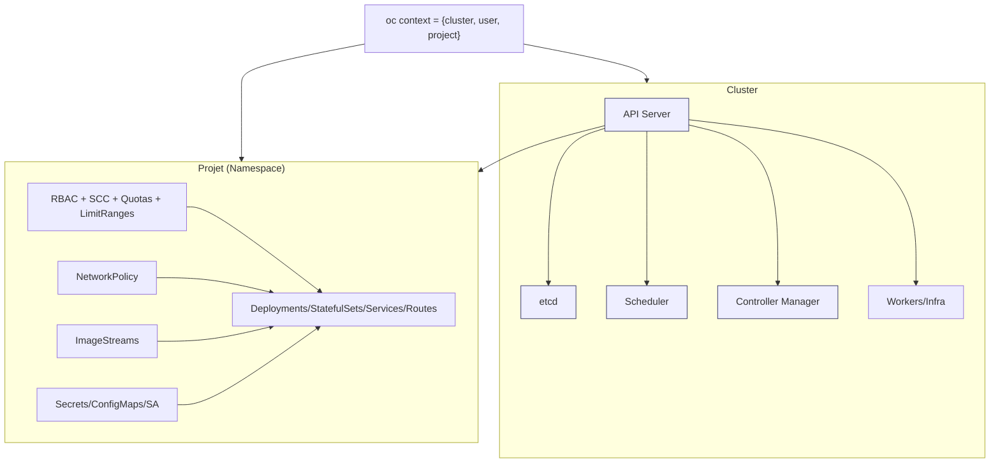

---

# Séquences clés

## 7) Trafic entrant : Route/Ingress → Service → Pod
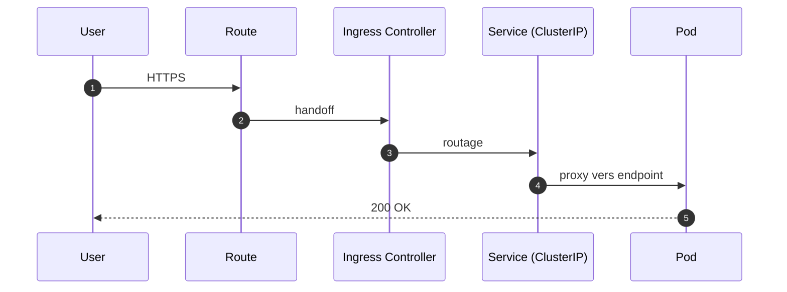

## 8) Build → Registry → Déploiement (ImageStream trigger)
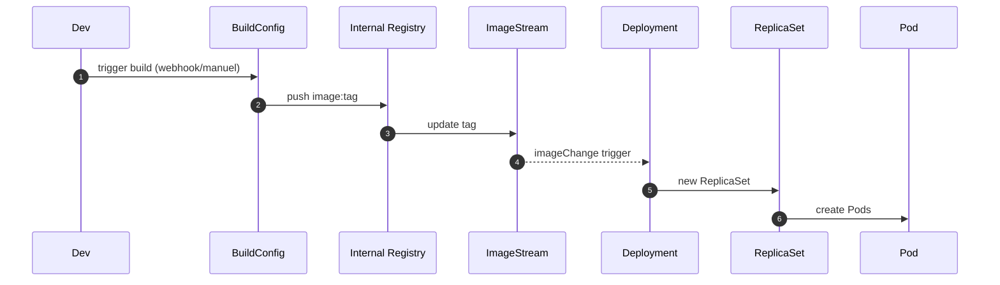

## 9) Mirroring d’une image externe vers le registry interne
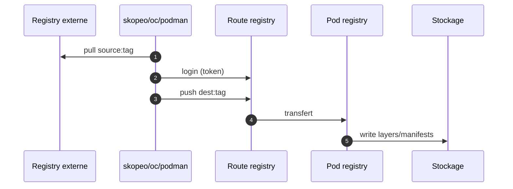

## 10) GitOps : Argo CD applique l’état Git
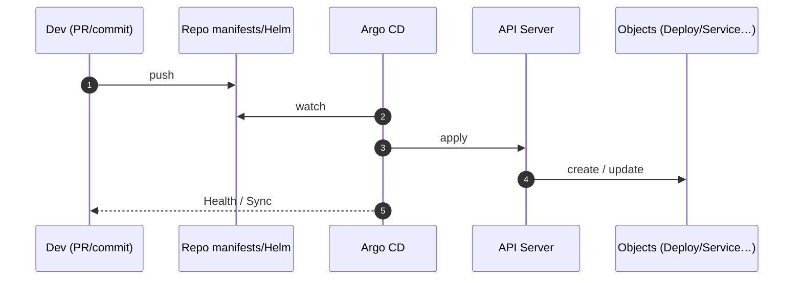

## 11) CI externe (Tekton/Jenkins) → Registry → GitOps
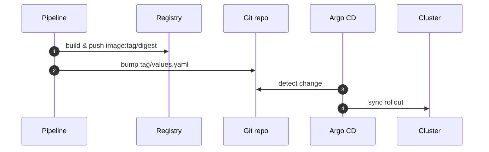

## 12) OAuth : login et token
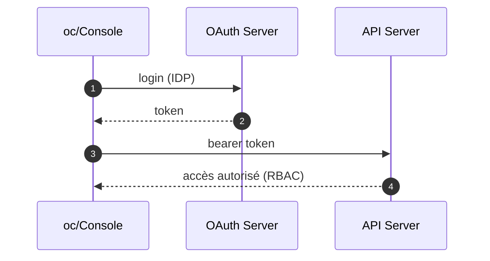

## 13) OLM : installation d’un Operator
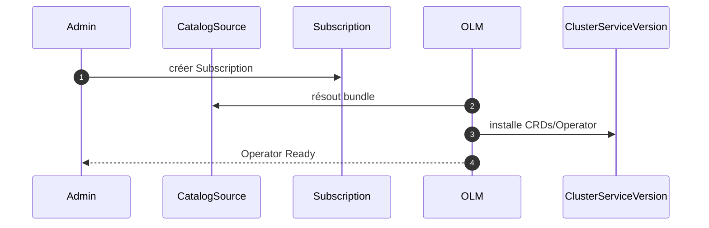

## 14) Provisioning dynamique : PVC → PV via StorageClass
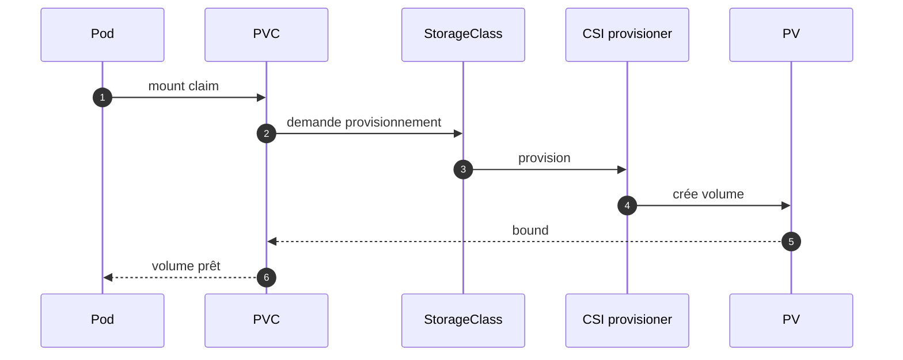

## 15) HPA : autoscaling horizontal
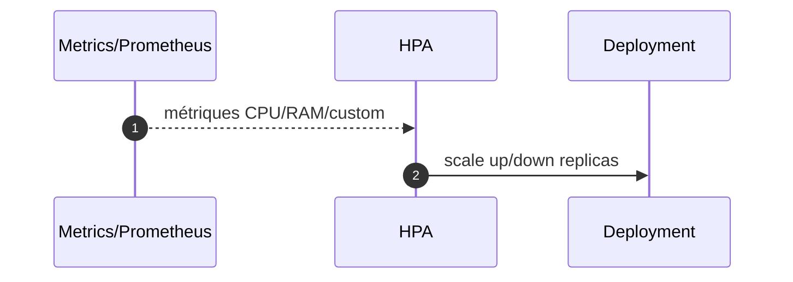

## 16) Admission : RBAC + SCC → création du Pod
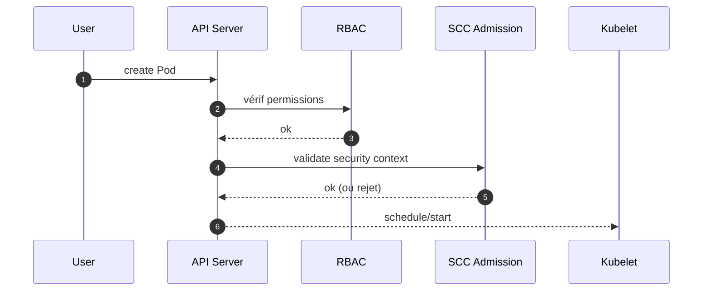

---

## 17) Rappels pratiques
- En DEV local CRC : registry via **route par défaut** pour push depuis le poste, endpoint **svc:5000** pour pull in‑cluster.
- En PROD : séparer **nœuds infra** (ingress/registry/monitoring) et **workers**.
- GitOps : Git = vérité. Aucune modification manuelle en PROD.
- Sécurité : SCC `restricted` par défaut, RBAC minimal, NetworkPolicy « deny‑all » + allowlist.
- Images : mirror des bases, Dockerfile dérivé pour custom, scan vuln.
- Stockage : choisir les `StorageClass` selon RWO/RWX et performance.

