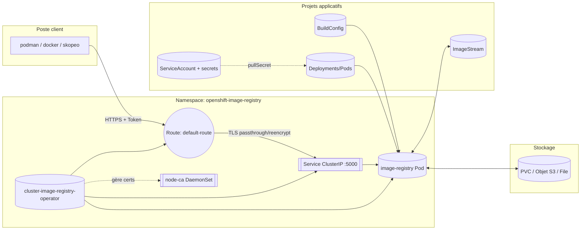
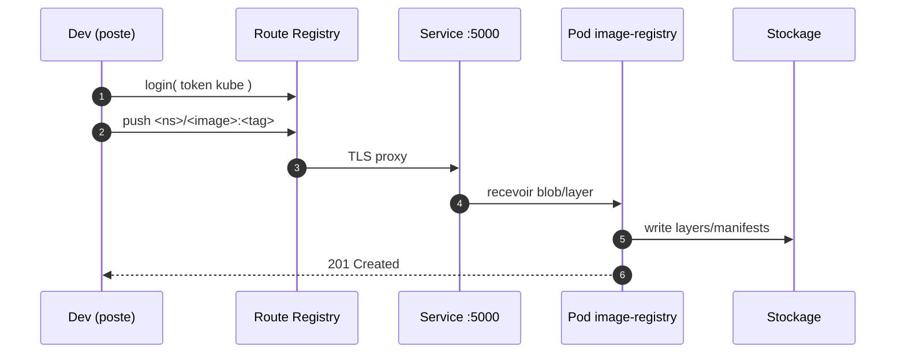
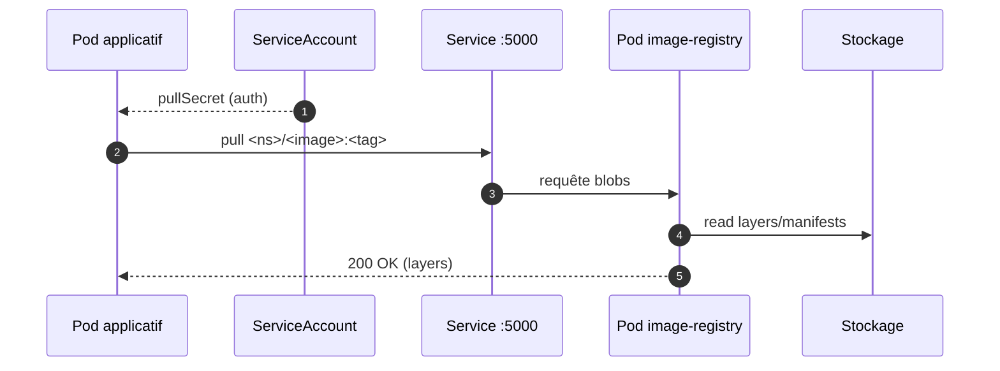
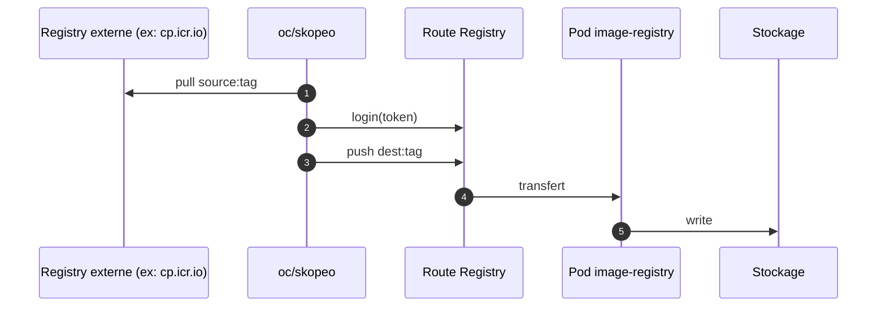

# OpenShift Image Registry — Schémas et séquences (CRC)

## 1) Repères rapides
- **Operator** : `cluster-image-registry-operator` (gère le cycle de vie du registry).
- **Pod registry** : `image-registry-xxxx` (sert/pousse/retire les images).
- **Node CA** : `node-ca-xxxx` (propage les certs vers les nœuds).
- **Endpoints** :
  - Interne cluster : `image-registry.openshift-image-registry.svc:5000`
  - Route externe : `default-route-openshift-image-registry.apps-crc.testing`
- **Stockage** : PVC/PV ou objet (selon conf). Sur CRC, souvent PV local.
- **Objets liés** : `ImageStream`, `BuildConfig`, `Deployment`, `ServiceAccount` + secrets pull/push.

---

## 2) Diagramme composants (vue logique)


---

## 3) Flux réseau et sécurité
- **Depuis l’extérieur** : accès via **Route** (TLS, auth token `oc whoami -t`).
- **Depuis le cluster** : accès via **Service** interne (`svc:5000`).
- **Auth** : token OpenShift ou *robot account* du registry.
- **TLS** : CRC → cert auto-signé côté route; côté cluster, confiance via `node-ca`.

---

## 4) Séquences clés

### 4.1 Push depuis le poste vers la Route


### 4.2 Pull depuis un Pod du cluster


### 4.3 Importer/mirrorer une image externe vers l’interne


---

## 5) Objets OpenShift impliqués
- **ImageRegistry (configs.imageregistry/cluster)** : active la `defaultRoute`, backend storage.
- **ImageStream** : méta-catalogue d’images par projet; déclenche imports et triggers.
- **BuildConfig** : S2I/Docker builds qui publient dans le registry.
- **Secrets** : `kubernetes.io/dockerconfigjson` pour pull/push.
- **ServiceAccount** : associe les secrets aux pods.

---

## 6) Décisions d’usage
- **Juste consommer** des images officielles → mirror via `oc image mirror`/`skopeo`.
- **Customiser ODM** (drivers, OIDC, conf) → image dérivée **FROM** l’officielle puis push.
- **Air‑gap** → plan de mirroring périodique + `ImageContentSourcePolicy`.

---

## 7) Endpoints et commandes repère
- Interne cluster :
  - `image-registry.openshift-image-registry.svc:5000/<ns>/<image>:<tag>`
- Externe (CRC) :
  - `default-route-openshift-image-registry.apps-crc.testing/<ns>/<image>:<tag>`

```bash
# Login route externe depuis le poste
TOKEN=$(oc whoami -t)
podman login default-route-openshift-image-registry.apps-crc.testing \
  -u $(oc whoami) -p $TOKEN --tls-verify=false

# Push d’une image taggée
podman push default-route-openshift-image-registry.apps-crc.testing/odm-dev/odm:9.5 --tls-verify=false

# Consommation depuis le cluster (déploiement)
oc -n odm-dev create deploy odm \
  --image=image-registry.openshift-image-registry.svc:5000/odm-dev/odm:9.5
```

