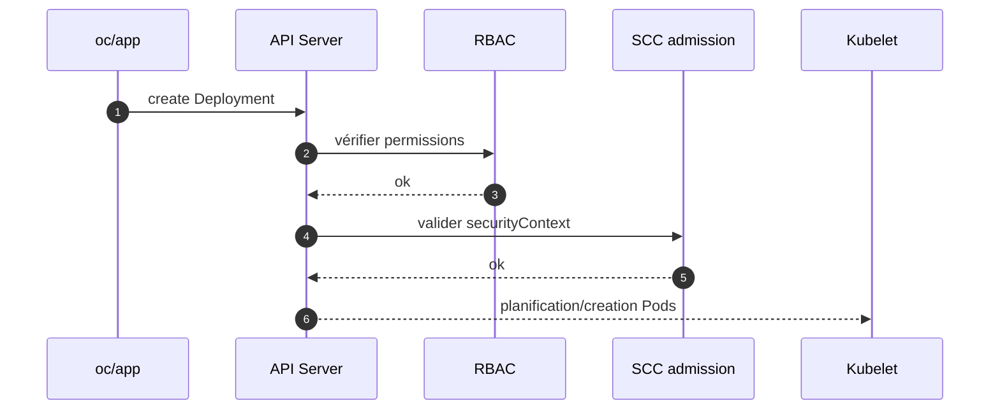
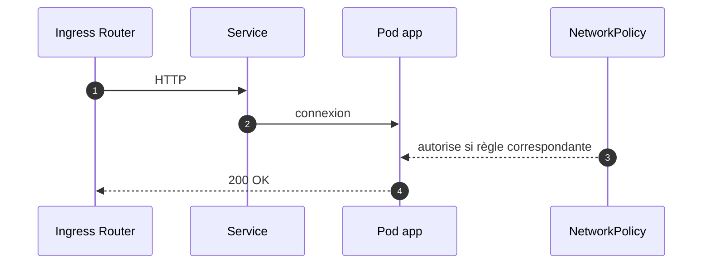

# OpenShift — Sécurité d’exécution (SCC • RBAC • NetworkPolicy)

## 0) Objectif
Poser les fondamentaux de la sécurité d’exécution sur OpenShift côté **identité/permissions (RBAC)**, **confinement à l’exécution (SCC)**, et **isolation réseau (NetworkPolicy)**, avec modèles prêts à l’emploi.

---

## 1) Principes
- **Identité** : chaque Pod s’exécute sous un **ServiceAccount**. Les accès API sont donnés via **Role/RoleBinding**.
- **Exécution** : les **SCC** imposent UID non-root, capabilities, seccomp, volumes, etc.
- **Réseau** : **NetworkPolicy** filtre les flux Ingress/Egress au niveau pod.
- **Secrets** : montés en volume ou env vars. Pull secrets pour registries privés.

---

## 2) RBAC minimal (exemples)
### ServiceAccount
```yaml
apiVersion: v1
kind: ServiceAccount
metadata:
  name: sa-app
  namespace: app-dev
```

### Role en lecture (ConfigMaps, Services)
```yaml
apiVersion: rbac.authorization.k8s.io/v1
kind: Role
metadata:
  name: role-read-config
  namespace: app-dev
rules:
- apiGroups: [""]
  resources: ["configmaps","services"]
  verbs: ["get","list","watch"]
```

### RoleBinding
```yaml
apiVersion: rbac.authorization.k8s.io/v1
kind: RoleBinding
metadata:
  name: bind-sa-app-read
  namespace: app-dev
subjects:
- kind: ServiceAccount
  name: sa-app
roleRef:
  apiGroup: rbac.authorization.k8s.io
  kind: Role
  name: role-read-config
```

### Vérifications utiles
```bash
oc -n app-dev auth can-i get configmaps --as=system:serviceaccount:app-dev:sa-app
oc -n app-dev get role,rolebinding
```

---

## 3) SCC : exécution conforme "restricted"
Recommandé par défaut : **non-root**, **pas d’élévation**, **capabilities drop**, **FS en lecture seule** si possible.

### Déploiement avec securityContext durci
```yaml
apiVersion: apps/v1
kind: Deployment
metadata:
  name: web
  namespace: app-dev
spec:
  replicas: 2
  selector:
    matchLabels: { app: web }
  template:
    metadata:
      labels: { app: web }
    spec:
      serviceAccountName: sa-app
      securityContext:
        seccompProfile:
          type: RuntimeDefault
      containers:
      - name: nginx
        image: registry.internal/app-dev/nginx:1.27
        ports:
        - containerPort: 8080
        securityContext:
          allowPrivilegeEscalation: false
          readOnlyRootFilesystem: true
          runAsNonRoot: true
          capabilities:
            drop: ["ALL"]
        resources:
          requests: { cpu: "100m", memory: "128Mi" }
          limits:   { cpu: "500m", memory: "256Mi" }
        volumeMounts:
        - name: cache
          mountPath: /tmp
      volumes:
      - name: cache
        emptyDir: { medium: Memory }
```

### Lier une SCC spécifique (à éviter sauf besoin)
```bash
# Éviter anyuid, préférer restricted. Exemple seulement :
oc -n app-dev adm policy add-scc-to-user anyuid -z sa-app
```

### Audit rapide
```bash
oc get scc
oc get pod web-xxxx -n app-dev -o jsonpath='{.metadata.annotations.openshift\.io/scc}\n'
```

---

## 4) NetworkPolicy : modèles utiles
### 4.1 Par défaut, tout interdire (Ingress)
```yaml
apiVersion: networking.k8s.io/v1
kind: NetworkPolicy
metadata:
  name: deny-all-ingress
  namespace: app-dev
spec:
  podSelector: {}
  policyTypes: ["Ingress"]
```

### 4.2 Par défaut, tout interdire (Egress)
```yaml
apiVersion: networking.k8s.io/v1
kind: NetworkPolicy
metadata:
  name: deny-all-egress
  namespace: app-dev
spec:
  podSelector: {}
  policyTypes: ["Egress"]
```

### 4.3 Autoriser le trafic intra-namespace
```yaml
apiVersion: networking.k8s.io/v1
kind: NetworkPolicy
metadata:
  name: allow-same-namespace
  namespace: app-dev
spec:
  podSelector: {}
  policyTypes: ["Ingress"]
  ingress:
  - from:
    - podSelector: {}
```

### 4.4 Autoriser depuis l’ingress controller OpenShift
```yaml
apiVersion: networking.k8s.io/v1
kind: NetworkPolicy
metadata:
  name: allow-from-openshift-ingress
  namespace: app-dev
spec:
  podSelector: { matchLabels: { app: web } }
  policyTypes: ["Ingress"]
  ingress:
  - from:
    - namespaceSelector:
        matchLabels:
          kubernetes.io/metadata.name: openshift-ingress
```

### 4.5 Autoriser egress DNS (CoreDNS)
```yaml
apiVersion: networking.k8s.io/v1
kind: NetworkPolicy
metadata:
  name: allow-egress-dns
  namespace: app-dev
spec:
  podSelector: {}
  policyTypes: ["Egress"]
  egress:
  - to:
    - namespaceSelector:
        matchLabels:
          kubernetes.io/metadata.name: openshift-dns
    ports:
    - protocol: UDP
      port: 53
    - protocol: TCP
      port: 53
```

### 4.6 Autoriser egress vers DB dans un autre namespace
```yaml
apiVersion: networking.k8s.io/v1
kind: NetworkPolicy
metadata:
  name: allow-egress-db
  namespace: app-dev
spec:
  podSelector: { matchLabels: { app: web } }
  policyTypes: ["Egress"]
  egress:
  - to:
    - namespaceSelector:
        matchLabels:
          kubernetes.io/metadata.name: data-prod
      podSelector:
        matchLabels:
          app: postgres
    ports:
    - protocol: TCP
      port: 5432
```

---

## 5) Secrets et pull secrets
### Créer un pull secret et le lier au SA
```bash
oc -n app-dev create secret docker-registry regcred \
  --docker-server=registry.internal \
  --docker-username=robot$ci --docker-password='TOKEN' \
  --docker-email=none@local
oc -n app-dev secrets link sa-app regcred --for=pull
```

### Monter un secret applicatif
```yaml
apiVersion: v1
kind: Secret
metadata:
  name: db-cred
  namespace: app-dev
type: Opaque
data:
  username: ZGJ1c2Vy   # base64
  password: c2VjcmV0
---
apiVersion: apps/v1
kind: Deployment
metadata: { name: web, namespace: app-dev }
spec:
  replicas: 1
  selector: { matchLabels: { app: web } }
  template:
    metadata: { labels: { app: web } }
    spec:
      serviceAccountName: sa-app
      containers:
      - name: web
        image: registry.internal/app-dev/web:1.0
        env:
        - name: DB_USER
          valueFrom: { secretKeyRef: { name: db-cred, key: username } }
        - name: DB_PASS
          valueFrom: { secretKeyRef: { name: db-cred, key: password } }
```

---

## 6) Séquences (admission, réseau)
### 6.1 Admission : RBAC + SCC


### 6.2 Réseau : politiques en action


---

## 7) Contrôles et diagnostics
```bash
# Qui peut utiliser une SCC ?
oc adm policy who-can use scc restricted
oc adm policy who-can use scc anyuid

# Quelle SCC a admis un pod ?
oc -n app-dev get pod web-xxxxx -o jsonpath='{.metadata.annotations.openshift\.io/scc}\n'

# Vérifier RBAC effectif
oc -n app-dev auth can-i list pods --as=system:serviceaccount:app-dev:sa-app

# Lister politiques réseau
oc -n app-dev get netpol
oc -n app-dev describe netpol allow-from-openshift-ingress

# Événements récents
oc -n app-dev get events --sort-by=.lastTimestamp
```

---

## 8) Checklist déploiement sécurisé
- ServiceAccount dédié par app. RBAC minimal.
- SCC « restricted » respectée. Image non-root. Capabilities drop ALL.
- FS en lecture seule si possible. Volumes `emptyDir` en mémoire pour /tmp.
- NetworkPolicy : deny-all + allowlist ciblée (ingress, egress DNS, DB, intra-ns).
- Pull secrets sur SA. Secrets montés via refs, jamais en clair.
- Requests/limits définis. Probes liveness/readiness configurées.
- `oc auth can-i` et annotation SCC vérifiées avant prod.

---

## 9) Étapes suivantes possibles
- Policy-as-code : Kyverno ou Gatekeeper (validate images, limits, probes).
- Supply chain : signatures d’images (Cosign), scans, provenance SLSA.
- SLO/Alerting : budgets d’erreur, alertes, runbooks incidents.

