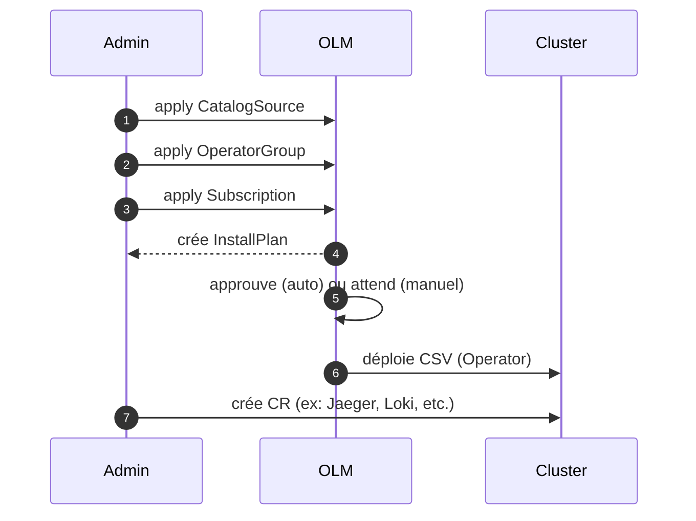
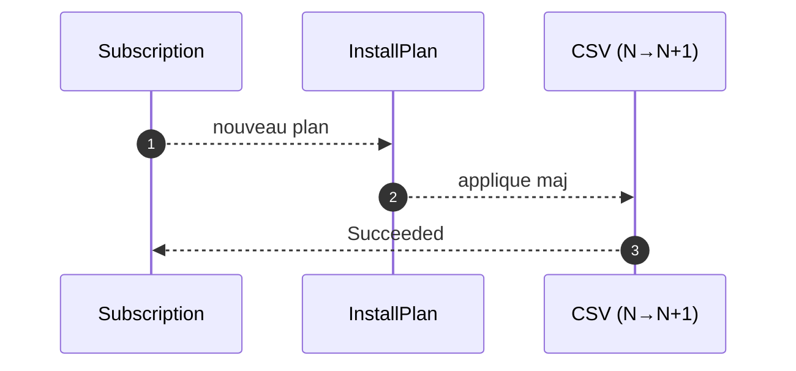

# 09 — Operators & OLM (CatalogSource • Subscription • CSV • CRD • GitOps)

## 0) Objectif
Maîtriser **OLM** pour installer, mettre à jour et gérer des **Operators** et leurs **CRDs/CRs**. Intégrer avec GitOps, contrôler la portée (all-namespaces vs single-namespace), sécuriser et dépanner.

---

## 1) Composants OLM
- **CatalogSource** : source de bundles (index FBC).
- **Subscription** : désir d’installer un Operator (canal, approbation, version).
- **InstallPlan** : plan d’installation/upgrade (auto ou manuel).
- **CSV (ClusterServiceVersion)** : état et métadonnées de la version installée.
- **OperatorGroup** : définit la **portée** (namespaces ciblés).
- **CRD / CR** : API fournie par l’Operator et ressources gérées.

---

## 2) Vue d’ensemble
```mermaid
flowchart TB
  CS[CatalogSource] --> Sub[Subscription]
  Sub --> IP[InstallPlan]
  IP --> CSV[ClusterServiceVersion]
  CSV --> CRD[CRDs]
  CRD --> CR[Custom Resources (CR)]
  OG[OperatorGroup] -. définit portée .-> CSV
```

Séquence d’installation :


---

## 3) Portées d’installation (Install Modes)
- **AllNamespaces** : Operator installé dans `openshift-operators`, regarde tous les namespaces.
- **SingleNamespace** : Operator + OperatorGroup dans le **namespace cible** seulement.
- **MultiNamespace** : Operator dans un ns, **watch** plusieurs ns listés par l’OperatorGroup.

Bonnes pratiques : préférer **Single/MultiNamespace** pour limiter la portée.

---

## 4) Manifests — modèle générique
### 4.1 CatalogSource (index FBC)
```yaml
apiVersion: operators.coreos.com/v1alpha1
kind: CatalogSource
metadata:
  name: partner-catalog
  namespace: openshift-marketplace
spec:
  sourceType: grpc
  image: quay.io/org/catalog:latest  # index image (FBC)
  displayName: Partner Catalog
  publisher: Partner
```

### 4.2 OperatorGroup (single namespace)
```yaml
apiVersion: operators.coreos.com/v1
kind: OperatorGroup
metadata:
  name: og-logging
  namespace: logging
spec:
  targetNamespaces: ["logging"]
```

### 4.3 Subscription
```yaml
apiVersion: operators.coreos.com/v1alpha1
kind: Subscription
metadata:
  name: loki-operator
  namespace: logging
spec:
  channel: stable
  installPlanApproval: Automatic   # ou Manual
  name: loki-operator
  source: partner-catalog
  sourceNamespace: openshift-marketplace
```

### 4.4 CR d’exemple (après installation)
```yaml
apiVersion: loki.grafana.com/v1
kind: LokiStack
metadata: { name: logs, namespace: logging }
spec:
  size: 1x.extra-small
  storage:
    schemas: [{ version: v13 }]
```

Ordre GitOps : **CatalogSource → OperatorGroup → Subscription → CR**.

---

## 5) Canaux, versions, approbation
- **channel** : `stable`, `fast`, `candidate`, etc.
- **installPlanApproval** : `Automatic` (OLM applique) ou `Manual` (vous approuvez).
- **pin de version** : forcer une version via `startingCSV` ou verrou GitOps.

---

## 6) Dépendances & permissions
- Les bundles déclarent **dependencies** (ex : CRDs préalables).
- Le CSV embarque RBAC, Deployments, Webhooks nécessaires.
- Vérifier SCC/PSA requises ; éviter d’élargir le cluster sans nécessité.

---

## 7) GitOps avec Argo CD
- Déployer OLM resources via App‑of‑Apps.
- **Sync waves** : `CatalogSource` wave 0, `OperatorGroup` wave 1, `Subscription` wave 2, CR wave 3.
- **IgnoreDifferences** pour champs gérés par OLM dans CSV.
- Fenêtres de sync et approbation manuelle pour upgrades sensibles.

Annotations utiles :
```yaml
metadata:
  annotations:
    argocd.argoproj.io/sync-wave: "1"
```

---

## 8) Upgrades
Séquence :

Bonnes pratiques :
- **Pre-prod** avant prod.
- **Manual** en prod critique.
- Lire notes de version de l’Operator.

---

## 9) Sécurité
- Préférer **Single/MultiNamespace**.
- Vérifier RBAC du CSV.
- **NetworkPolicy** pour isoler le namespace opérateur.
- **ImagePolicy**: forcer registries signés (voir canvas 03).
- **SCC restricted** par défaut pour workloads gérés.

---

## 10) Dépannage
```bash
# Vue générale
oc get catalogsource -A
oc get operators -A | head -n 20
oc get subscriptions -A
oc get installplan -A
oc get csv -A

# Détails et événements
oc describe subscription -n logging loki-operator
oc describe installplan -n logging <ip-name>
oc describe csv -n logging <csv-name>

# Logs opérateur
oc -n logging logs deploy/loki-operator-controller-manager -c manager
```
Problèmes courants :
- **CSV Pending** : dépendances manquantes, droits RBAC, CRDs non prêtes.
- **InstallPlan RequiresApproval** : approuver si `Manual`.
- **Image pull error** : secret registry manquant.

---

## 11) Patterns concrets
- **Operators de plateforme** : Logging, Monitoring, Service Mesh, Pipelines.
- **Operators applicatifs** : DB opérées (Postgres, Kafka), Jaeger, Keycloak.
- Limiter **all-namespaces** aux services réellement transverses.

---

## 12) Checklist
- CatalogSource validée et disponible.
- OperatorGroup correct (targetNamespaces).
- Subscription avec canal et stratégie d’approbation définis.
- CRDs installées, CRs appliqués via GitOps.
- Upgrades testées et planifiées.
- Sécurité et RBAC revus.
- Runbook de dépannage documenté.

