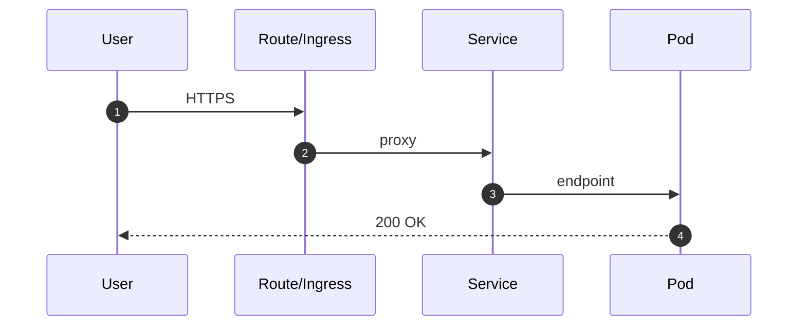

# 04 — Réseau avancé (Routes • Ingress • Services • EgressFirewall • EgressIP • Mesh)

## 0) Objectif
Maîtriser l’exposition, l’isolation, et la sortie réseau sous OpenShift : **Routes/Ingress**, **types de Service**, **NetworkPolicy**, **EgressFirewall**, **EgressIP**, et notions Mesh.

---

## 1) Carte mentale rapide
```mermaid
flowchart TB
  Client[Client HTTP(S)] --> Route[Route OpenShift]
  Client --> Ingress[Ingress]
  Route --> SVC[Service ClusterIP]
  Ingress --> SVC
  SVC --> Pod[Pod / Endpoints]
  Pod --> NP[NetworkPolicy]
  Pod --> EFW[EgressFirewall]
  Pod --> EIP[EgressIP]
```

---

## 2) Types de Services Kubernetes
- **ClusterIP** : défaut, interne au cluster.
- **NodePort** : ouvre un port sur chaque nœud. Usage limité.
- **LoadBalancer** : via cloud LB ou MetalLB on‑prem.
- **Headless (clusterIP: None)** : résolution directe Pods (stateful, gRPC, DBs).

### Modèles
```yaml
apiVersion: v1
kind: Service
metadata: { name: web }
spec:
  type: ClusterIP
  selector: { app: web }
  ports:
  - name: http
    port: 8080
    targetPort: 8080
---
apiVersion: v1
kind: Service
metadata: { name: web-nodeport }
spec:
  type: NodePort
  selector: { app: web }
  ports:
  - port: 8080
    targetPort: 8080
    nodePort: 32080
```

---

## 3) Exposition HTTP : **Route** vs **Ingress**
### Routes OpenShift
- Simples, natives OCP. TLS : **edge**, **reencrypt**, **passthrough**.
```yaml
apiVersion: route.openshift.io/v1
kind: Route
metadata: { name: web }
spec:
  to: { kind: Service, name: web }
  tls: { termination: edge }
```

### Ingress Kubernetes
- Standard K8s. Utilise l’Ingress Controller OpenShift.
```yaml
apiVersion: networking.k8s.io/v1
kind: Ingress
metadata:
  name: web
  annotations:
    route.openshift.io/termination: edge
spec:
  rules:
  - host: web.example.local
    http:
      paths:
      - path: /
        pathType: Prefix
        backend:
          service: { name: web, port: { number: 8080 } }
```

### Séquence d’un appel


---

## 4) NetworkPolicy: Ingress/Egress
Deny‑all + allowlist.
```yaml
apiVersion: networking.k8s.io/v1
kind: NetworkPolicy
metadata: { name: deny-all, namespace: app }
spec:
  podSelector: {}
  policyTypes: [Ingress, Egress]
---
apiVersion: networking.k8s.io/v1
kind: NetworkPolicy
metadata: { name: allow-from-ingress, namespace: app }
spec:
  podSelector: { matchLabels: { app: web } }
  policyTypes: [Ingress]
  ingress:
  - from:
    - namespaceSelector: { matchLabels: { kubernetes.io/metadata.name: openshift-ingress } }
---
apiVersion: networking.k8s.io/v1
kind: NetworkPolicy
metadata: { name: allow-egress-dns, namespace: app }
spec:
  podSelector: {}
  policyTypes: [Egress]
  egress:
  - to:
    - namespaceSelector: { matchLabels: { kubernetes.io/metadata.name: openshift-dns } }
    ports:
    - { protocol: UDP, port: 53 }
    - { protocol: TCP, port: 53 }
```

---

## 5) **EgressFirewall** (par namespace, OVN‑K)
Bloquer/autoriser destinations externes au niveau projet.
```yaml
apiVersion: k8s.ovn.org/v1
kind: EgressFirewall
metadata: { name: default, namespace: app }
spec:
  egress:
  - type: Allow
    to: { cidrSelector: 10.0.0.0/8 }
  - type: Allow
    to: { dnsName: api.trusted.local }
  - type: Deny
    to: { cidrSelector: 0.0.0.0/0 }
```
> Ordre évalué du haut vers le bas. Nécessite label `network.openshift.io/policy-group: ingress` côté router si besoin d’accès entrant.

---

## 6) **EgressIP** (source NAT sortante dédiée)
Forcer les Pods d’un namespace à sortir avec une IP spécifique.
```yaml
apiVersion: k8s.ovn.org/v1
kind: EgressIP
metadata: { name: app-egressip }
spec:
  egressIPs: ["192.0.2.50"]
  namespaceSelector:
    matchLabels: { kubernetes.io/metadata.name: app }
  podSelector:
    matchLabels: { app: web }
```
> L’IP doit être assignable sur un nœud compatible. Coordonné par OVN‑K.

---

## 7) Patterns d’exposition d’applications
- **HTTP(s) simple** : Route edge.
- **TLS de bout en bout** : Route reencrypt/passthrough.
- **gRPC/WS** : Ingress/Route passthrough.
- **TCP non‑HTTP** : `IngressController` custom + Route passthrough, ou SVC LoadBalancer.
- **Interne seulement** : ClusterIP + NetPol allowlist.

---

## 8) ODM / Liberty — points pratiques
- Probes (readiness/liveness) sur context‑root.
- Timeout router, headers X‑Forwarded.
- Certs côté route et côté app en reencrypt.
- Sticky session si nécessaire (routes expose `haproxy.router.openshift.io/balance` etc.).

---

## 9) Mesh (optionnel)
- **OpenShift Service Mesh** (Istio) : mTLS, traffic‑split, retries, mirroring.
- Canary/Blue‑Green via **VirtualService**/**DestinationRule** ou **Argo Rollouts**.

---

## 10) Dépannage
```bash
# Résolution DNS et endpoints
oc -n app get svc,pods,endpoints

# Router/Ingress
oc -n openshift-ingress get pods
oc -n openshift-ingress-operator get deployment

# NetPol
oc -n app get netpol

# EgressFirewall (OVN-K)
oc -n app get egressfirewall -o yaml

# EgressIP
oc get egressip -A

# Trafic vers pod
oc -n app rsh deploy/web curl -vk http://web:8080/health
```

---

## 11) Checklist
- Service choisi correctement (ClusterIP par défaut).
- Route/Ingress conforme + mode TLS adapté.
- NetPol deny‑all + allowlist ingress/dns/db.
- EgressFirewall appliqué si contrôle internet voulu.
- EgressIP si IP source dédiée requise.
- Probes et timeouts ajustés. Certs gérés.

