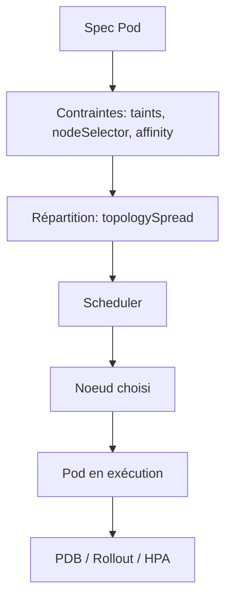
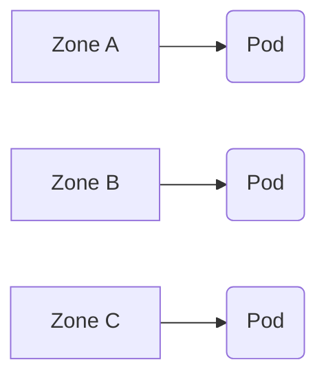
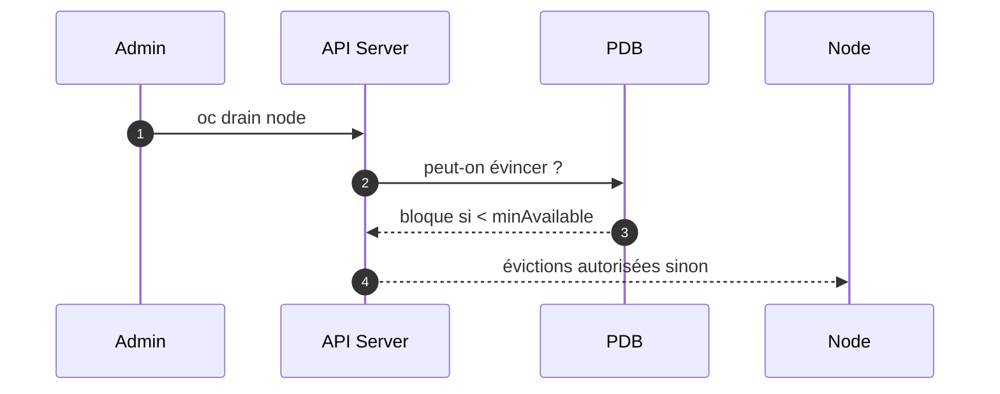
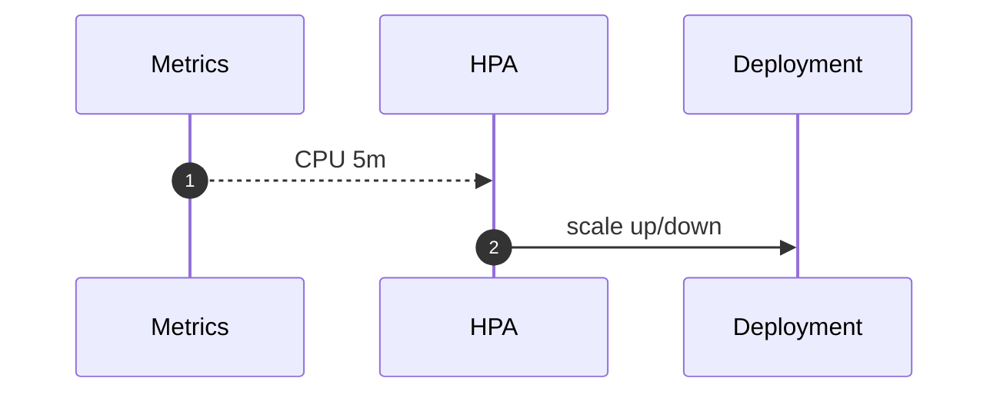

# 06 — Scheduling & HA (Taints • Affinités • Spread • PDB • HPA/VPA • Rollouts)

## 0) Objectif
Garantir disponibilité et placement optimisé des pods : **taints/tolerations**, **node/affinités**, **topologySpreadConstraints**, **PDB**, **HPA/VPA**, stratégies de **rollout**, **priorités/évictions**, et procédures de drain/maintenance.

---

## 1) Carte rapide


---

## 2) Taints & Tolerations
**Taint (nœud)** : repousse les pods sauf s’ils tolèrent. Bon pour nœuds infra/dédiés.
```bash
# Tainter un nœud (ex: dédié ingress)
oc taint node worker-1 role=ingress:NoSchedule
```
```yaml
# Tolérer le taint côté pod
spec:
  tolerations:
  - key: "role"
    operator: "Equal"
    value: "ingress"
    effect: "NoSchedule"
```

---

## 3) nodeSelector / Affinity / Anti-affinity
### 3.1 nodeSelector (simple)
```yaml
spec:
  nodeSelector:
    node-role.kubernetes.io/worker: ""
```

### 3.2 NodeAffinity (souple/strict)
```yaml
spec:
  affinity:
    nodeAffinity:
      requiredDuringSchedulingIgnoredDuringExecution:
        nodeSelectorTerms:
        - matchExpressions:
          - key: topology.kubernetes.io/zone
            operator: In
            values: [zone-a, zone-b]
      preferredDuringSchedulingIgnoredDuringExecution:
      - weight: 50
        preference:
          matchExpressions:
          - key: node-type
            operator: In
            values: [fast]
```

### 3.3 PodAntiAffinity (éviter co-localisation)
```yaml
spec:
  affinity:
    podAntiAffinity:
      requiredDuringSchedulingIgnoredDuringExecution:
      - labelSelector:
          matchLabels: { app: web }
        topologyKey: kubernetes.io/hostname
```

---

## 4) Répartition : TopologySpreadConstraints
Évite les déséquilibres par **zone**, **nœud**, **rack**.
```yaml
spec:
  topologySpreadConstraints:
  - maxSkew: 1
    topologyKey: topology.kubernetes.io/zone
    whenUnsatisfiable: DoNotSchedule
    labelSelector: { matchLabels: { app: web } }
```

Diagramme :


---

## 5) PodDisruptionBudget (PDB)
Protège un **minimum** de pods pendant drains/MAJ.
```yaml
apiVersion: policy/v1
kind: PodDisruptionBudget
metadata: { name: web-pdb, namespace: app }
spec:
  minAvailable: 2
  selector:
    matchLabels: { app: web }
```
Séquence drain :


---

## 6) Stratégies de rollout (Deployments)
```yaml
spec:
  strategy:
    type: RollingUpdate
    rollingUpdate:
      maxUnavailable: 1
      maxSurge: 1
```
Recommandations :
- **ReadinessProbe** stricte. Pas de `maxUnavailable: 0` si HPA actif.
- **ProgressDeadlineSeconds** pour détecter un rollout coincé.

StatefulSet : ordonné (pod-0 → pod-1 …), préférer PDB + anti‑affinité.

---

## 7) HPA / VPA
### 7.1 HPA (HorizontalPodAutoscaler)
```yaml
apiVersion: autoscaling/v2
kind: HorizontalPodAutoscaler
metadata: { name: web, namespace: app }
spec:
  scaleTargetRef: { apiVersion: apps/v1, kind: Deployment, name: web }
  minReplicas: 2
  maxReplicas: 10
  metrics:
  - type: Resource
    resource:
      name: cpu
      target:
        type: Utilization
        averageUtilization: 70
```
Séquence :


### 7.2 VPA (optionnel)
- Ajuste **requests/limits** automatiquement.
- Utiliser **HPA OU VPA** sur CPU cible, pas les deux en conflit.

---

## 8) Priorités & évictions
### 8.1 PriorityClass
```yaml
apiVersion: scheduling.k8s.io/v1
kind: PriorityClass
metadata: { name: high-priority }
value: 100000
preemptionPolicy: PreemptLowerPriority
globalDefault: false
description: "Services critiques"
```
Usage dans le Pod :
```yaml
spec:
  priorityClassName: high-priority
```

### 8.2 QoS (Guaranteed/Burstable/BestEffort)
- **Guaranteed** : requests = limits pour tous les conteneurs.
- **Burstable** : requests < limits.
- **BestEffort** : aucun request/limit.

Évictions sous pression : BestEffort en premier.

---

## 9) Probes & budgets de santé
```yaml
readinessProbe:
  httpGet: { path: /healthz, port: 8080 }
  periodSeconds: 5
  timeoutSeconds: 2
  failureThreshold: 3
livenessProbe:
  httpGet: { path: /live, port: 8080 }
  initialDelaySeconds: 20
  periodSeconds: 10
```
- Readiness protège le trafic pendant rollouts/HPA.
- Liveness redémarre les pods bloqués.

---

## 10) Drain / maintenance
Procédure :
```bash
# Empêcher nouvelles programmations
oc adm cordon <node>
# Évincer les pods en respectant PDB
oc adm drain <node> --ignore-daemonsets --delete-emptydir-data
# Maintenance…
# Réautoriser
oc adm uncordon <node>
```
Vérifier que PDB/HPA/anti‑affinité permettent de tenir la charge restante.

---

## 11) Patterns recommandés
- **Nœuds dédiés** : taints + tolerations pour ingress/registry/monitoring.
- **HA multi‑zones** : nodeAffinity + spread par `topology.kubernetes.io/zone`.
- **Anti‑co‑localisation** : PodAntiAffinity sur hostname.
- **PDB + RollingUpdate** : éviter les trous de capacité.
- **HPA** : scale sur CPU/métriques custom. Requests cohérents.
- **PriorityClass** : pour services critiques seulement.

---

## 12) Dépannage
```bash
# Pourquoi ce pod n’est pas schedulé ?
oc describe pod <pod> | sed -n '/Events/,$p'

# Voir taints, labels
oc describe node <node> | egrep "Taints|Labels"

# PDB
oc get pdb -A -o wide

# HPA état
oc -n app get hpa

# Répartition par zone
oc get pods -o custom-columns=NAME:.metadata.name,NODE:.spec.nodeName -n app
```

---

## 13) Checklist
- Taints/tolerations définis pour workloads spéciaux.
- Affinity/anti‑affinity et spread actifs par zone/nœud.
- PDB en place pour services stateful/stateless critiques.
- HPA configuré avec requests réalistes et probes OK.
- Stratégie RollingUpdate calibrée (maxSurge/maxUnavailable)