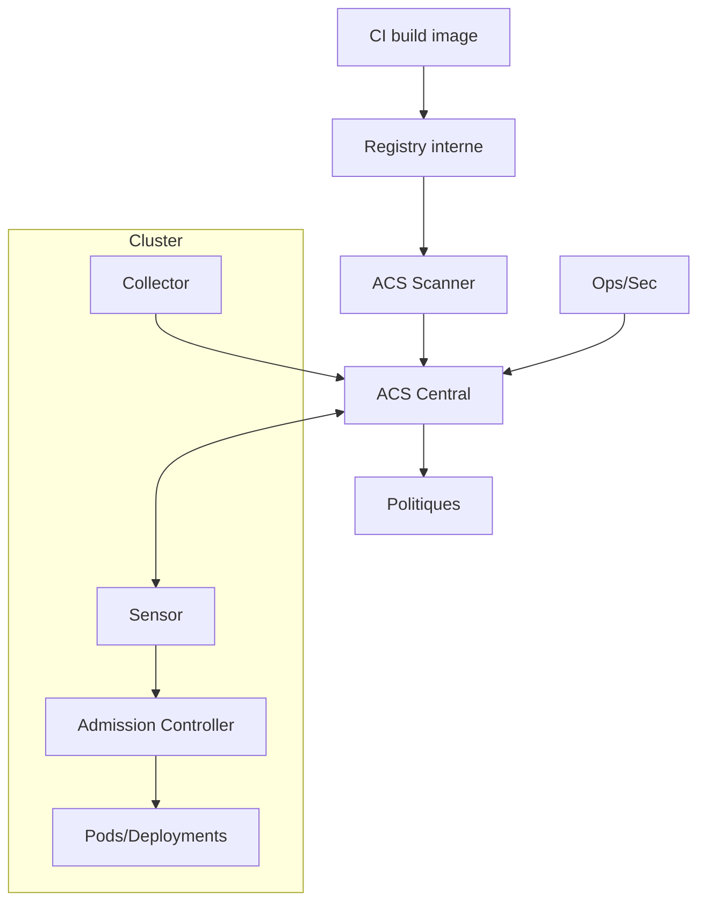
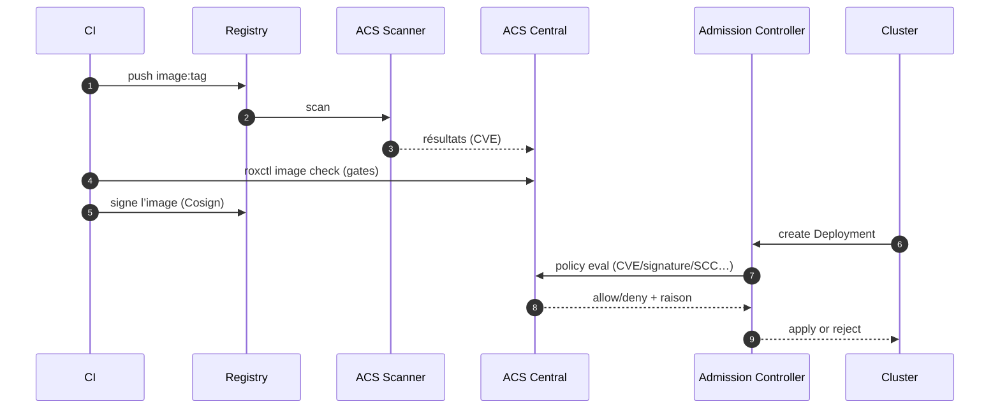
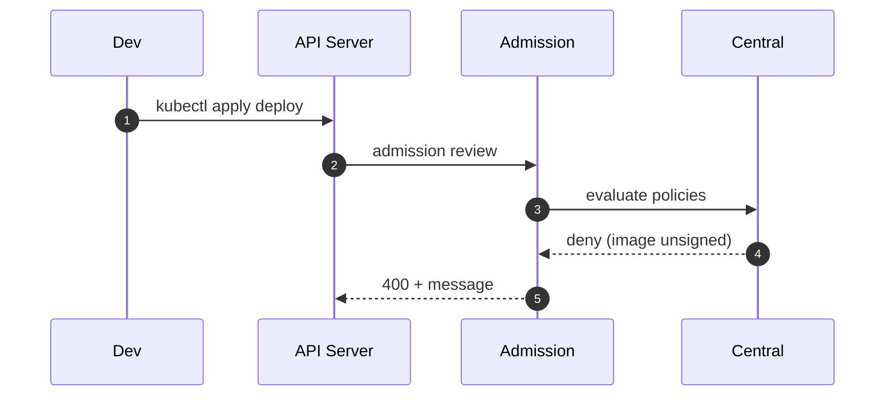

# 13 — Sécurité runtime & conformité (Red Hat ACS / StackRox)

## 0) Objectif
Protéger la supply‑chain **et** l’exécution : scans d’images, politiques d’admission, détection runtime, conformité (CIS/NIST/PCI), et remédiation. Outil : **Red Hat Advanced Cluster Security (ACS/StackRox)**.

---

## 1) Composants
- **Central** : cerveau ACS (API/UI, moteur de politique, risques, rapports).
- **Scanner** (+ DB) : analyse vulnérabilités des images (CVE, fix, couches).
- **SecuredCluster** : **Sensor** (télémétrie K8s), **Collector** (eBPF/Kernel), **Admission Controller** (enforce à l’entrée).
- **roxctl** : CLI pour CI/CD et GitOps.

---

## 2) Architecture globale


---

## 3) Déploiement (Operator)
1) Installer **RHACS Operator**.
2) Créer **Central** (namespace `stackrox`) → Route/UI + token init.
3) Créer **SecuredCluster** sur chaque cluster cible.
4) Activer **Scanner** (interne ou externe).
5) Configurer intégrations : registries, CI, notifications.

---

## 4) Flux type — Build→Scan→Sign→Admit→Run


---

## 5) Politiques (exemples)
Catégories : **Build**, **Deploy**, **Runtime**.
- Build : « CVSS≥7 interdit », « secret dans image », « binaire shell ».
- Deploy : « privileged interdit », « hostPath/hostPID interdits », « image non signée ».
- Runtime : « proc non attendu », « connexions exfil », « crypto‑mining ».

Exemple règle d’admission (logique) :
- Si `image not signed by org` → **deny**.
- Si `CVE critical not fixed` → **deny** en prod, **warn** en dev.

---

## 6) Intégration CI/CD — `roxctl`
### 6.1 Scan + gate image
```bash
export ROX_API_TOKEN=***
export ROX_CENTRAL_ENDPOINT=acs.example.com:443
roxctl image scan --image $IMAGE --endpoint $ROX_CENTRAL_ENDPOINT --insecure-skip-tls-verify
roxctl image check --image $IMAGE --endpoint $ROX_CENTRAL_ENDPOINT \
  --policy "Fixable Severity at least Important"
```
### 6.2 Check de déploiement rendu
```bash
kustomize build envs/prod | roxctl deployment check \
  --endpoint $ROX_CENTRAL_ENDPOINT --insecure-skip-tls-verify -f -
```
Échec → pipeline stop. Succès → push Git → Argo CD déploie.

---

## 7) Admission Controller
- Mode **enforce** ou **inform**.
- Cible : `CREATE`/`UPDATE` sur (Deployments, StatefulSets, DaemonSets, Jobs).
- Sources de décision : résultats de scan, policies, signatures, runtime baselines.

Séquence rejet :


---

## 8) Détection runtime
- **Collector** observe process, réseau, fichiers via eBPF.
- **Baselines** par déploiement (apprentissage initial, puis déviations).
- Alertes : exécution de `nc`, `curl` anormal, écriture sensible, escalades.
- Réponse : notifier, enrichir (pod/namespace/image), proposer NetPol.

---

## 9) Conformité & rapports
- Benchmarks : **CIS Kubernetes/OpenShift**, NIST, PCI‑DSS.
- Rapports planifiés par cluster/namespace.
- Export PDF/JSON, suivi remédiations.

---

## 10) Segmentation réseau assistée
- Graph ACS → flux observés → **politiques réseau suggérées**.
- Générer NetPol minimales : autoriser uniquement flux requis.

---

## 11) Notifications & SIEM
- Intégrations : Slack, Webhook, Jira, Splunk/ELK, PagerDuty.
- Règles : severité, cluster, namespace, libellés d’app.

---

## 12) Observabilité
- Scores de **risque** par image/déploiement.
- Tendances CVE, politiques violées, temps de correction.
- Tableaux pour équipes appli et SecOps.

---

## 13) Bonnes pratiques
- **Shift‑left** : bloquer en **CI** avant admission.
- **Signatures** : Cosign + politique « only signed images ».
- **Scopes** : politiques plus strictes en prod, plus souples en dev.
- **Exclusions** : minimales et à durée limitée.
- **Trust** : limiter registries + ICSP, CA fiables.

---

## 14) Dépannage
```bash
# Santé ACS
oc -n stackrox get pods,route,secret

# Admission
oc -n stackrox logs deploy/admission-control -c admission-control

# CI CLI
roxctl --help

# Événements politiques
oc -n stackrox logs deploy/central -c central | tail -n 200
```
Problèmes fréquents : CA non approuvée, token expiré, timeouts registre, noyau non supporté pour eBPF (collector fallback kernel module).

---

## 15) Checklist
- Operator installé, Central + SecuredCluster opérationnels.
- Scanner branché à vos registries.
- CI : `roxctl image check` et `deployment check` bloquants.
- Admission Controller en enforce sur prod.
- Politiques sign/privileged/hostNetwork/CVE≥critique actives.
- Rapports conformité planifiés, NetPol recommandées appliquées.

