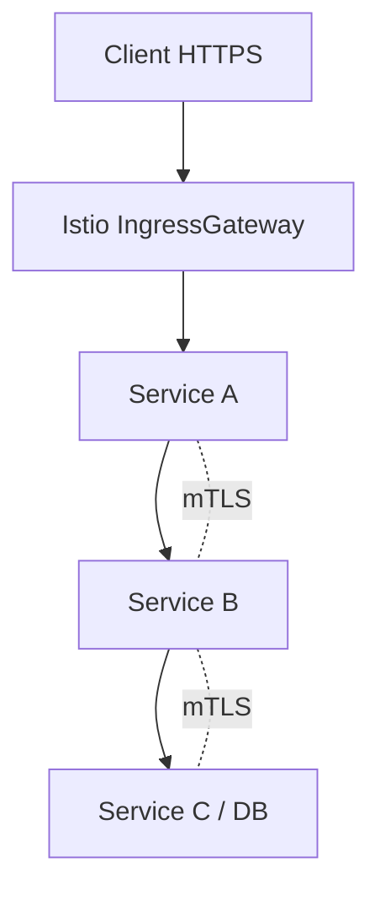
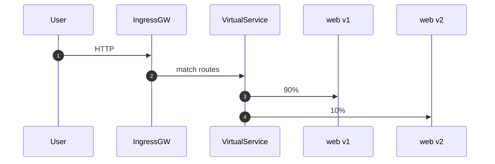

# 11 — Service Mesh (OpenShift Service Mesh • Istio)

## 0) Objectif
Sécuriser et piloter le trafic **est‑ouest** et **nord‑sud** : mTLS, routage fin, canary/blue‑green, quotas, observabilité, et contrôle d’accès au niveau **service**.

---

## 1) Composants
- **Control plane** : `istiod` (pilotage, XDS, certificats mTLS).
- **Sidecar** : **Envoy** injecté dans chaque pod membre.
- **Ingress/Egress Gateway** : points d’entrée/sortie du mesh.
- **Add‑ons** : Kiali (graph), Jaeger/Tempo (traces), Prometheus/Grafana (métriques), Loki (logs).

**Onboarding** : déclarer les namespaces dans **ServiceMeshMemberRoll** et activer l’injection sidecar.

---

## 2) Chemin de requête (vue simple)


---

## 3) Onboarding d’un namespace
### 3.1 Membre du mesh
```yaml
apiVersion: maistra.io/v1
kind: ServiceMeshMemberRoll
metadata: { name: default, namespace: istio-system }
spec:
  members: ["app-dev", "app-prod"]
```

### 3.2 Injection sidecar (si requis)
```yaml
apiVersion: v1
kind: Namespace
metadata:
  name: app-dev
  labels:
    istio-injection: enabled
```
> Alternativement, annotation par Pod : `sidecar.istio.io/inject: "true"`.

---

## 4) Sécurité mTLS
### 4.1 Tout en **STRICT**
```yaml
apiVersion: security.istio.io/v1beta1
kind: PeerAuthentication
metadata: { name: mesh-default, namespace: istio-system }
spec:
  mtls:
    mode: STRICT
```

### 4.2 TLS côté client (si besoin explicite)
```yaml
apiVersion: networking.istio.io/v1beta1
kind: DestinationRule
metadata: { name: svc-b, namespace: app-dev }
spec:
  host: svc-b.app-dev.svc.cluster.local
  trafficPolicy:
    tls:
      mode: ISTIO_MUTUAL
```

### 4.3 Autorisation (RBAC service)
```yaml
apiVersion: security.istio.io/v1beta1
kind: AuthorizationPolicy
metadata: { name: allow-a-to-b, namespace: app-dev }
spec:
  selector: { matchLabels: { app: svc-b } }
  rules:
  - from:
    - source:
        principals: ["cluster.local/ns/app-dev/sa/svc-a"]
```

---

## 5) Routage : canary / blue‑green / mirroring
### 5.1 Subsets versions
```yaml
apiVersion: networking.istio.io/v1beta1
kind: DestinationRule
metadata: { name: web, namespace: app-dev }
spec:
  host: web.app-dev.svc.cluster.local
  subsets:
  - name: v1
    labels: { version: v1 }
  - name: v2
    labels: { version: v2 }
```

### 5.2 Canary par poids
```yaml
apiVersion: networking.istio.io/v1beta1
kind: VirtualService
metadata: { name: web, namespace: app-dev }
spec:
  hosts: ["web"]
  http:
  - route:
    - destination: { host: web, subset: v1 }
      weight: 90
    - destination: { host: web, subset: v2 }
      weight: 10
```

### 5.3 Traffic mirroring (shadow)
```yaml
spec:
  hosts: ["web"]
  http:
  - route: [{ destination: { host: web, subset: v1 } }]
    mirror: { host: web, subset: v2 }
    mirrorPercentage: { value: 20 }
```

Séquence :


---

## 6) Exposition nord‑sud (Ingress Gateway)
### 6.1 Gateway + VirtualService
```yaml
apiVersion: networking.istio.io/v1beta1
kind: Gateway
metadata: { name: public-gw, namespace: app-dev }
spec:
  selector: { istio: ingressgateway }
  servers:
  - port: { number: 443, name: https, protocol: HTTPS }
    tls: { mode: PASSTHROUGH }
    hosts: ["web.apps.example.com"]
---
apiVersion: networking.istio.io/v1beta1
kind: VirtualService
metadata: { name: web-ext, namespace: app-dev }
spec:
  hosts: ["web.apps.example.com"]
  gateways: ["public-gw"]
  tls:
  - match: [{ port: 443, sniHosts: ["web.apps.example.com"] }]
    route: [{ destination: { host: web.app-dev.svc.cluster.local, port: { number: 8443 } } }]
```

### 6.2 Route OpenShift vers IngressGateway
```yaml
apiVersion: route.openshift.io/v1
kind: Route
metadata: { name: igw, namespace: istio-system }
spec:
  to: { kind: Service, name: istio-ingressgateway }
  port: { targetPort: 443 }
  tls: { termination: passthrough }
```

---

## 7) Sortie vers l’extérieur (egress)
### 7.1 Accès direct autorisé
```yaml
apiVersion: networking.istio.io/v1beta1
kind: Sidecar
metadata: { name: default, namespace: app-dev }
spec:
  egress:
  - hosts: ["./*", "istio-system/*", "~.example.com"]
```

### 7.2 ServiceEntry (contrôle fin)
```yaml
apiVersion: networking.istio.io/v1beta1
kind: ServiceEntry
metadata: { name: ext-api, namespace: app-dev }
spec:
  hosts: ["api.external.example.com"]
  ports: [{ number: 443, name: https, protocol: TLS }]
  resolution: DNS
  location: MESH_EXTERNAL
```

---

## 8) Observabilité
- **Métriques** : Envoy → Prometheus, dashboards Grafana.
- **Traces** : B3/W3C → Jaeger/Tempo via collector. Ajouter headers.
- **Logs** : access logs Envoy, corrélation avec Loki.

---

## 9) Quotas, timeouts, retries, circuit‑breaking
```yaml
apiVersion: networking.istio.io/v1beta1
kind: VirtualService
metadata: { name: web, namespace: app-dev }
spec:
  hosts: ["web"]
  http:
  - timeout: 3s
    retries: { attempts: 2, perTryTimeout: 1s }
---
apiVersion: networking.istio.io/v1beta1
kind: DestinationRule
metadata: { name: web, namespace: app-dev }
spec:
  host: web
  trafficPolicy:
    connectionPool: { http: { http1MaxPendingRequests: 100 }, tcp: { maxConnections: 100 } }
    outlierDetection: { consecutive5xxErrors: 5, interval: 5s, baseEjectionTime: 30s }
```

---

## 10) Sécurité avancée
- **JWT** : `RequestAuthentication` + `AuthorizationPolicy`.
- **mTLS obligatoire** : PeerAuthentication STRICT au niveau ns.
- **RBAC fin** : principals par ServiceAccount.

Exemple JWT :
```yaml
apiVersion: security.istio.io/v1beta1
kind: RequestAuthentication
metadata: { name: jwt, namespace: app-dev }
spec:
  selector: { matchLabels: { app: web } }
  jwtRules:
  - issuer: https://issuer.example.com/
    jwksUri: https://issuer.example.com/keys
```

---

## 11) Runbooks
- **Sidecar non injecté** : vérifier label ns et `ServiceMeshMemberRoll`.
- **503 mTLS** : PeerAuthentication STRICT mais DR TLS manquant → ajouter ISTIO_MUTUAL.
- **SNI/Ingress** : host VirtualService + Route passthrough alignés.
- **Boucles** : vérifier `VirtualService` host vs service DNS.

---

## 12) Commandes utiles
```bash
oc -n istio-system get smmr,smcp,deploy,svc
oc -n app-dev get vs,dr,pa,ap,gw,se
oc -n istio-system logs deploy/istiod -c discovery | tail -n 200
oc -n app-dev logs -l istio-proxy -c istio-proxy --tail=200
istioctl proxy-status
```

---

## 13) Checklist
- Namespaces membres + injection sidecar activée.
- PeerAuthentication STRICT + policies d’autorisation.
- VirtualService/DestinationRule pour versions et canary.
- IngressGateway exposé via Route passthrough.
- Egress contrôlé (ServiceEntry/Sidecar), observabilité branchée.

