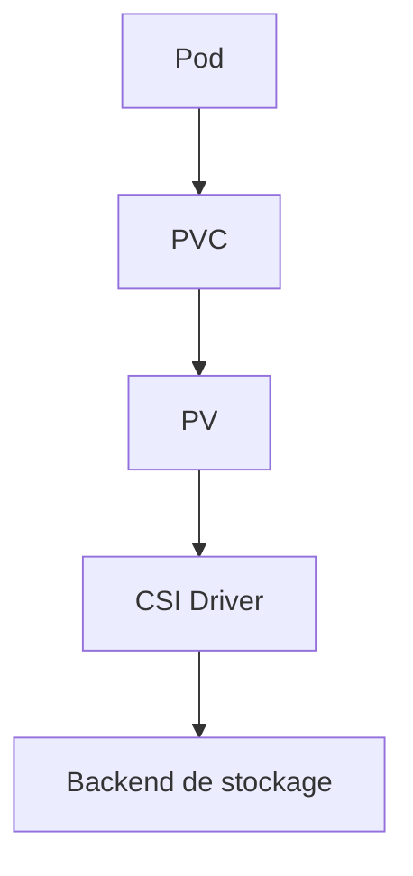
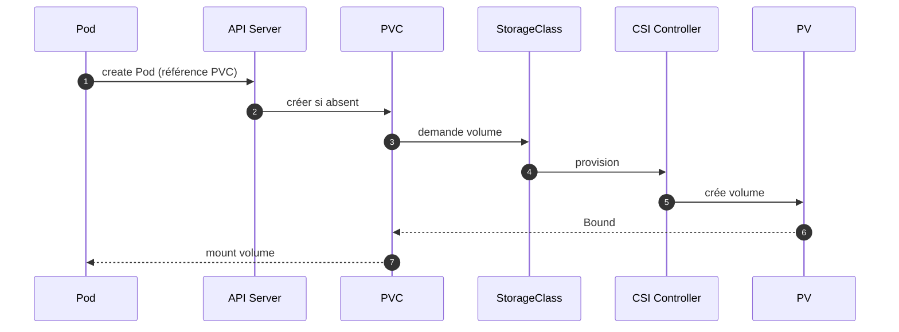
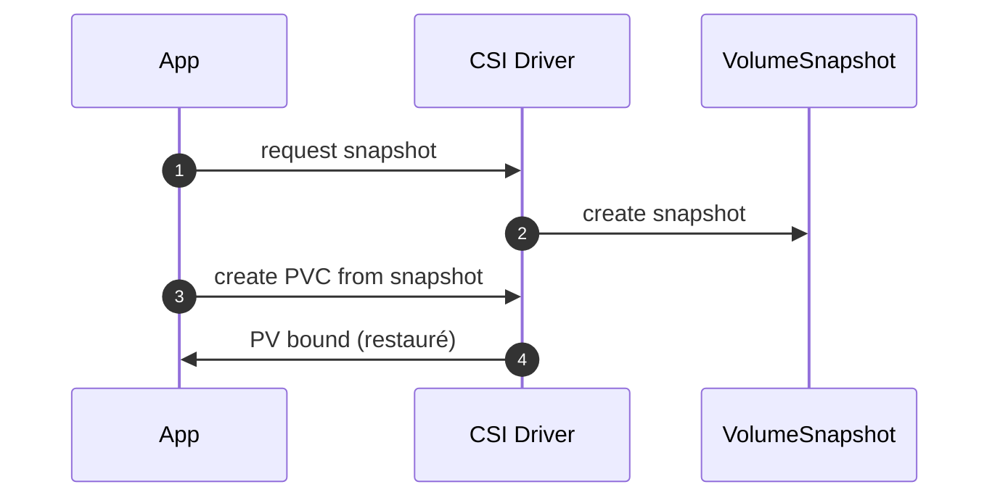

# 05 — Stockage & Données (CSI • StorageClass • PVC/PV • Snapshots • StatefulSet)

## 0) Objectif
Maîtriser le stockage persistant sur OpenShift : **CSI**, **StorageClass**, **PVC/PV**, **modes d’accès**, **snapshots/restore**, **StatefulSet**, **sécurité** et **performances**.

---

## 1) Concepts clés
- **CSI Driver** : plugin stockage (AWS EBS, Azure Disk/File, GCE PD, vSphere CNS, Ceph/ODF, NFS, etc.).
- **StorageClass (SC)** : profil de provisionnement (paramètres, reclaimPolicy, bindingMode, volumeBinding/topology).
- **PV/PVC** : PV = volume réel. PVC = demande d’un Pod.
- **Modes d’accès** : `RWO` (ReadWriteOnce), `RWX` (ReadWriteMany), `ROX` (ReadOnlyMany).
- **VolumeMode** : `Filesystem` (par défaut) ou `Block` (raw block).
- **ReclaimPolicy** : `Delete` ou `Retain`.
- **bindingMode** : `Immediate` ou `WaitForFirstConsumer` (évite mauvaise zone).

---

## 2) Schéma d’architecture


Topologie (zones/noeuds) influe sur l’ordonnancement quand `WaitForFirstConsumer` est actif.

---

## 3) Séquence — provisionnement dynamique


---

## 4) StorageClass — modèles
### 4.1 SC générique (filesystem RWO)
```yaml
apiVersion: storage.k8s.io/v1
kind: StorageClass
metadata: { name: fast-rwo }
provisioner: csi.example.com
reclaimPolicy: Delete
allowVolumeExpansion: true
volumeBindingMode: WaitForFirstConsumer
parameters:
  type: gp3            # ex. cloud
  iops: "3000"        # selon driver
  throughput: "125"   # selon driver
```

### 4.2 SC RWX (ex. fichiers partagés)
```yaml
apiVersion: storage.k8s.io/v1
kind: StorageClass
metadata: { name: shared-rwx }
provisioner: csi.example.com-files
reclaimPolicy: Delete
allowVolumeExpansion: true
volumeBindingMode: WaitForFirstConsumer
mountOptions: ["nfsvers=4.1"]   # si NFS/CephFS
```

### 4.3 SC Block
```yaml
apiVersion: storage.k8s.io/v1
kind: StorageClass
metadata: { name: block-rwo }
provisioner: csi.example.com-block
reclaimPolicy: Delete
volumeBindingMode: WaitForFirstConsumer
parameters: { fstype: "xfs" }
```

---

## 5) PVC — modèles
### 5.1 PVC RWO Filesystem
```yaml
apiVersion: v1
kind: PersistentVolumeClaim
metadata: { name: data, namespace: app }
spec:
  accessModes: [ReadWriteOnce]
  resources: { requests: { storage: 20Gi } }
  storageClassName: fast-rwo
```

### 5.2 PVC RWX Filesystem
```yaml
apiVersion: v1
kind: PersistentVolumeClaim
metadata: { name: shared, namespace: app }
spec:
  accessModes: [ReadWriteMany]
  resources: { requests: { storage: 50Gi } }
  storageClassName: shared-rwx
```

### 5.3 PVC Block
```yaml
apiVersion: v1
kind: PersistentVolumeClaim
metadata: { name: raw-block, namespace: app }
spec:
  accessModes: [ReadWriteOnce]
  volumeMode: Block
  resources: { requests: { storage: 10Gi } }
  storageClassName: block-rwo
```

---

## 6) StatefulSet — identité stable + volumes
```yaml
apiVersion: apps/v1
kind: StatefulSet
metadata: { name: db, namespace: data }
spec:
  serviceName: db-headless
  replicas: 3
  selector: { matchLabels: { app: db } }
  template:
    metadata: { labels: { app: db } }
    spec:
      terminationGracePeriodSeconds: 30
      securityContext:
        fsGroup: 2000
      containers:
      - name: pg
        image: registry/pg:16
        ports: [{ containerPort: 5432 }]
        volumeMounts:
        - name: datadir
          mountPath: /var/lib/postgresql/data
  volumeClaimTemplates:
  - metadata: { name: datadir }
    spec:
      accessModes: [ReadWriteOnce]
      resources: { requests: { storage: 100Gi } }
      storageClassName: fast-rwo
```

Headless Service :
```yaml
apiVersion: v1
kind: Service
metadata: { name: db-headless, namespace: data }
spec:
  clusterIP: None
  selector: { app: db }
  ports: [{ port: 5432, targetPort: 5432 }]
```

---

## 7) Snapshots & restore (CSI)
### 7.1 Classes de snapshot
```yaml
apiVersion: snapshot.storage.k8s.io/v1
kind: VolumeSnapshotClass
metadata: { name: csi-snap }
driver: csi.example.com
deletionPolicy: Delete
```

### 7.2 Créer un snapshot
```yaml
apiVersion: snapshot.storage.k8s.io/v1
kind: VolumeSnapshot
metadata: { name: data-2025-08-26, namespace: app }
spec:
  volumeSnapshotClassName: csi-snap
  source: { persistentVolumeClaimName: data }
```

### 7.3 Restaurer vers un nouveau PVC
```yaml
apiVersion: v1
kind: PersistentVolumeClaim
metadata: { name: data-restore, namespace: app }
spec:
  dataSource:
    name: data-2025-08-26
    kind: VolumeSnapshot
    apiGroup: snapshot.storage.k8s.io
  accessModes: [ReadWriteOnce]
  resources: { requests: { storage: 20Gi } }
  storageClassName: fast-rwo
```

Séquence :


---

## 8) Sécurité des volumes
- **fsGroup** et `runAsUser` pour permissions.
- **SELinux** : labels automatiques sur volumes; éviter `:z` en prod, préférer fsGroup.
- **SCC** : types de volumes autorisés (PVC, configMap, secret…).
- **Chiffrement** : côté backend (disks, object store). Activer au niveau storage.
- **readOnlyRootFilesystem** + montages RW dédiés (`emptyDir` mémoire pour `/tmp`).

---

## 9) Performances & pratiques
- Choisir SC adaptée (IOPS/Throughput). Préférer `WaitForFirstConsumer`.
- Éviter RWX sur DBs. Préférer RWO par réplique.
- Monter `noatime` si supporté. Taille de volume adaptée.
- Anti‑affinité pods pour éviter co‑localisation chaude.
- Tests charge : fio/pgbench, mesurer latence p95.

---

## 10) Backups & DR
- **Velero** : sauvegarde objets K8s + snapshots PV (CSI) ou **restic** file‑level.
- Politique : quotidien + hebdo, rétention et restauration testée.
- Registry : planifier GC/backup si nécessaire.

---

## 11) Observabilité & alertes
- Alertes : PVC Pending, PV Lost, usage > 80 %.
- Métriques : `kube_persistentvolumeclaim_status_phase`, `kubelet_volume_stats_used_bytes`.
- Dashboards : stockage par namespace/app, taux de croissance.

---

## 12) Dépannage
```bash
# Inventaire
oc get sc
oc get pvc -A -o wide
oc get pv -A

# Détails
oc describe pvc data -n app
oc describe pv <pv>

# Logs CSI
oc -n openshift-cluster-csi-drivers get pods
oc -n openshift-cluster-csi-drivers logs deploy/<csi-controller> -c csi-provisioner

# Dans un pod
oc -n app rsh deploy/web df -hT
```

---

## 13) Checklist
- SC par défaut définie. `WaitForFirstConsumer` activé sur SCs zonées.
- Choix mode d’accès adapté (RWO vs RWX). Pas de RWX pour DBs.
- SecurityContext (fsGroup/runAsUser) défini. SCC respectée.
- Snapshots disponibles et test de restauration documenté.
- Velero en place. Alertes sur PENDING/usage élevé.

