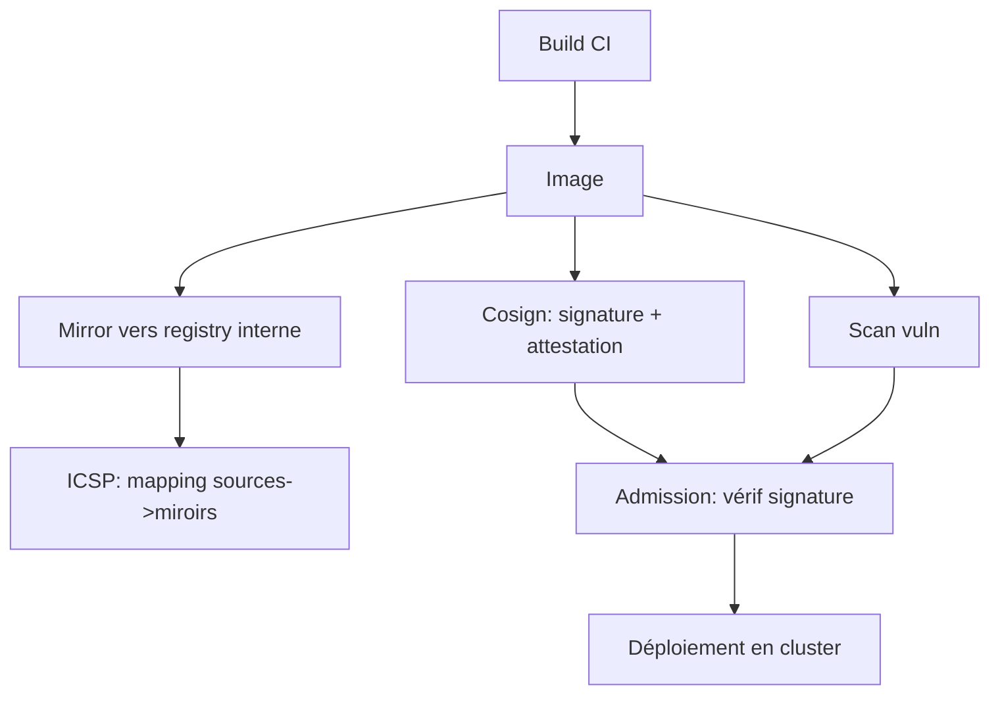
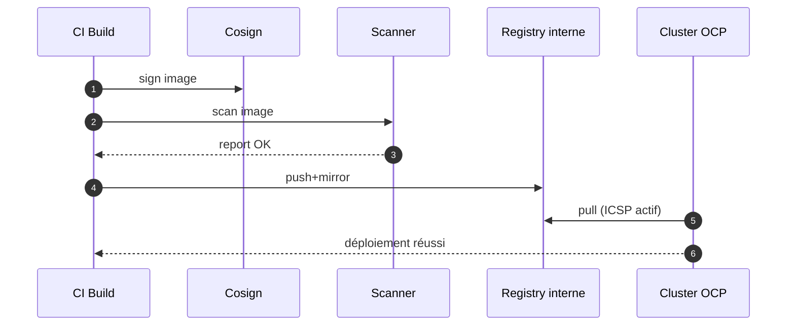
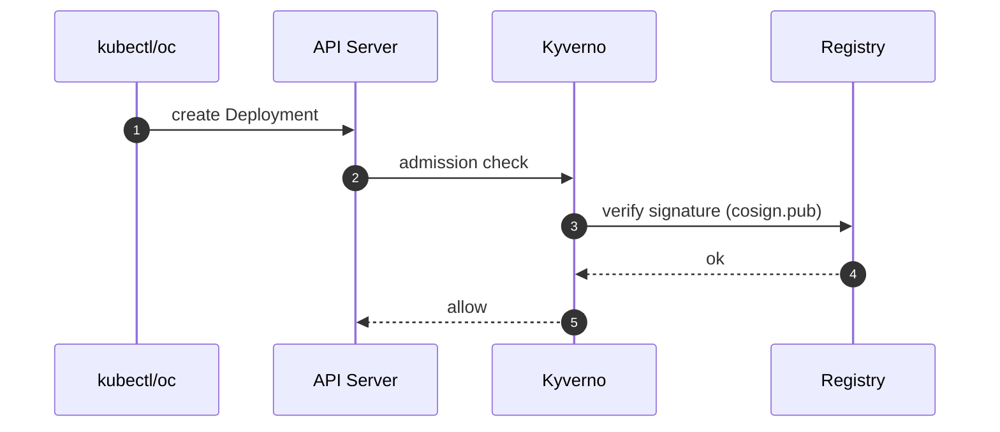

# 03 — Supply‑chain d’images (Mirroring • ICSP • Cosign • Scan • Admission)

## 0) Objectif
Sécuriser et fiabiliser le cycle de vie des **images** : mirroring interne, mapping cluster (ICSP), **signature Cosign** + attestations, **scan** vulnérabilités, **politiques d’admission** (Kyverno/Gatekeeper), et runbooks.

---

## 1) Vue d’ensemble


---

## 2) Registries et stratégies
- **Registry interne** obligatoire (OpenShift registry, Harbor, Quay, Artifactory, Nexus, GitLab).
- **Listes autorisées** : n’autoriser que vos registries approuvés.
- **Tags immuables** : préférer digest `@sha256:…`.
- **Mirroring** régulier des bases (nginx, busybox, etc.).

---

## 3) Mirroring : `oc image mirror` / `skopeo`
### 3.1 Exemple générique
```bash
# Source publique -> registry interne
oc whoami -t | cat > /tmp/token
SRC=docker.io/library/nginx:1.27
DST=default-route-openshift-image-registry.apps-crc.testing/images-local/nginx:1.27
podman login default-route-openshift-image-registry.apps-crc.testing -u $(oc whoami) -p $(oc whoami -t) --tls-verify=false
skopeo copy docker://$SRC docker://$DST --dest-tls-verify=false
```

### 3.2 Avec `oc image mirror`
```bash
oc image mirror $SRC $DST --insecure=true
```

### 3.3 Runbook mirroring
- Échec TLS : utiliser route interne ou ajouter CA au trust.
- Rate limits Docker Hub : prévoir cache/miroirs internes.
- Drifts : planifier job cron de refresh.

---

## 4) ImageContentSourcePolicy (ICSP)
Associe un **registry source** à un **miroir interne** au niveau cluster.
```yaml
apiVersion: operator.openshift.io/v1alpha1
kind: ImageContentSourcePolicy
metadata:
  name: base-images-mirror
spec:
  repositoryDigestMirrors:
  - mirrors:
    - image-registry.openshift-image-registry.svc:5000/images-local
    source: docker.io/library
  - mirrors:
    - registry.internal/base
    source: quay.io/organization
```
Effet : pour un digest donné, le cluster tentera d’abord le miroir.

---

## 5) Signature et attestations (Cosign)
### 5.1 Génération clés
```bash
cosign generate-key-pair \
  --output-key cosign.key \
  --output-pub cosign.pub
```

### 5.2 Signature d’une image
```bash
IMG=registry.internal/app/web@sha256:deadbeef...
cosign sign --key cosign.key $IMG
```

### 5.3 Vérification
```bash
cosign verify --key cosign.pub $IMG
```

### 5.4 Attestation (provenance, SLSA, SBOM)
```bash
cosign attest --key cosign.key --predicate sbom.spdx.json --type spdx $IMG
cosign verify-attestation --key cosign.pub --type spdx $IMG
```

**Stockage clés** : ConfigMap/Secret dans `argocd` ou `policy` namespace; accès lecture pour l’admission.

---

## 6) Admission : Kyverno (verifyImages) — signatures requises
```yaml
apiVersion: kyverno.io/v1
kind: ClusterPolicy
metadata:
  name: require-signed-images
spec:
  validationFailureAction: Enforce
  rules:
  - name: verify-signature
    match:
      any:
      - resources:
          kinds: [Pod, Deployment, StatefulSet, DaemonSet, Job, CronJob]
    verifyImages:
    - imageReferences:
      - "registry.internal/*"
      attestors:
      - entries:
        - keys:
            publicKeys: |
              -----BEGIN PUBLIC KEY-----
              MIIBIjANBgkqh...IDAQAB
              -----END PUBLIC KEY-----
```

Variant : scope par namespace via `Policy` (non cluster‑wide).

---

## 7) Admission : registries autorisés et anti‑`latest`
### 7.1 Allowlist de registries
```yaml
apiVersion: kyverno.io/v1
kind: ClusterPolicy
metadata:
  name: allow-registries
spec:
  validationFailureAction: Enforce
  rules:
  - name: only-internal-registries
    match:
      any:
      - resources:
          kinds: [Pod, Deployment, StatefulSet, DaemonSet, Job, CronJob]
    validate:
      message: "Registry non autorisé"
      pattern:
        spec:
          containers:
          - image: "registry.internal/* | image-registry.openshift-image-registry.svc:5000/*"
```

### 7.2 Interdire `:latest` et exiger digest
```yaml
apiVersion: kyverno.io/v1
kind: ClusterPolicy
metadata:
  name: no-latest-require-digest
spec:
  validationFailureAction: Enforce
  rules:
  - name: no-latest
    match:
      any:
      - resources:
          kinds: [Pod, Deployment, StatefulSet, DaemonSet, Job, CronJob]
    validate:
      message: "Tag latest interdit"
      pattern:
        spec:
          containers:
          - (=image): "!*:latest"
  - name: require-digest
    match:
      any:
      - resources:
          kinds: [Pod, Deployment, StatefulSet, DaemonSet, Job, CronJob]
    validate:
      message: "Utiliser un digest sha256"
      pattern:
        spec:
          containers:
          - image: "*@sha256:*"
```

---

## 8) Intégration CI : scanner avant admission
### 8.1 Trivy en pipeline
```bash
trivy image --exit-code 1 --severity HIGH,CRITICAL registry.internal/app/web:1.2.3
```
Si exit‑code 1 : échec build → pas de push.

### 8.2 Harbor / Quay / ACS
- Activer scan auto post‑push.
- Webhook vers CI/Slack en cas de HIGH/CRITICAL.
- Gate en admission : exiger label/annotation "scan:clean" ajouté par CI.

Exemple d’annotation obligatoire :
```yaml
apiVersion: kyverno.io/v1
kind: ClusterPolicy
metadata: { name: require-clean-scan }
spec:
  validationFailureAction: Enforce
  rules:
  - name: must-have-scan-label
    match:
      any:
      - resources:
          kinds: [Deployment]
    validate:
      message: "Scan requis: label scan=clean manquant"
      pattern:
        metadata:
          labels:
            scan: "clean"
```

---

## 9) Séquences
### 9.1 Build→Sign→Scan→Mirror→Deploy


### 9.2 Admission signature


---

## 10) Diagnostics & runbooks
- **Signature invalide** : `cosign verify` local, clé publique OK ? même digest ?
- **Échec verifyImages** : consulter `kyverno logs` + événement sur ressource.
- **Mirroring KO** : tester `skopeo copy` à la main; vérifier CA/route.
- **Pull refusé** : check allowlist registry et format digest.
- **Scan bloquant** : ajuster seuils severité et exceptions justifiées.

---

## 11) Checklist mise en place
- Registry interne opérationnel et authentifié.
- ICSP déployé pour sources critiques.
- Clés Cosign générées, pub distribuée aux policies.
- Pipeline : sign + scan + push + annoter `scan=clean`.
- Kyverno : verifyImages + allow‑registries + no‑latest + require‑digest.
- Monitoring : alertes sur échecs mirroring et verifyImages.

