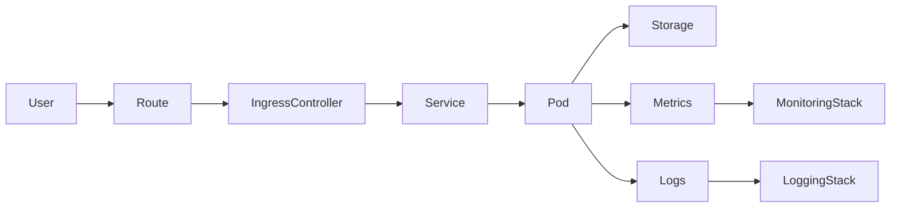

# Architecture globale OpenShift – Lab Architecte

## 1. Objectif du lab

- Fournir un cluster OpenShift unique pour :
  - les labs EX280 / EX288 / EX370 / EX380 / EX480 / EX482 ;
  - les exercices d’architecture (GitOps, sécurité, observabilité, multi-cluster).
- Servir de maquette pour un SI d’entreprise de taille moyenne.

## 2. Contexte technique

- Type de cluster : OpenShift Local (CRC) / environnement de lab.
- Version cible : OpenShift 4.x (>= 4.18).
- Localisation : laptop de développement (Windows 11 + VM CRC).
- Topologie : 1 nœud « tout-en-un » (control plane + worker).

_(À adapter plus tard si tu passes sur ARO, ROSA ou OCP on-prem.)_

## 3. Vue d’ensemble logique

- Entrées :
  - CLI `oc`, console web, outils GitOps (Argo CD).
- Plan de données :
  - Projets applicatifs (`ex280-*`, `ex288-*`, etc.).
- Plan de contrôle :
  - Projets `openshift-*`, `openshift-operators`, `openshift-gitops`, monitoring/logging.

## 4. Briques principales de la plateforme

- **Contrôle / scheduling**
  - API server, scheduler, controller manager intégrés au nœud CRC.
- **Compute**
  - Nœud unique CRC hébergeant l’ensemble des workloads de lab.
- **Réseau**
  - SDN/OVN-Kubernetes, services ClusterIP/NodePort, Routes via IngressController par défaut.
- **Stockage**
  - StorageClass locale fournie par CRC pour les PVC des labs.
- **GitOps**
  - Argo CD (OpenShift GitOps) déployé dans `openshift-gitops` (voir `docs/gitops-platform.md`).
- **Observabilité**
  - Stack monitoring OCP + extensions éventuelles (Grafana perso, ServiceMonitor) (voir `docs/observability-sre.md`).
- **Sécurité**
  - RBAC, SCC / PodSecurity, NetworkPolicy sur projets applicatifs (voir `docs/security-architecture.md`).

## 5. Organisation des projets (namespaces)

- **Plateforme**
  - `openshift-*`, `kube-*` : composants internes OCP.
  - `openshift-gitops` : GitOps de la plateforme.
  - `openshift-monitoring`, `openshift-logging` (si activé) : observabilité.
- **Lab / applicatif**
  - `ex280-*` : labs admin.
  - `ex288-*` : labs dev.
  - `ex370-*`, `ex380-*`, `ex480-*`, `ex482-*` : autres modules.
  - `sandbox-*` : expérimentations libres.

## 6. Liens vers les docs détaillées

- GitOps : `docs/gitops-platform.md`
- Multi-cluster / ACM : `docs/multi-cluster.md`
- Observabilité / SRE : `docs/observability-sre.md`
- Sécurité : `docs/security-architecture.md`
- Portfolio architecte : `docs/portfolio-architect.md`

