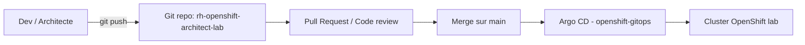

# GitOps de la plateforme OpenShift

## 1. Objectifs

* Décrire comment la configuration du cluster de lab est gérée par Git.
* Séparer clairement :

  * la configuration **plateforme** (namespaces, quotas, RBAC, operators…) ;
  * les workloads **labs/examens** (EX280, EX288, EX370, EX380, EX480, EX482).
* Servir de modèle réutilisable pour un SI d’entreprise (GitOps complet).

## 2. Principes GitOps retenus

* La **vérité** de la configuration est dans Git.
* Les changements passent par :

  * commit → pull request → merge → synchronisation Argo CD.
* Pas de modification manuelle persistante dans la console OCP :

  * les tests sont possibles, mais doivent ensuite être “rejoués” via Git.

## 3. Périmètre GitOps

### 3.1. Géré par GitOps (plateforme)

* Création et configuration des namespaces applicatifs :

  * `ex280-*`, `ex288-*`, `ex370-*`, `ex380-*`, `ex480-*`, `ex482-*`, `sandbox-*`.
* Quotas et limites :

  * `ResourceQuota`, `LimitRange` standardisés par projet.
* RBAC :

  * `Role`, `RoleBinding`, `ClusterRoleBinding` pour les rôles type (admin, dev, ops).
* Configuration réseau :

  * `NetworkPolicy` de base (isolation par défaut, egress contrôlé).
* Operators et CRDs spécifiques au lab :

  * configuration des Operators non “core” via manifests.

### 3.2. Hors GitOps (dans ce lab)

* Composants OpenShift **gérés par Red Hat** :

  * `openshift-*`, `kube-*`, cluster operators.
* Configuration interne de CRC (storage local, nœud unique).
* Expérimentations temporaires dans `sandbox-*` (peuvent ensuite être figées en GitOps).

## 4. Structure GitOps dans le dépôt

Dans ce dépôt :

```text
platform/
  gitops/
    argocd-apps/       # Manifests Application/AppProject Argo CD
    cluster-config/    # Manifests de configuration plateforme (namespaces, quotas, RBAC...)
  observability/
  security/
```

* `platform/gitops/argocd-apps/` :

  * contient les objets `Application` / `AppProject` Argo CD.
  * permet un modèle **app-of-apps** (une application racine qui référence les autres).

* `platform/gitops/cluster-config/` :

  * contient les manifests “bruts” de configuration :

    * `namespaces/`, `quotas/`, `rbac/`, `networkpolicies/`, etc. (à créer progressivement).

## 5. Flux GitOps (du commit au cluster)



* L’architecte modifie `platform/gitops/cluster-config/` ou `argocd-apps/`.
* Une PR est créée et revue (même si, dans le lab, tu peux merger toi-même).
* Argo CD détecte les changements et applique la configuration au cluster.
* Le statut (Synced / OutOfSync) est visible dans la console Argo CD ou `oc`.

## 6. Modèle App-of-Apps (cible)

Objectif : avoir une application racine qui gère les “sous-applications” :

* `platform-root` (Application racine)

  * `platform-namespaces`
  * `platform-quotas`
  * `platform-rbac`
  * `platform-network`
  * `platform-observability`
  * `platform-security`

Chacune de ces sous-applications pointe vers un sous-dossier de `platform/gitops/cluster-config/`.

Ce modèle est compatible avec une future extension multi-cluster (EX480) :

* même logique, mais avec des `ApplicationSet` pointant vers plusieurs clusters.

## 7. Roadmap GitOps pour ce lab

1. Créer une première Application Argo CD :

   * `platform-namespaces` → création des projets `ex280-*`, `sandbox-*`.
2. Ajouter les quotas et limites :

   * `platform-quotas` → `ResourceQuota` + `LimitRange` standards.
3. Ajouter le RBAC :

   * `platform-rbac` → rôles `admin`, `dev`, `ops` communs aux labs.
4. Étendre à l’observabilité et à la sécurité :

   * `platform-observability`, `platform-security`.

Les manifests concrets seront ajoutés progressivement dans `platform/gitops/` au fil des labs.
