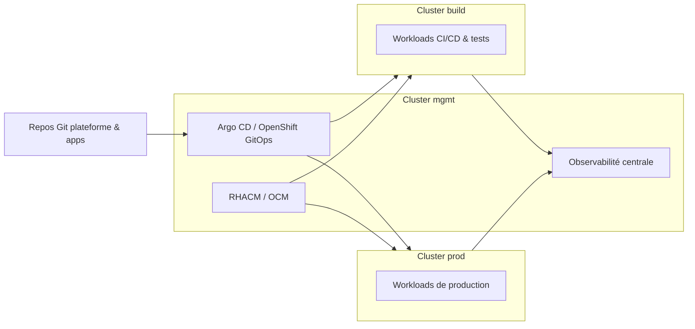

# Multi-cluster et Advanced Cluster Management – Lab Architecte

## 1. Objectifs

* Comprendre comment piloter plusieurs clusters OpenShift de manière centralisée.
* Préparer une topologie réutilisable en contexte entreprise (on-prem + cloud).
* Servir de base pour les labs EX480 (multi-cluster) et les scénarios d’architecture.

Dans ce lab, on part d’un **cluster unique** (CRC), mais on raisonne comme si l’on avait :

* 1 cluster **mgmt** (management hub),
* plusieurs clusters **workload** (build, preprod, prod, edge…).

## 2. Topologie cible

### 2.1. Vue logique



* **Cluster mgmt** :

  * héberge RHACM/OCM (gestion multi-cluster),
  * héberge Argo CD (GitOps plateforme & apps),
  * peut héberger l’observabilité centralisée (Prometheus/Thanos, Loki…).
* **Clusters workload** :

  * hébergent les applications réelles (build, préprod, prod, edge…).

Dans le lab, CRC représente un de ces clusters (souvent le cluster `build` ou un cluster de dev).

### 2.2. Rôles par cluster

* **mgmt** :

  * administration globale (policies, placement, GitOps),
  * vue consolidée inventaire & santé.
* **build** :

  * CI/CD, environnements de test, expérimentations,
  * intégration continue des nouveautés.
* **prod** :

  * workloads business critiques,
  * règles plus strictes (policies, quotas, sécurité).

## 3. Concepts clés RHACM / OCM

Même si le lab reste sur un seul cluster, on retient les briques suivantes :

* **ManagedCluster** :

  * objet représentant un cluster géré par le hub.
* **ClusterSet** :

  * groupement logique de clusters (ex : `build-set`, `prod-set`).
* **Placement / PlacementRule** :

  * définit sur quels clusters vont s’appliquer des ressources (policies, applications…).
* **Policy** :

  * règles de conformité/sécurité appliquées à un ou plusieurs clusters.

## 4. Types de policies multi-cluster

Exemples de policies à appliquer via RHACM :

* Sécurité :

  * imposer des `SecurityContext` / PodSecurity standards,
  * interdire les images sans provenance (no `latest`, registries non approuvées…).
* Capacité / quotas :

  * s’assurer que chaque namespace critique définit des `ResourceQuota` et `LimitRange`.
* Network :

  * vérifier qu’un certain set de `NetworkPolicy` existe dans les namespaces sensibles.
* GitOps :

  * policy qui vérifie la présence d’un agent Argo CD/Flux sur les clusters workload.

## 5. Lien avec le dépôt `rh-openshift-architect-lab`

Dans ce dépôt :

* `docs/ARCHITECTURE.md` décrit la vue globale du lab (cluster unique CRC).
* `docs/gitops-platform.md` décrit comment la configuration est gérée par GitOps.
* Ce fichier `docs/multi-cluster.md` décrit la **projection** vers une architecture multi-cluster.

Pour les labs EX480 :

* On pourra ajouter un sous-dossier dédié :

```text
ex480-multicluster/
  policies/
  placements/
  apps/
```

* `policies/` : exemples de policies RHACM (YAML), même si non exécutées dans CRC.
* `placements/` : exemple de `Placement` / `PlacementRule`.
* `apps/` : exemples d’applications multi-cluster (déployées selon des labels de clusters).

## 6. Scénarios d’architecture multi-cluster (exemples)

1. **Hub on-prem + workloads cloud** :

   * mgmt : cluster on-premise,
   * workloads : OCP sur cloud (ARO, ROSA, OCP sur IaaS).
2. **Hub cloud + workloads hybrides** :

   * mgmt : OCP géré dans le cloud,
   * workloads : clusters on-prem + edge.
3. **Edge** :

   * cluster mgmt au datacenter,
   * petits clusters OpenShift ou K8s en agence/site distant, pilotés via OCM.

## 7. Comment utiliser ce fichier dans ta pratique

* Comme **support de réflexion** :

  * quand tu prépares un entretien pour un poste d’architecte OCP multi-cluster,
  * quand tu expliques à un client comment organiser ses clusters.
* Comme **checklist** :

  * as-tu pensé au hub, aux policies globales, au modèle GitOps multi-cluster ?
* Comme **pont** entre ton lab CRC et les architectures réelles :

  * CRC = un cluster `build` simplifié,
  * EX480 = projection vers un environnement complet à plusieurs clusters.
