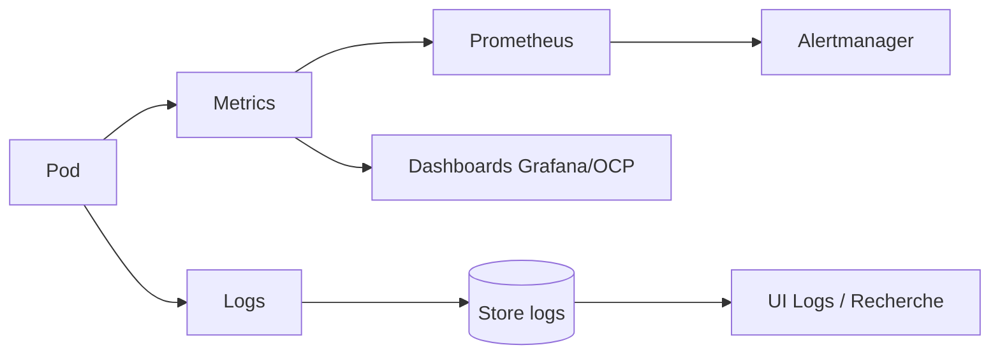

# Observabilité et pratiques SRE – Lab OpenShift

## 1. Objectifs

* Disposer d'une vision claire de l'état du cluster et des workloads de lab.
* S'entraîner à raisonner comme un SRE (fiabilité, alerte, capacité).
* Préparer un modèle réutilisable pour un SI d'entreprise.

## 2. Stack observabilité cible

### 2.1. Metrics

* Stack native OpenShift :

  * Prometheus (cluster + user-workload)
  * Alertmanager
  * Thanos (selon configuration)
* Visualisation :

  * Console OpenShift (dashboards intégrés)
  * Grafana dédié au lab (optionnel, déployé dans un namespace spécifique)

### 2.2. Logs

* Logs plateforme :

  * journaux des composants `openshift-*`, `kube-*`.
* Logs applicatifs :

  * logs des pods dans les namespaces `ex280-*`, `ex288-*`, etc.
* Cible de consolidation (au choix dans le lab) :

  * stack Loki (logs time-series)
  * ou stack ELK/EFK (Elasticsearch / Kibana / Fluentd/Fluentbit)

### 2.3. Traces (optionnel)

* Possibilité d'ajouter plus tard :

  * OpenTelemetry Collector
  * backend Jaeger/Tempo pour traces distribuées

## 3. Flux observabilité – vue d’ensemble



* Les pods exposent :

  * endpoints `/metrics` (Prometheus),
  * logs stdout/stderr collectés par l’agent de logs.
* Prometheus scrape les cibles (via `ServiceMonitor` / `PodMonitor`).
* Alertmanager gère les alertes basées sur les règles.
* Les logs sont indexés et consultés via une UI (Kibana, Grafana Loki, etc.).

## 4. KPIs et signaux SRE

On se base sur les “quatre signaux d’or” :

1. **Latence**

   * temps de réponse HTTP (p50, p90, p99)
   * erreurs de timeouts

2. **Trafic**

   * requêtes par seconde (RPS)
   * charge sur les services principaux

3. **Erreurs**

   * taux d’erreurs HTTP (4xx, 5xx)
   * exceptions applicatives majeures

4. **Saturation**

   * utilisation CPU/mémoire des pods
   * saturation des quotas (`ResourceQuota`), épuisement des PVC

Exemples d’objectifs SLO pour le lab (à adapter en prod) :

* Disponibilité HTTP : 99,0 % sur 30 jours pour les apps de lab importantes.
* Latence p95 < 500 ms sur les endpoints principaux.
* Taux d’erreurs 5xx < 1 %.

## 5. Intégration observabilité dans le dépôt Git

Dans ce dépôt, les objets liés à l’observabilité sont regroupés dans :

```text
platform/
  observability/
    servicemonitors/
    dashboards/
```

* `servicemonitors/` :

  * `ServiceMonitor` et `PodMonitor` pour les applications de lab.
* `dashboards/` :

  * fichiers JSON de dashboards Grafana ou modèles (à ajouter progressivement).

Ces manifests pourront être gérés par GitOps via `platform/gitops/`.

## 6. Exemple de stratégie pour une application de lab

Pour une application HTTP de lab (`ex280-app1` par exemple) :

1. **Metrics**

   * exposer `/metrics` dans le container (Prometheus client).
   * créer un `ServiceMonitor` dans `platform/observability/servicemonitors/`.

2. **Logs**

   * s’assurer que les logs vont sur stdout/stderr.
   * taguer le namespace/app avec des labels pour le routing dans la stack logs.

3. **Dashboards**

   * créer un dashboard Grafana (JSON) avec :

     * CPU/mémoire pod
     * HTTP requests total
     * HTTP 5xx
     * latence p95

4. **Alertes**

   * ajouter plus tard des règles Prometheus :

     * `HighErrorRate`
     * `HighLatency`
     * `PodRestartingTooOften`

## 7. Roadmap observabilité pour ce lab

1. Utiliser la console OCP pour observer les métriques et dashboards natifs.
2. Ajouter un premier `ServiceMonitor` pour une app de test :

   * commit dans `platform/observability/servicemonitors/`.
3. Ajouter au moins un dashboard personnalisé :

   * commit JSON dans `platform/observability/dashboards/`.
4. Définir 2–3 SLO simples pour une application importante du lab.
5. Documenter dans ce fichier l’évolution de la stack (ajout de Loki, etc.).

